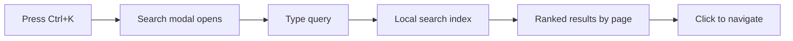

# Using Search

The Gas Town documentation includes a powerful local search feature that helps you find information quickly across all pages.



---

## Accessing Search

:::tip
Press **`Ctrl+K`** (Windows/Linux) or **`⌘+K`** (Mac) from any page to instantly open search. This is the fastest way to find anything in the docs.
:::

### Keyboard Shortcut

Press **`Ctrl+K`** (Windows/Linux) or **`⌘+K`** (Mac) from any page to open the search modal.

### Click to Search

Click the search icon or search box in the navigation bar at the top of the page.

---

## How Search Works

The documentation uses **local search** powered by [@easyops-cn/docusaurus-search-local](https://github.com/easyops-cn/docusaurus-search-local). This means:

- **No external requests**: All search happens in your browser
- **Fast results**: Instant search as you type
- **Offline capable**: Works even without internet connection
- **Privacy-friendly**: No search queries are sent to external servers

### What Gets Indexed

The search indexes:
- **Page titles**: Primary matching for navigation
- **Headings**: All H2 and H3 headings across the docs
- **Body content**: Full-text search of all documentation content
- **Code blocks**: Searches code examples and commands

### What Doesn't Get Indexed

- Comments in code blocks
- Hidden or collapsed content
- External links (only the link text, not destination content)

---

## Search Tips

### Basic Search

Just start typing - results appear instantly:

```text
witness
```

Finds all pages mentioning "witness" (the patrol agent type).

### Multi-Word Search

Search for multiple words together:

```bash
git merge conflict
```

Finds pages discussing git merge conflicts.

### Phrase Search

Use quotes for exact phrases:

```text
"gt doctor --fix"
```

Finds exact command references.

### Command Search

Search for specific commands:

```bash
bd ready
```

Finds documentation for the `bd ready` command.

### Concept Search

Search by concept or feature:

```text
convoy tracking
```

Finds pages explaining convoy functionality.

---

## Understanding Results

### Result Format

Each search result shows:
- **Page title**: The document containing the match
- **Heading**: The specific section within the page
- **Preview**: Snippet showing the matched text with highlights
- **Path**: Breadcrumb showing location in docs hierarchy

### Result Ranking

Results are ranked by relevance:
1. **Exact title matches**: Pages with the search term in the title appear first
2. **Heading matches**: Sections with matching headings
3. **Body content**: Full-text matches in page content
4. **Recency**: More recently updated pages rank higher

### Highlighted Terms

When you click a search result, the matching terms are **highlighted in yellow** on the destination page, making it easy to find the relevant content.

---

## Advanced Search Techniques

### Finding Commands

To find a specific command:

```bash
gt mail send
```

Returns all references to the mail sending command across guides and references.

### Troubleshooting Searches

Looking for solutions to problems:

```text
zombie session
agent stuck
merge conflict
```

### Conceptual Searches

Understanding how things work:

```text
how polecats work
witness patrol cycle
refinery merge queue
```

### Reference Searches

Looking up specific syntax:

```bash
bd create flags
convoy syntax
hook format
```

---

## Search Shortcuts

| Shortcut | Action |
|----------|--------|
| `Ctrl+K` / `⌘+K` | Open search |
| `Esc` | Close search |
| `↑` / `↓` | Navigate results |
| `Enter` | Go to selected result |
| `Tab` | Cycle through results |

---

## Search Scope

### Included in Search

- **Getting Started** guides
- **Architecture** documentation
- **CLI Reference** pages
- **Concepts** explainers
- **Workflows** guides
- **Operations** guides
- **Agent** documentation
- **Troubleshooting** sections

### Not Included in Search

- External GitHub repository code
- Medium blog posts (linked but not indexed)
- Community forum content
- API documentation (if separate)

---

## Common Search Queries

### For New Users

```text
installation
quickstart
first convoy
getting started
```

### For Troubleshooting

```text
agent not responding
error messages
zombie
stuck
failed
```

### For Command Reference

```bash
gt status
bd create
convoy list
mail send
```

### For Understanding Concepts

```text
what is a polecat
how witnesses work
beads system
hook mechanism
```

---

## Search Performance

### Index Size

The search index is approximately:
- **Compressed**: ~100KB (downloaded on first visit)
- **Uncompressed**: ~300KB (stored in browser cache)
- **Pages indexed**: 60+ documentation pages

### Load Time

- **First visit**: Index downloads with the page (~200ms)
- **Subsequent visits**: Index loads from browser cache (instant)
- **Search results**: Appear as you type (under 50ms per keystroke)

---

## Troubleshooting Search

### Search Not Working

If search isn't responding:

1. **Refresh the page**: `Ctrl+R` or `⌘+R`
2. **Clear browser cache**: Search index may be corrupted
3. **Check JavaScript**: Search requires JavaScript enabled
4. **Try another browser**: Browser compatibility issue

### No Results Found

If your search returns no results:

1. **Check spelling**: Try variations or simpler terms
2. **Try broader terms**: "agent" instead of "polecat"
3. **Use related terms**: "mail" if "message" finds nothing
4. **Search parent concepts**: "workflow" instead of specific step names

### Outdated Results

If search results seem outdated:

1. **Hard refresh**: `Ctrl+Shift+R` / `⌘+Shift+R`
2. **Clear site data**: Browser settings → Clear site data
3. **Check deployment**: Site may be deploying updates

---

## Search vs Navigation

### When to Use Search

- You know what you're looking for
- Quick reference needed
- Finding specific commands
- Troubleshooting errors
- Cross-referencing concepts

### When to Use Navigation

- Browsing documentation structure
- Learning Gas Town from scratch
- Understanding topic relationships
- Reading guides sequentially
- Exploring related concepts

---

## Search Limitations

### What Search Can't Do

- **Code execution**: Can't test commands or validate syntax
- **Context-aware help**: Doesn't know your specific setup
- **External resources**: Can't search GitHub issues or forums
- **Future features**: Only searches current documentation
- **Personalization**: Doesn't learn from your searches

### For These Cases, Use:

- **Code testing**: Your local Gas Town installation
- **Setup-specific help**: `gt doctor` diagnostics
- **Community**: GitHub issues and discussions
- **Roadmap**: GitHub project boards
- **Support**: File an issue or ask in discussions

---

## Providing Feedback

### Improve Search Results

If search isn't finding what you expect:

1. **File an issue**: [GitHub issues](https://github.com/steveyegge/gastown/issues)
2. **Suggest keywords**: Terms that should be added to pages
3. **Report broken links**: Links in search results that don't work
4. **Request content**: Missing documentation you'd like to see

### Search Analytics

The documentation site does not collect search analytics to protect privacy. Search queries stay in your browser and are never transmitted.

---

## Summary

- **Fast local search**: Instant results, works offline
- **Keyboard shortcut**: `Ctrl+K` / `⌘+K` to search
- **Highlighted results**: Terms highlighted on destination pages
- **Full documentation**: Searches all pages, headings, and content
- **Privacy-friendly**: No external requests or tracking

Happy searching! If you can't find what you need, consider filing a [documentation issue](https://github.com/steveyegge/gastown/issues) to help improve the docs for everyone.

## Related

- [Glossary](../guides/glossary.md) -- Complete terminology reference for Gas Town agents, concepts, and commands
- [Quick Start](quickstart.md) -- Get started with Gas Town from scratch
- [Architecture Guide](../guides/architecture.md) -- Narrative overview of how all the pieces fit together
- [Troubleshooting Guide](../guides/troubleshooting.md) -- Solutions for the most common Gas Town problems

### Blog Posts

- [Welcome to the Gas Town Blog](/blog/welcome) -- Introducing the Gas Town documentation blog with multi-agent orchestration tips and workflow patterns
