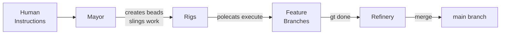
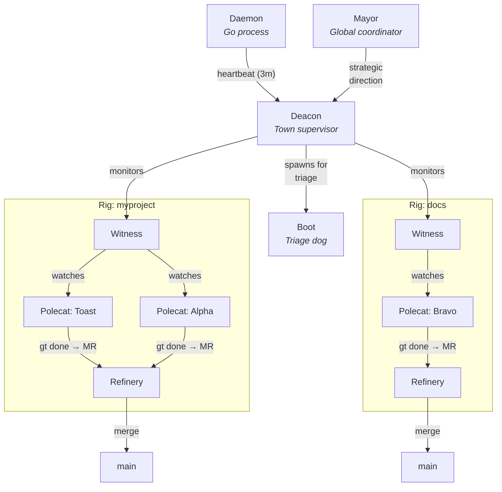
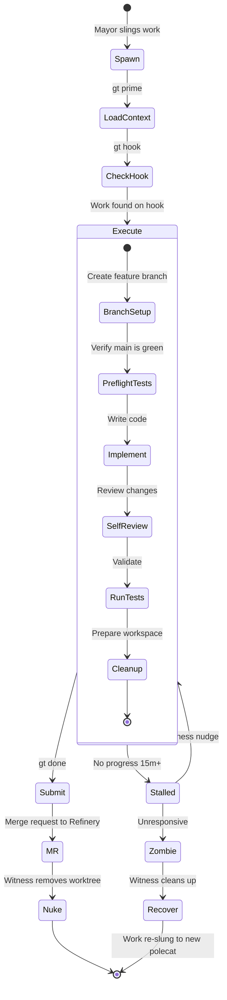
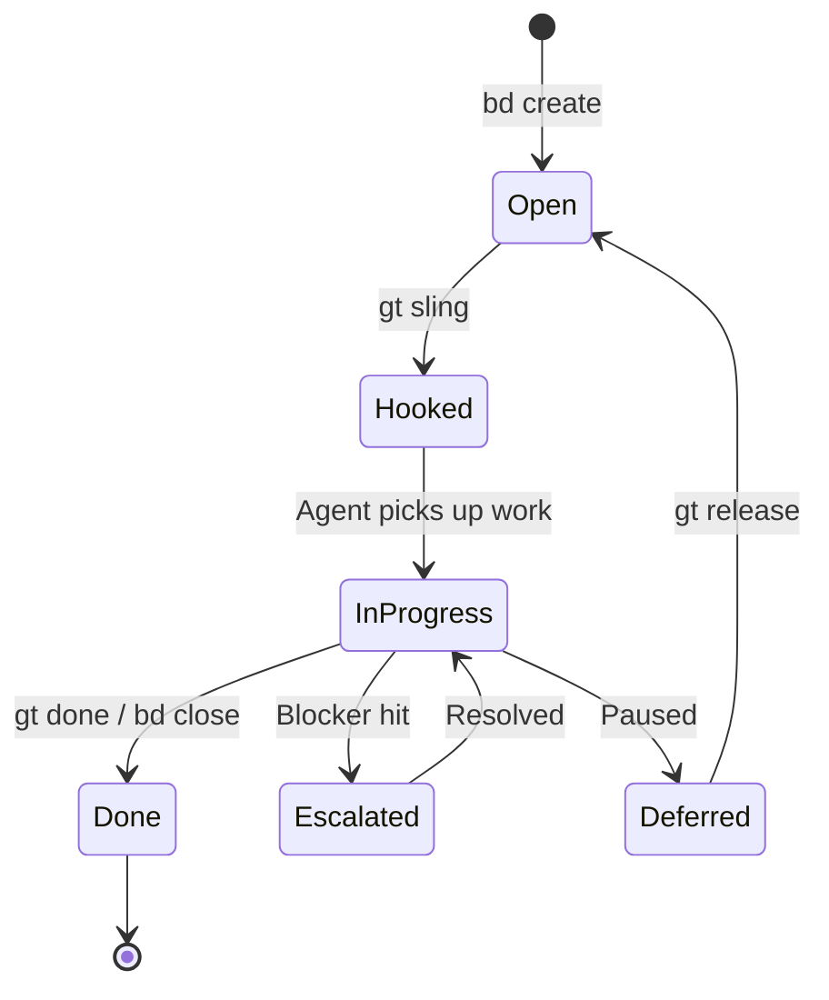
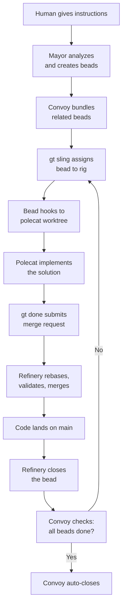
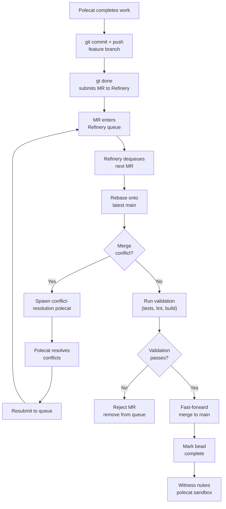
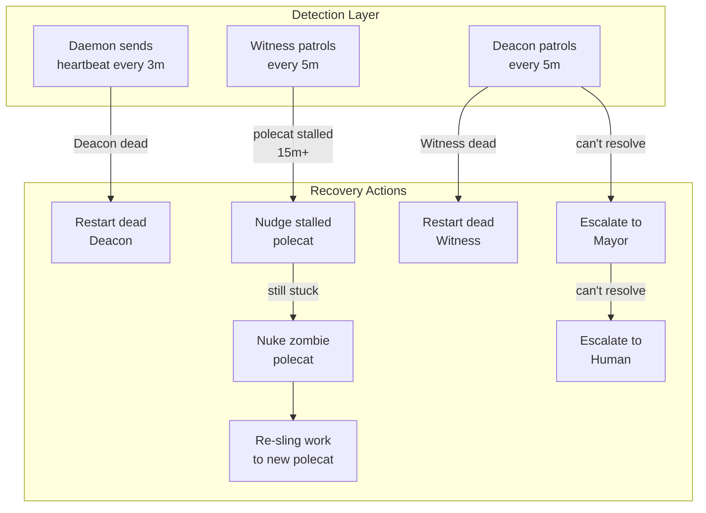
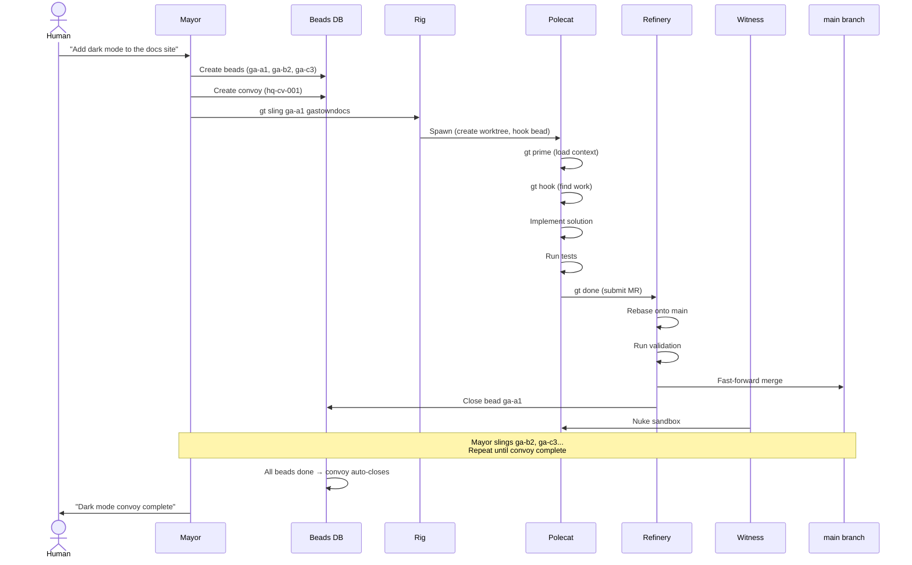

# Architecture Guide

Gas Town is a multi-agent AI orchestration system where dozens of autonomous agents coordinate to build software. This guide walks through the entire architecture in one place -- from the high-level metaphor down to the merge pipeline that lands code on `main`.

If you want reference-style documentation, see the [Architecture](../architecture/index.md) section. This guide is the narrative version: how the pieces fit together and *why* they are shaped the way they are.

---

## The Mental Model: A Steam Engine

Gas Town is a steam engine. Work enters as fuel. Agents are pistons. Code on `main` is the output.

The system's throughput depends on one thing: **when an agent finds work on its hook, it executes immediately.** No confirmation. No planning meetings. No waiting for approval. This is the **Propulsion Principle** ([GUPP](../concepts/gupp.md)), and every architectural decision flows from it.



:::tip
Gas Town follows a "Let It Crash" philosophy inspired by Erlang. Agents are expected to crash occasionally, and the supervision hierarchy (Witness, Deacon, Mayor) ensures automatic recovery. Design your workflows around resilience, not prevention.
:::

The rest of this guide explains each component in that pipeline.

---

## Town: The Root of Everything

A **town** is the root directory (typically `~/gt/`) that contains all projects, agents, and coordination state. Think of it as the factory floor where everything happens.

```text
~/gt/
├── mayor/              # Global coordinator
├── deacon/             # Town-level health monitor
├── daemon/             # Background scheduler (Go process)
├── .beads/             # Town-level issue tracking (hq-* prefix)
├── settings/           # Global configuration
├── scripts/            # Automation scripts
├── logs/               # System logs
├── myproject/          # ← A rig
├── docs/               # ← Another rig
└── ...
```

Town-level state includes the global beads database (prefixed `hq-*`), Mayor and Deacon contexts, daemon process state, and configuration. Everything below this root is either a rig or a town-level agent.

---

## Rigs: Project Containers

A **rig** is a self-contained project unit. Each rig wraps a git repository and provides the full agent infrastructure needed to work on that project autonomously. See the [Rigs concept page](../concepts/rigs.md) for reference details.

```text
myproject/                # One rig
├── .beads/               # Rig-level issue tracking
├── metadata.json         # Rig identity and configuration
├── refinery/rig/         # Canonical git clone (Refinery owns this)
├── mayor/rig/            # Mayor's reference worktree
├── witness/              # Witness agent workspace
├── crew/                 # Human developer workspaces
│   └── dave/
├── polecats/             # Ephemeral worker directories
│   ├── toast/            # ← git worktree
│   └── alpha/            # ← git worktree
└── plugins/              # Rig-level plugins
```

Each rig has its own beads prefix (e.g., `ga-` for gastowndocs, `gt-` for gastown). The `bd` CLI routes commands to the correct rig automatically based on issue ID prefix.

A rig can be in one of three states:

| State | Meaning |
|-------|---------|
| **Active** | Agents running, work in progress |
| **Parked** | Agents stopped, state preserved |
| **Docked** | Archived, minimal footprint |

---

## The Agent Hierarchy

Gas Town uses seven agent roles organized in an [Erlang-inspired supervisor tree](../architecture/agent-hierarchy.md). Each level monitors the level below it, providing fault tolerance and automatic recovery.



| Agent | Scope | Lifecycle | Count | Purpose |
|-------|-------|-----------|-------|---------|
| **[Mayor](../agents/mayor.md)** | Town | Persistent | 1 | Global coordination and strategy |
| **[Deacon](../agents/deacon.md)** | Town | Persistent | 1 | Health monitoring and lifecycle |
| **[Witness](../agents/witness.md)** | Per-rig | Persistent | 1 per rig | Polecat supervision |
| **[Refinery](../agents/refinery.md)** | Per-rig | Persistent | 1 per rig | Merge queue processing |
| **[Polecats](../agents/polecats.md)** | Per-rig | Ephemeral | Many per rig | Feature implementation |
| **[Dogs](../agents/dogs.md)** | Town | Reusable | Pool | Infrastructure tasks |
| **[Crew](../agents/crew.md)** | Per-rig | Managed | Named | Human developer workspaces |

The hierarchy has a clear division: **persistent agents** (Mayor, Deacon, Witness, Refinery) run continuously and survive restarts. **Ephemeral agents** (Polecats) spawn for a single task, complete it, and self-destruct. **Reusable agents** (Dogs) handle multiple tasks but are managed by the Deacon.

### Mayor: The Coordinator

The Mayor is the human-facing brain of Gas Town. You give the Mayor natural language instructions, and it handles the rest:

1. Decomposes instructions into discrete [beads](../concepts/beads.md) (issues)
2. Bundles related beads into [convoys](../concepts/convoys.md) for tracking
3. Slings work to rigs using `gt sling`
4. Monitors convoy progress and reports back

The Mayor follows the [MEOW workflow](../concepts/meow-stack.md) (Mayor Execution and Orchestration Workflow): **Receive** instructions, **Analyze** scope, **Create** beads, **Bundle** into convoy, **Assign** to rigs, **Monitor** progress, **Report** completion.

The Mayor does *not* monitor health -- that is the Deacon's job. This role separation is deliberate: strategic coordination and operational health monitoring are different concerns.

### Deacon: The Immune System

The Deacon is the town-level watchdog. It receives heartbeats from the Daemon every 3 minutes and runs a patrol cycle every 5 minutes:

1. Check all Witnesses across all rigs
2. Nudge stale Witnesses that have stopped responding
3. Restart unresponsive Witnesses
4. Clean stale hooks (work with no active agent)
5. Detect orphaned work and zombie sessions
6. Spawn the Boot dog for triage when needed

The Deacon monitors **operational health** (is everything running?) while the Mayor handles **strategic coordination** (what should we build?). If a Witness dies, the Deacon restarts it. If a rig has problems the Deacon cannot resolve, it escalates to the Mayor.

### Witness: The Rig Guardian

Each rig has one Witness that supervises all polecats in that rig. The Witness runs a 5-minute patrol cycle:

1. List all polecats in the rig
2. Check each one's activity (last progress timestamp)
3. Nudge stalled polecats (no progress for 15+ minutes)
4. Escalate unresponsive polecats to the Deacon
5. Detect and clean up zombie sessions (crashed without completing)
6. Verify Refinery health

The Witness is also responsible for **nuking** polecat sandboxes after they complete. When a polecat runs `gt done`, the Witness removes its git worktree and reclaims the polecat name for future use.

### Refinery: The Gatekeeper

:::warning
All code merges to `main` go through the Refinery — there is no other path. Pushing directly to main bypasses validation and can break the system for all agents.
:::

Each rig has one Refinery that holds the **canonical git clone** and processes the merge queue.

The Refinery processes merge requests (MRs) strictly one at a time to prevent race conditions. For each MR:

1. Rebase the feature branch onto latest `main`
2. Check for merge conflicts
3. If conflicts exist: spawn a fresh polecat to resolve them
4. Run validation (tests, linting, builds)
5. If validation passes: fast-forward merge to `main`
6. Mark the bead as complete

The Refinery follows the **Scotty Principle**: it never proceeds past a failure. If validation fails, the MR is rejected and removed from the queue.

### Polecats: The Hands

Polecats are ephemeral worker agents -- the hands of Gas Town. They spawn, implement one feature or fix, submit their work, and self-destruct. A polecat is never idle.

Each polecat gets:

- A **name** from a pool (Toast, Alpha, Bravo, Obsidian, etc.)
- A **git worktree** under `<rig>/polecats/<name>/`
- A unique **git identity** (`toast@rig.gt`, etc.)
- A **hook** with its assigned work

Polecats exist in exactly three states:

| State | Meaning | Response |
|-------|---------|----------|
| **Working** | Actively making progress | Healthy -- leave it alone |
| **Stalled** | No progress for 15+ minutes | Witness nudges it |
| **Zombie** | Session crashed or exited abnormally | Witness cleans up and recovers work |

---

## The Polecat Lifecycle

The polecat lifecycle is the core execution loop of Gas Town. Understanding it explains most of the system's behavior.



### Step by Step

1. **Spawn**: The Mayor slings a bead to a rig. The system creates a git worktree and spawns a new agent session.
2. **Load Context**: The polecat runs `gt prime` to load its role, rig context, and instructions.
3. **Check Hook**: `gt hook` reveals the assigned work. The polecat reads the bead and begins immediately -- no confirmation step.
4. **Execute**: The polecat follows its [molecule](../concepts/molecules.md) steps: set up a branch, run preflight tests, implement the solution, self-review, run tests, clean up.
5. **Submit**: `gt done` commits, pushes the feature branch, submits an MR to the Refinery, and exits.
6. **Nuke**: The Witness removes the git worktree and reclaims the polecat name.

If the polecat crashes at any point, the hook persists. The Witness detects the zombie, cleans up, and the work can be re-slung to a fresh polecat. No work is lost.

---

## Beads: The Coordination Primitive

[Beads](../concepts/beads.md) is Gas Town's AI-native issue tracking system. Every unit of work -- features, bugs, tasks, escalations, merge requests -- is a bead. Beads are the shared language that all agents use to coordinate.

### Two-Level Architecture

Beads exist at two levels:

| Level | Location | Prefix | Purpose |
|-------|----------|--------|---------|
| **Town** | `~/gt/.beads/` | `hq-*` | Mayor coordination, cross-rig tracking |
| **Rig** | `<rig>/.beads/` | Per-rig (e.g., `ga-*`) | Project-level issues |

The `bd` CLI routes commands automatically based on prefix: `bd show ga-abc` routes to the gastowndocs rig, `bd show hq-xyz` routes to town-level beads.

### Bead Lifecycle



Key bead types:

| Type | Purpose |
|------|---------|
| `task` | General work item |
| `bug` | Defect to fix |
| `feature` | New functionality |
| `escalation` | Problem needing attention |
| `merge-request` | Code waiting for merge |
| `convoy` | Batch tracker |

### How Beads Flow Through the System



The bead is the unit of work that travels through the entire pipeline. It starts as a human instruction, becomes a tracked issue, gets assigned to an agent, drives implementation, accompanies the merge request, and closes when code lands on `main`.

---

## Convoys: Batch Tracking

A [convoy](../concepts/convoys.md) bundles related beads together for coordinated progress tracking. When you ask the Mayor to "add dark mode support," it might create five beads (CSS variables, toggle component, persistence, tests, docs) and bundle them into one convoy.

```bash
# Mayor creates a convoy
gt convoy create "Dark mode support" ga-a1 ga-b2 ga-c3 ga-d4 ga-e5

# Check progress
gt convoy status hq-cv-001
```

Convoys auto-close when all tracked beads reach a terminal state. The Deacon checks this during its patrol cycle.

Convoys can span multiple rigs -- a single convoy might track beads in `gastowndocs` (documentation), `gastown` (CLI changes), and `beads` (tracking updates). Cross-prefix tracking makes this seamless.

---

## The Merge Pipeline

The merge pipeline is how code gets from a polecat's feature branch to `main`. It is the most operationally critical part of Gas Town.



### Why This Design?

Multiple polecats work concurrently on the same repository. Without serialized merges, you get race conditions: two polecats both rebase onto the same `main`, both pass tests, both try to merge -- one wins, the other's merge is invalid.

The Refinery solves this by processing MRs strictly one at a time. Each merge updates `main`, and the next MR rebases onto the new `main`. This guarantees that every merge is valid.

### Conflict Resolution

When a rebase produces conflicts, the Refinery does not attempt to resolve them itself. Instead, it spawns a fresh polecat specifically tasked with conflict resolution. This polecat has full context about both the feature and the current state of `main`, resolves the conflicts, and resubmits to the queue. This approach is more reliable than automated resolution because the resolving agent understands the code's intent.

---

## Communication: How Agents Talk

Agents communicate through four mechanisms:

### Mail (Async)

The primary communication channel. Agents send and receive messages through a filesystem-backed mail system.

```bash
# Send mail
gt mail send gastowndocs/witness -s "Subject" -m "Message body"

# Check inbox
gt mail inbox
```

Mail is used for escalations, status reports, handoff context, and coordination messages. It is async -- the sender does not wait for a response.

### Nudge (Sync)

A synchronous message injected directly into a running agent's session. Used by Witnesses to wake stalled polecats.

```bash
gt nudge <agent> "Are you still working?"
```

Nudges are more intrusive than mail -- they interrupt the agent's current context. Used sparingly and only by supervisors.

### Escalations

Priority-routed alerts that travel up the supervision chain:

| Severity | Route |
|----------|-------|
| P0 (Critical) | Bead + Mail to Mayor + Email/SMS to Human |
| P1 (High) | Bead + Mail to Mayor + Email to Human |
| P2 (Medium) | Bead + Mail to Mayor |
| P3 (Low) | Bead only |

```bash
gt escalate "Description" -s HIGH -m "Details"
```

### Hooks (Persistent State)

[Hooks](../concepts/hooks.md) are not a communication channel per se, but they carry persistent work state between agent sessions. A hook survives crashes, restarts, handoffs, and context compaction. It is the mechanism that ensures no work is lost.

---

## Molecules: Structured Workflows

A [molecule](../concepts/molecules.md) is a multi-step workflow that guides an agent through a task. Molecules are instances of **formulas** -- TOML templates that define step sequences, dependencies, and gates.

The standard polecat work molecule (`mol-polecat-work`) includes nine steps:

1. **Load context** -- `gt prime`, verify assignment
2. **Branch setup** -- Create feature branch
3. **Preflight tests** -- Verify `main` is green
4. **Implement** -- Write the code
5. **Self-review** -- Review your own changes
6. **Run tests** -- Validate the implementation
7. **Cleanup workspace** -- Remove debug artifacts
8. **Prepare for review** -- Final commit, push
9. **Submit and exit** -- `gt done`

Molecules provide **crash recovery**. If an agent restarts mid-task, `bd ready` shows the next incomplete step, and work resumes from where it left off. Steps can have dependencies (step 6 depends on step 4), gates (human approval required), and failure handling.

```bash
# Check your current steps
bd ready

# Mark a step complete
bd close <step-id>

# See what's next
bd ready
```

Persistent agents (Witness, Refinery, Deacon) use **patrol molecules** that follow a squash-and-respawn pattern: complete the patrol, squash all step beads, spawn a fresh molecule for the next cycle. This prevents step bead accumulation over time.

---

## Git Worktree Management

Gas Town uses git worktrees to enable concurrent work on the same repository. Each polecat gets its own worktree -- an independent working directory linked to the same git repository.

```text
myproject/
├── refinery/rig/      # Canonical clone (.repo.git)
├── mayor/rig/         # Mayor's reference worktree
├── polecats/
│   ├── toast/         # Polecat worktree (feature branch)
│   └── alpha/         # Polecat worktree (different branch)
└── crew/
    └── dave/          # Crew worktree
```

**The Refinery holds the canonical clone.** All other worktrees -- mayor, polecats, crew -- link back to it. This is efficient (one repository, many working directories) and safe (each agent has isolated state on its own branch).

When a polecat finishes and runs `gt done`, the Witness removes the worktree with `git worktree remove`. The repository data stays in the canonical clone. When a new polecat spawns, `git worktree add` creates a fresh working directory.

---

## Self-Healing: The Escalation Chain

Gas Town is designed to recover from failures automatically. The supervision hierarchy forms a chain where each level monitors and heals the level below:



The key principle is **Let It Crash** (borrowed from Erlang): agents can crash, and that is acceptable. What matters is that the supervisor detects the crash and recovers. A polecat that crashes mid-implementation is not a failure -- its work is on the hook, the Witness cleans up the zombie, and a fresh polecat picks up the work.

---

## Putting It All Together

Here is the complete flow from human instruction to code on `main`:



### The Five Invariants

:::info
These invariants are enforced by the system architecture, not by convention. Violating any of them indicates a bug, not a workflow choice.
:::

These properties hold true at all times in a healthy Gas Town:

1. **Every piece of work is a bead.** Nothing happens without a tracked issue.
2. **Every agent has a clear role.** Roles do not overlap. The Mayor does not merge code. The Refinery does not assign work.
3. **Every hook persists.** Work survives crashes, restarts, and handoffs. No work is lost.
4. **Every merge goes through the Refinery.** There is no shortcut to `main`.
5. **Every agent is monitored.** Persistent agents patrol. Ephemeral agents are watched. Nothing runs unsupervised.

---

## State Management

All persistent state lives in git or the filesystem:

| State | Storage | Survives |
|-------|---------|----------|
| Issues (beads) | SQLite + JSONL export | Everything |
| Work hooks | Git worktrees | Crashes, restarts, handoffs |
| Mail | Filesystem JSONL | Session restarts |
| Configuration | JSON/YAML files | Everything |
| Agent context | CLAUDE.md files (committed) | Everything |
| Activity log | `.events.jsonl` | Everything |

Git is the ground truth. The Refinery's canonical clone is the single source of truth for code. The beads database is the single source of truth for work state. Everything else can be reconstructed from these two sources.

---

## Further Reading

- **[Architecture Overview](../architecture/overview.md)** -- Five-layer reference breakdown
- **[Agent Hierarchy](../architecture/agent-hierarchy.md)** -- Detailed supervision tree
- **[Work Distribution](../architecture/work-distribution.md)** -- Sling, hook, and convoy mechanics
- **[Design Principles](../architecture/design-principles.md)** -- The ten principles behind the architecture
- **[Usage Guide](usage-guide.md)** -- Practical day-to-day workflows
- **[Background & Philosophy](philosophy.md)** -- Why Gas Town exists and how it evolved

## Related

- [System Overview](../architecture/overview.md) -- Concise five-layer reference breakdown
- [Agent Hierarchy](../architecture/agent-hierarchy.md) -- Detailed supervision tree and patrol cycles
- [Work Distribution](../architecture/work-distribution.md) -- Sling, hook, and convoy mechanics
- [Design Principles](../architecture/design-principles.md) -- The twelve principles behind the architecture

### Blog Posts

- [Gas Town's Security Model: Trust Boundaries for AI Agents](/blog/security-model) -- How Gas Town implements security through workspace isolation and trust boundaries
- [Scaling Gas Town Beyond 30 Agents](/blog/scaling-beyond-30) -- Architectural patterns and operational strategies for running at scale
- [Hook-Driven Architecture in Gas Town](/blog/hook-driven-architecture) -- Deep dive into the hook mechanism that powers the propulsion principle described in this guide
