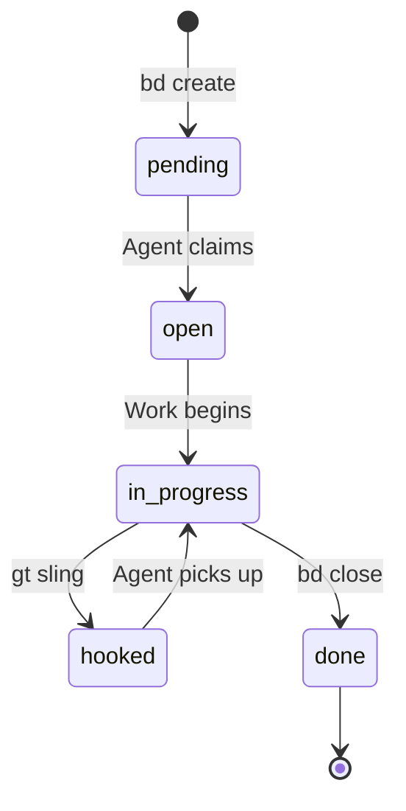
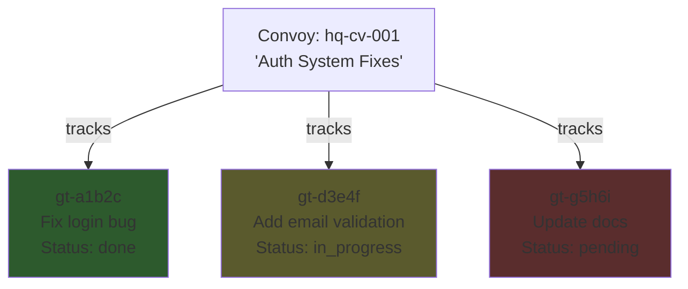
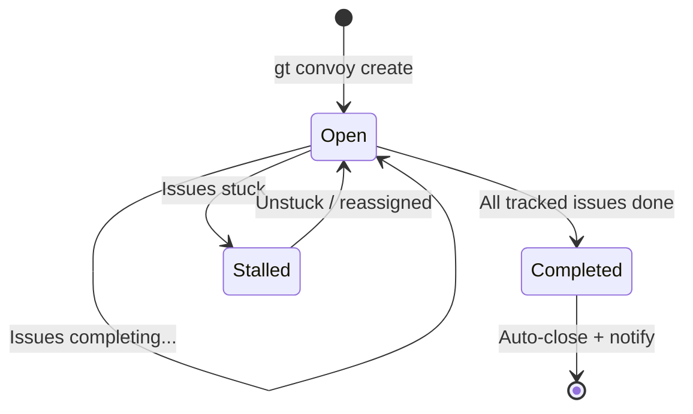

# Beads Tutorial

This tutorial walks you through the Beads issue tracking system from first principles. By the end, you will know how to create and manage work items, set up dependencies, use slots to attach work to agents, and coordinate batches of work with convoys.

:::info[Prerequisites]

This tutorial assumes you have a working Gas Town installation with `bd` available on your PATH. If you have not set up Gas Town yet, see [Getting Started](../getting-started/index.md). For the conceptual overview, see [Beads (Issue Tracking)](../concepts/beads.md).

:::

---

## What Is a Bead?

A **bead** is an atomic unit of tracked work -- an issue, task, bug, feature, or any other work item. Beads are stored in a SQLite database inside the `.beads/` directory of your repository, managed entirely through the `bd` CLI. This design makes Beads usable by both humans and AI agents working through the terminal.

```
.beads/
├── beads.db           # SQLite database (primary store)
├── formulas/          # TOML workflow templates
├── README.md          # Onboarding documentation
└── daemon.log         # Daemon activity log
```

Every bead has a unique ID with a prefix that identifies which rig it belongs to:

```
gt-abc12    # A bead in the "gt" rig
bd-def34    # A bead in the "bd" rig
hq-cv-001   # A town-level convoy bead
```

---

## Creating Beads

Use `bd create` to create a new bead.

### Basic Creation

```bash
# Minimal creation -- just a title
bd create --title "Fix login bug"
# Created: gt-abc12

# Shorthand (title as positional argument)
bd create "Add email validation"
# Created: gt-def34
```

### Full Creation with Metadata

```bash
bd create --title "Fix login bug" \
  --type bug \
  --priority 1 \
  --label "auth" \
  --label "critical" \
  --description "Login fails when password contains special characters"
# Created: gt-abc12
```

### All `bd create` Options

| Flag | Description |
|------|-------------|
| `--title <text>` | Bead title (required) |
| `--type <type>` | Bead type (see [Types](#bead-types) below) |
| `--priority <level>` | Priority level: 0-3 or `critical`, `high`, `medium`, `low` |
| `--description <text>` | Detailed description |
| `--label <label>` | Add a label (repeatable) |
| `--rig <name>` | Assign to a specific rig |
| `--parent <id>` | Set parent bead for hierarchical tracking |
| `--convoy <id>` | Add to an existing convoy |

---

## Bead Types

Every bead has a **type** that determines its semantics. Set the type at creation time with `--type`:

| Type | Purpose | Example |
|------|---------|---------|
| `task` | General work item | "Refactor auth module" |
| `bug` | Defect report | "Login fails with special characters" |
| `feature` | New functionality | "Add email notifications" |
| `chore` | Non-feature work | "Update dependencies" |
| `epic` | Large feature grouping | "Auth system redesign" |
| `message` | Communication record | Internal agent message |
| `escalation` | Priority alert | "CI broken for 2 hours" |
| `merge-request` | Merge queue entry | Polecat branch ready for merge |
| `agent` | Agent state bead | Polecat runtime status |
| `convoy` | Batch tracking | Group of related issues |
| `wisp` | Ephemeral tracking | Temporary molecule step |

For everyday work, you will mostly use `task`, `bug`, `feature`, and `epic`.

```bash
bd create --title "Refactor auth module" --type task
bd create --title "Login fails on Safari" --type bug --priority 1
bd create --title "Add dark mode" --type feature
bd create --title "Auth system redesign" --type epic
```

---

## Priorities

Priority levels control escalation routing and work ordering. Priorities use numeric codes (0-3):

| Priority | Code | Name | Escalation Route |
|----------|------|------|-----------------|
| P0 | 0 | Critical | Bead, Mail:Mayor, Email:Human, SMS:Human |
| P1 | 1 | High | Bead, Mail:Mayor, Email:Human |
| P2 | 2 | Medium | Bead, Mail:Mayor |
| P3 | 3 | Low | Bead only |

You can use either the numeric code or the name:

```bash
# These are equivalent
bd create --title "Security vulnerability" --priority 0
bd create --title "Security vulnerability" --priority critical

# Default priority is P2 (medium)
bd create --title "Minor UI improvement"
```

Higher priority beads are picked up first by agents and escalate more aggressively when stuck.

---

## The Bead Lifecycle

Beads progress through a defined set of statuses:



| Status | Meaning | How You Get Here |
|--------|---------|-----------------|
| `pending` | Created, not yet assigned | Initial state after `bd create` |
| `open` | Acknowledged, ready for work | Agent or human claims it |
| `in_progress` | Actively being worked on | `bd update <id> --status in_progress` |
| `hooked` | Attached to an agent's hook | After `gt sling` assigns it |
| `done` | Completed and closed | After `bd close` |

### Walking Through the Lifecycle

Here is a typical bead moving through its full lifecycle:

```bash
# 1. Create the bead (status: pending)
bd create --title "Fix login redirect loop" --type bug --priority 1
# Created: gt-abc12

# 2. Claim the work (status: in_progress)
bd update gt-abc12 --status in_progress

# 3. Do the work...
# (edit code, run tests, etc.)

# 4. Close the bead (status: done)
bd close gt-abc12 --reason "Fixed OAuth callback URL"
```

In practice, much of this lifecycle is automated. When the Mayor slings work to a rig, the bead status transitions to `hooked` automatically. When a polecat picks it up, it moves to `in_progress`. When the polecat runs `gt done`, the bead closes.

---

## Listing and Filtering Beads

Use `bd list` to find beads matching specific criteria.

### Basic Listing

```bash
# List all open beads
bd list

# List by status
bd list --status open
bd list --status in_progress
bd list --status closed
```

### Filtered Queries

```bash
# High-priority bugs
bd list --type bug --priority high

# Beads in a specific rig
bd list --rig myproject

# Beads with a specific label
bd list --label "auth"

# Most recent 10 beads, sorted by update time
bd list --limit 10 --sort updated

# JSON output for scripting
bd list --json
```

### Finding Available Work

The `bd ready` command is a shortcut for finding beads that are available to work on -- those in `pending` or `open` status with no blockers:

```bash
bd ready
```

This is the command agents run at the start of each session to discover their next task.

### All `bd list` Options

| Flag | Description |
|------|-------------|
| `--status <status>` | Filter: `open`, `in_progress`, `closed`, `pending`, `hooked` |
| `--type <type>` | Filter by type |
| `--priority <level>` | Filter by priority |
| `--rig <name>` | Filter by rig |
| `--label <label>` | Filter by label |
| `--limit <n>` | Maximum number of results |
| `--sort <field>` | Sort by: `created`, `updated`, `priority` |
| `--json` | Output in JSON format |

---

## Viewing Bead Details

Use `bd show` to view the full details of a specific bead:

```bash
bd show gt-abc12
```

Sample output:

```
? gt-abc12 · Fix login redirect loop   [● P1 · IN_PROGRESS]
Owner: mayor · Assignee: polecat/toast · Type: bug
Created: 2026-01-15 · Updated: 2026-01-15

DESCRIPTION
Login fails when password contains special characters.
OAuth callback URL is malformed.
```

### Options

```bash
# Show as JSON (useful for scripting)
bd show gt-abc12 --json

# Include comments
bd show gt-abc12 --comments
```

---

## Updating Beads

Use `bd update` to modify a bead's fields:

```bash
# Change status
bd update gt-abc12 --status in_progress

# Change priority
bd update gt-abc12 --priority critical

# Add a comment
bd update gt-abc12 --comment "Reproduced the issue on staging"

# Add a label
bd update gt-abc12 --label "reviewed"

# Assign to an agent
bd update gt-abc12 --assign polecat/toast
```

### Closing Beads

Use `bd close` to mark a bead as complete:

```bash
# Simple close
bd close gt-abc12

# Close with a reason
bd close gt-abc12 --reason "Fixed in commit abc1234"

# Close multiple beads at once
bd close gt-abc12 gt-def34 gt-ghi56
```

### Reopening Beads

If a bead was closed prematurely:

```bash
bd reopen gt-abc12
```

---

## Blocking Relationships (Dependencies)

Beads can depend on other beads. A blocked bead cannot be worked on until its dependencies are resolved.

### Creating Dependencies

```bash
# "gt-def34 depends on gt-abc12"
# (gt-def34 is blocked until gt-abc12 completes)
bd dep add gt-def34 gt-abc12
```

You can also use the `--blocks` shorthand for the reverse direction:

```bash
# "gt-abc12 blocks gt-def34" (same result as above)
bd dep gt-abc12 --blocks gt-def34
```

:::danger[Dependency Direction Gotcha]

Temporal language inverts dependencies. "Phase 1 blocks Phase 2" feels like `bd dep add phase1 phase2`, but that is **wrong**.

- **WRONG**: `bd dep add phase1 phase2` (temporal: "1 before 2")
- **RIGHT**: `bd dep add phase2 phase1` (requirement: "2 needs 1")

**Rule**: Think "X needs Y", not "X comes before Y".

:::

### Viewing Dependencies

```bash
# Show what is blocking a specific bead
bd show gt-def34
# (the output includes blocking/blocked-by information)

# Show all blocked beads across the project
bd blocked

# Show the full dependency tree
bd dep tree gt-abc12

# List dependencies of a specific bead
bd dep list gt-def34
```

### Removing Dependencies

```bash
bd dep remove gt-def34 gt-abc12
```

### Detecting Cycles

If you accidentally create a circular dependency:

```bash
bd dep cycles
```

### Practical Example: Dependent Tasks

```bash
# Create the foundation task
bd create --title "Design auth API schema" --type task
# Created: gt-a1b2c

# Create a task that depends on the schema
bd create --title "Implement auth endpoints" --type task
# Created: gt-d3e4f

# Create another that depends on the implementation
bd create --title "Write auth integration tests" --type task
# Created: gt-g5h6i

# Set up the dependency chain
bd dep add gt-d3e4f gt-a1b2c   # Implement depends on Design
bd dep add gt-g5h6i gt-d3e4f   # Tests depend on Implement

# Verify the chain
bd dep tree gt-a1b2c
# gt-a1b2c  Design auth API schema
# └── gt-d3e4f  Implement auth endpoints
#     └── gt-g5h6i  Write auth integration tests

# Only the first task shows up as ready
bd ready
# gt-a1b2c  Design auth API schema  [ready]
```

When `gt-a1b2c` completes, `gt-d3e4f` automatically becomes ready. When `gt-d3e4f` completes, `gt-g5h6i` becomes ready. Agents discover newly unblocked work by running `bd ready`.

---

## Slots

**Slots** are named references on agent beads that point to other beads. They are the mechanism that connects agents to their current work.

### What Are Slots?

Agent beads (beads of type `agent`) have named slots:

| Slot | Purpose | Cardinality |
|------|---------|-------------|
| `hook` | Current work attached to the agent | 0 or 1 |
| `role` | Role definition bead | Required |

The `hook` slot is the most important -- it holds the bead an agent is currently working on. This is what makes Gas Town crash-safe: when an agent restarts, it reads its hook slot to find where it left off.

### Viewing Slots

```bash
# Show all slots for an agent
bd slot show gt-emma

# Show mayor's slots
bd slot show gt-mayor
```

### Setting Slots

```bash
# Attach work to an agent's hook
bd slot set gt-emma hook gt-abc12

# Set an agent's role bead
bd slot set gt-mayor role gt-role-def
```

:::note

The hook slot enforces cardinality -- if it is already occupied, `bd slot set` will error. You must clear the existing hook first.

:::

### Clearing Slots

```bash
# Detach work from an agent's hook
bd slot clear gt-emma hook
```

### How Slots Relate to `gt sling` and `gt hook`

In practice, you rarely use `bd slot` directly. The higher-level `gt` commands handle slot management for you:

- **`gt sling gt-abc12 myrig`** -- Creates a polecat, sets its hook slot to the bead, and spawns it
- **`gt hook`** -- Reads the current agent's hook slot to show what work is attached
- **`gt done`** -- Clears the hook slot and marks the bead as done

The `bd slot` commands are useful for debugging, manual recovery, and administrative operations when you need direct control over agent-to-work bindings.

---

## Wisps

**Wisps** are lightweight sub-beads that represent individual steps within a [molecule](../concepts/molecules.md) (multi-step workflow). They are ephemeral by default -- they exist while the molecule is active but are not exported to JSONL.

### What Are Wisps?

When a molecule is created from a formula, each step becomes a wisp bead. Wisps track fine-grained progress within a workflow:

```
Molecule: mol-polecat-work
├── load-context      [✓ done]        ← wisp
├── branch-setup      [✓ done]        ← wisp
├── implement         [● in_progress] ← wisp (current)
├── self-review       [○ pending]     ← wisp
├── run-tests         [○ pending]     ← wisp
└── submit-and-exit   [○ pending]     ← wisp
```

### Wisp States

| Symbol | State | Meaning |
|--------|-------|---------|
| `○` | pending | Not yet started |
| `●` | in_progress | Currently being worked on |
| `✓` | done | Completed successfully |
| `✗` | failed | Failed (may need retry) |
| `⏸` | gated | Waiting on an async gate |

### How Wisps Work

You do not create wisps directly -- they are generated automatically when a formula is poured into a molecule. Agents interact with wisps through molecule commands:

```bash
# See current molecule steps (wisps)
bd ready

# The agent works on the current step, then marks it done
bd close <step-id>

# Check what's next
bd ready
```

### Wisp Lifecycle

1. A formula is **poured** into a molecule, creating wisp beads for each step
2. Wisps are worked through in dependency order
3. When all wisps complete, the molecule is done
4. The molecule is **squashed** into a single digest bead, and the wisps are discarded

This squash pattern keeps the beads database clean while preserving an audit trail at the molecule level.

### When You See Wisps

You will encounter wisps in two places:

- **`bd ready`** output when working inside a molecule (shows your current and next steps)
- **`gt mol status`** output showing the full molecule progress

Since wisps are ephemeral, they do not appear in `bd list` by default.

---

## Convoys

A **convoy** bundles multiple beads into a batch for coordinated tracking. Convoys auto-close when all their tracked items complete and notify subscribers on landing.

### Why Convoys?

When the Mayor receives "Fix the auth module, add email validation, and update the docs," that becomes three beads. A convoy tracks them as a unit:



### Creating Convoys

```bash
# Create from existing beads
gt convoy create "Auth System Fixes" gt-a1b2c gt-d3e4f gt-g5h6i
# Created: hq-cv-001

# Create with just a name (add issues later)
gt convoy create "Sprint 42"
# Created: hq-cv-002
```

### Adding Issues to a Convoy

```bash
gt convoy add hq-cv-001 gt-h7i8j
gt convoy add hq-cv-001 gt-h7i8j gt-k9l0m
```

### Checking Convoy Progress

```bash
# List all convoys
gt convoy list

# Show convoy details
gt convoy show hq-cv-001
```

Sample output:

```
Convoy: hq-cv-001 "Auth System Fixes"
Status: OPEN
Progress: 2/3 issues completed

Tracked Issues:
  [DONE]        gt-a1b2c  Fix login bug
  [IN_PROGRESS] gt-d3e4f  Add email validation
  [PENDING]     gt-g5h6i  Update docs

Created: 2026-01-15T10:30:00Z
```

### Convoy Lifecycle



| State | Meaning |
|-------|---------|
| **Open** | At least one tracked issue is not yet done |
| **Completed** | All tracked issues have closed |
| **Stalled** | Issues exist but none are making progress |

### Auto-Close

Convoys close automatically when all their tracked issues reach a terminal state (`done`, `wontfix`, etc.). The Deacon checks convoy completion during its patrol cycle. You almost never need to close a convoy manually.

### Cross-Project Tracking

Convoys can track beads across multiple rigs:

```bash
gt convoy create "Cross-rig refactor" gt-a1b2c bd-d3e4f docs-x5y6z
```

### Finding Stranded Convoys

A stranded convoy has ready work that no agent is assigned to:

```bash
gt convoy stranded
```

### Convoy Command Reference

| Command | Description |
|---------|-------------|
| `gt convoy create <title> [bead-ids...]` | Create a new convoy |
| `gt convoy add <convoy-id> <bead-ids...>` | Add issues to a convoy |
| `gt convoy list` | List all convoys |
| `gt convoy status <convoy-id>` | Show convoy progress summary |
| `gt convoy show <convoy-id>` | Show full convoy details |
| `gt convoy close <convoy-id>` | Manually close a convoy |
| `gt convoy check <convoy-id>` | Check if convoy can auto-close |
| `gt convoy stranded` | Find convoys with unassigned work |

---

## Practical Workflows

### Workflow 1: Solo Developer

A single developer tracking their own work:

```bash
# File work as you discover it
bd create --title "Fix login redirect" --type bug --priority 1
bd create --title "Add input validation" --type task
bd create --title "Update API docs" --type chore

# See what's ready
bd ready

# Claim and work on the highest priority item
bd update gt-abc12 --status in_progress

# ... do the work ...

# Close it
bd close gt-abc12 --reason "Fixed in commit abc1234"

# Move on to the next
bd ready
```

### Workflow 2: Mayor-Driven Multi-Agent

The Mayor receives a request and coordinates agents:

```bash
# 1. Mayor creates beads for each task
bd create --title "Fix login redirect" --type bug --priority 1
bd create --title "Add email validation" --type feature
bd create --title "Update auth docs" --type task

# 2. Mayor bundles them into a convoy
gt convoy create "Auth Sprint" gt-abc12 gt-def34 gt-ghi56

# 3. Mayor slings work to rigs (spawning polecats)
gt sling gt-abc12 myproject
gt sling gt-def34 myproject
gt sling gt-ghi56 docs

# 4. Polecats execute autonomously...
# Each polecat: gt hook → bd ready → implement → gt done

# 5. Convoy auto-closes when all three beads complete
gt convoy status hq-cv-001
# Progress: 3/3 done → COMPLETED
```

### Workflow 3: Dependent Task Chain

Work items that must be completed in order:

```bash
# Create the tasks
bd create --title "Design API schema" --type task
# Created: gt-a1b2c
bd create --title "Implement API endpoints" --type task
# Created: gt-d3e4f
bd create --title "Write integration tests" --type task
# Created: gt-g5h6i
bd create --title "Deploy to staging" --type task
# Created: gt-j7k8l

# Set up the dependency chain
bd dep add gt-d3e4f gt-a1b2c   # Implement needs Design
bd dep add gt-g5h6i gt-d3e4f   # Tests need Implement
bd dep add gt-j7k8l gt-g5h6i   # Deploy needs Tests

# Only Design is ready now
bd ready
# gt-a1b2c  Design API schema

# As each completes, the next unblocks automatically
```

### Workflow 4: Agent Session Startup

What happens when a polecat starts a work session:

```bash
# 1. Check the hook (what work is assigned?)
gt hook

# 2. Check molecule steps (what do I need to do?)
bd ready

# 3. Work on the current step
# ... implement, test, review ...

# 4. Mark step complete
bd close <step-id>

# 5. Check for next step
bd ready

# 6. When all steps are done, submit
gt done
```

---

## Syncing with Git

Beads stores data in SQLite locally but can export to JSONL for git-based persistence:

```bash
# Export beads to JSONL (for git commit)
bd sync --flush-only

# Full sync with remote
bd sync
```

The typical session completion flow:

```bash
git add .
git commit -m "Implement feature X"
bd sync --flush-only
git add .beads/
git commit -m "Sync beads state"
git push
```

---

## Command Quick Reference

| Command | Description |
|---------|-------------|
| `bd create` | Create a new bead |
| `bd list` | List beads with optional filters |
| `bd ready` | Find available work (not blocked, not assigned) |
| `bd show <id>` | Show full details of a bead |
| `bd update <id>` | Update bead metadata |
| `bd close <id>` | Close a completed bead |
| `bd reopen <id>` | Reopen a closed bead |
| `bd blocked` | Show all blocked beads |
| `bd dep add <a> <b>` | Make bead A depend on bead B |
| `bd dep tree <id>` | Show dependency tree |
| `bd dep cycles` | Detect circular dependencies |
| `bd slot show <agent>` | Show agent's slots |
| `bd slot set <agent> <slot> <bead>` | Set a slot |
| `bd slot clear <agent> <slot>` | Clear a slot |
| `bd sync` | Sync beads with git |
| `bd search <query>` | Search beads by text |
| `bd status` | Show database overview and statistics |
| `gt convoy create` | Create a convoy |
| `gt convoy list` | List convoys |
| `gt convoy show <id>` | Show convoy details |
| `gt convoy add <id> <beads...>` | Add beads to a convoy |
| `gt convoy stranded` | Find convoys with unassigned work |
| `gt sling <bead> <rig>` | Assign work to a rig |
| `gt hook` | Check current agent's hook |
| `gt done` | Complete work and submit to merge queue |

---

## Related Concepts

- **[Beads (Concept)](../concepts/beads.md)** -- Conceptual overview of the beads architecture
- **[Convoys](../concepts/convoys.md)** -- Deep dive into convoy mechanics
- **[Molecules & Formulas](../concepts/molecules.md)** -- Multi-step workflows built on wisps
- **[Hooks](../concepts/hooks.md)** -- Persistent agent-to-work bindings
- **[Gates](../concepts/gates.md)** -- Async coordination primitives
- **[CLI Reference: Work Management](../cli-reference/work.md)** -- Full CLI reference for `bd` and `gt` work commands
- **[Glossary](glossary.md)** -- Complete terminology reference
