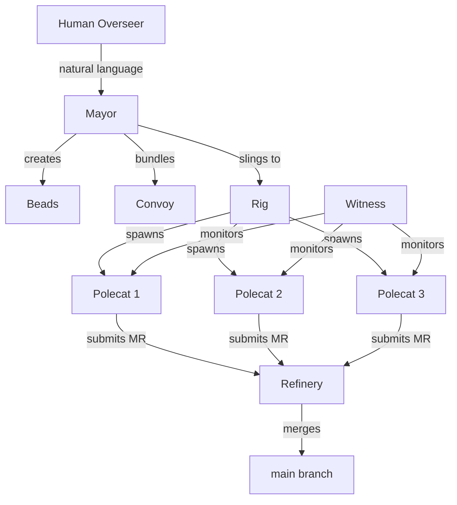
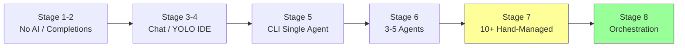

# The 8 Stages of AI Coding

This guide maps out the progression of AI-assisted software development, from basic code completions to building your own multi-agent orchestrator. Gas Town targets users at **Stage 7 and above** -- if you are not yet there, this guide will help you understand the path.

The framework is based on the work of [Steve Yegge](https://steve-yegge.medium.com/), Gas Town's creator, who has been tracking and predicting AI coding adoption since 2023. Yegge's earlier article [Revenge of the Junior Developer](https://sourcegraph.com/blog/revenge-of-the-junior-developer) identified six overlapping "modality waves" -- traditional coding, completions, chat, coding agents, agent clusters, and agent fleets -- each roughly 5x more productive than the last. The 8 Stages model refines this into a practitioner-focused maturity framework.

> "If you extrapolated from completions in 2023 to chat in 2024 to agents in early 2025, you arrived inescapably at orchestration arriving in early 2026."
>
> -- Steve Yegge, *[Software Survival 3.0](https://steve-yegge.medium.com/software-survival-3-0-97a2a6255f7b)*

---

## The Stages

### Stage 1: Zero AI

You write all code by hand. No AI assistance of any kind.

```text
You: *types every character*
AI:  *does not exist in your workflow*
```

**Characteristics:**

- Pure manual coding
- Traditional IDE features only (syntax highlighting, basic autocomplete)
- "AI is a toy / not ready / will take my job"

**When this was common:** Before 2023

---

### Stage 2: Completions

You use AI-powered code completion -- a smarter version of autocomplete that predicts multiple lines at once.

```text
You: def calculate_tax(
AI:  income, rate=0.25):
         return income * rate
```

**Characteristics:**

- Tab-complete suggestions (GitHub Copilot, Codeium, etc.)
- AI fills in boilerplate and obvious patterns
- You accept or reject each suggestion
- Still fundamentally human-driven development

**Tools:** GitHub Copilot, Codeium, TabNine, Amazon CodeWhisperer

**When this became mainstream:** Early 2023

> "Vibe coding just means letting the AI do the work."
>
> -- Steve Yegge, *[Revenge of the Junior Developer](https://sourcegraph.com/blog/revenge-of-the-junior-developer)*

---

### Stage 3: Chat in IDE

You use an AI chat panel alongside your editor. You ask questions, get explanations, request code snippets, and paste them into your project.

```text
You: "How do I add JWT authentication to this Express app?"
AI:  *provides explanation and code snippet*
You: *copies and adapts the code*
```

**Characteristics:**

- Side panel chat in your IDE
- Context-aware (can see your current file)
- Copy-paste workflow
- AI is a knowledgeable assistant you consult

**Tools:** Copilot Chat, Cursor Chat, Cody, Continue

**When this became mainstream:** Late 2023

> "Each successive modality wave, beginning with chat, is conservatively about 5x as productive as the previous wave."
>
> -- Steve Yegge, *The Future of Coding Agents*

---

### Stage 4: Agent in IDE with YOLO Mode

You let the AI agent edit files directly in your IDE. In "YOLO mode," you approve changes in batches rather than line by line. The agent can read your codebase, run commands, and make multi-file changes.

```text
You: "Refactor the auth module to use middleware pattern"
AI:  *edits 6 files, runs tests, shows diff*
You: "Looks good, apply it"
```

**Characteristics:**

- Agent makes edits directly (not just suggestions)
- Multi-file changes
- Can run terminal commands
- You review and approve batches of changes
- The agent fills your screen with its work

**Tools:** Cursor Agent, Windsurf, Cline, Aider

**When this became mainstream:** Early 2024

> "Once you have tried coding agents, and figured out how to be effective with them, you will never want to go back."
>
> -- Steve Yegge, *[Revenge of the Junior Developer](https://sourcegraph.com/blog/revenge-of-the-junior-developer)*

---

### Stage 5: CLI Single Agent, YOLO

You move from the IDE to a dedicated CLI agent running in your terminal. The agent has full access to your project, runs commands, edits files, and operates with minimal supervision.

```bash
claude "Add input validation to all API endpoints and write tests"
# Agent works for 10-30 minutes autonomously
```

**Characteristics:**

- Full terminal-based agent
- Complete project access
- Runs unsupervised for extended periods
- Single agent, single project
- You review results, not process

**Tools:** Claude Code, Gemini CLI, Codex CLI, Aider

**When this became mainstream:** Late 2024 / Early 2025

:::note[The CLI Turning Point]

Stage 5 is where most developers realize the bottleneck shifts from "writing code" to "managing agents." A single agent can do the work of 2-3 developers, but you can only run one at a time.

> "It's not AI's job to prove it's better than you. It's your job to get better using AI."
>
> -- Steve Yegge, *[Revenge of the Junior Developer](https://sourcegraph.com/blog/revenge-of-the-junior-developer)*

:::

---

### Stage 6: CLI Multi-Agent (3-5 Parallel)

You run 3-5 CLI agents in parallel, each working on a different task. You manage them manually using tmux panes or multiple terminals.

```bash
# Terminal 1
claude "Fix the login bug"

# Terminal 2
claude "Add email validation"

# Terminal 3
claude "Write integration tests for the API"
```

**Characteristics:**

- Multiple agents working simultaneously
- Manual coordination (you assign tasks and track progress)
- Merge conflicts start to appear
- Context management becomes challenging
- 3-5x throughput increase over Stage 5

**When this became common:** Early-Mid 2025

> "They are so incredibly effective that it's easy to get greedy and smother the goose."
>
> -- Steve Yegge, *[Revenge of the Junior Developer](https://sourcegraph.com/blog/revenge-of-the-junior-developer)*

:::warning[The Coordination Wall]

At 3-5 agents, manual coordination is still manageable. Beyond that, you hit the coordination wall: merge conflicts multiply, you lose track of what each agent is doing, and context management becomes a full-time job.

:::

---

### Stage 7: 10+ Agents, Hand-Managed

You scale to 10 or more agents running simultaneously. You develop ad-hoc scripts and workflows to manage them: automated git worktree creation, tmux scripting, custom issue tracking, manual merge coordination.

```bash
# Your custom scripts
./spawn-agent.sh feature-auth worktree-1
./spawn-agent.sh fix-tests worktree-2
./spawn-agent.sh refactor-db worktree-3
# ... 7 more
./check-status.sh
./merge-next.sh
```

**Characteristics:**

- 10+ simultaneous agents
- Custom scripts for lifecycle management
- Home-grown worktree management
- Manual merge sequencing
- You spend significant time on coordination vs. directing work
- Some agents crash; you restart them manually
- Work gets lost; you build recovery tools

**The realization:** You are building an orchestrator whether you planned to or not.

> "The new job of a software developer going forward will soon be managing dashboards of coding agents."
>
> -- Steve Yegge, *[Revenge of the Junior Developer](https://sourcegraph.com/blog/revenge-of-the-junior-developer)*

> "If you're not at least Stage 7, or maybe Stage 6 and very brave, then you will not be able to use Gas Town."
>
> -- Steve Yegge, *[Welcome to Gas Town](https://steve-yegge.medium.com/welcome-to-gas-town-4f25ee16dd04)*

---

### Stage 8: Building Your Own Orchestrator

You formalize the ad-hoc scripts from Stage 7 into a proper orchestration system. You build or adopt a framework that handles agent lifecycle, work distribution, merge coordination, health monitoring, and escalations.



```bash
# A proper orchestration system
gt start --all
gt mayor attach
# "Build the auth system, run all tests, deploy to staging"
# 15 agents coordinate automatically
```

**Characteristics:**

- Formal agent hierarchy and supervision
- Automated work distribution
- Serialized merge queue
- Health monitoring and auto-recovery
- Persistent work state that survives crashes
- Escalation routing for human intervention
- Cost tracking and resource management

**This is where Gas Town lives.**

> "Gas Town is a new take on the IDE for 2026. Gas Town helps you with the tedium of running lots of Claude Code instances."
>
> -- Steve Yegge, *[Welcome to Gas Town](https://steve-yegge.medium.com/welcome-to-gas-town-4f25ee16dd04)*

> "Working effectively in Gas Town involves committing to vibe coding. Work becomes fluid, an uncountable that you sling around freely."
>
> -- Steve Yegge, *[Welcome to Gas Town](https://steve-yegge.medium.com/welcome-to-gas-town-4f25ee16dd04)*

> "Most work gets done; some work gets lost. Fish fall out of the barrel. Some escape back to sea, or get stepped on. The focus is throughput: creation and correction at the speed of thought."
>
> -- Steve Yegge, *[Welcome to Gas Town](https://steve-yegge.medium.com/welcome-to-gas-town-4f25ee16dd04)*

---

## The Progression Timeline

Each stage transition represents roughly a 5x productivity gain, compounding as you climb:

> "Each successive modality wave, beginning with chat, is conservatively about 5x as productive as the previous wave."
>
> -- Steve Yegge, *[Revenge of the Junior Developer](https://sourcegraph.com/blog/revenge-of-the-junior-developer)*



| Stage | Era | Agent Count | Coordination |
|-------|-----|-------------|--------------|
| 1-2 | Pre-2023 / 2023 | 0 | N/A |
| 3-4 | 2023-2024 | 1 (in IDE) | N/A |
| 5 | Late 2024 | 1 (CLI) | N/A |
| 6 | Early 2025 | 3-5 | Manual |
| 7 | Mid 2025 | 10+ | Ad-hoc scripts |
| 8 | Late 2025+ | 10-30+ | Orchestration system |

---

## Where Gas Town Fits

Gas Town is a **Stage 8** orchestration system. It provides the infrastructure that Stage 7 users end up building by hand:

| Stage 7 (DIY) | Stage 8 (Gas Town) |
|----------------|---------------------|
| Custom spawn scripts | `gt sling` / `gt start --all` |
| Manual worktree management | Automatic per-polecat worktrees |
| Ad-hoc issue tracking | Beads (`bd`) integrated tracking |
| Manual merge queue | Refinery with auto-rebase |
| No health monitoring | Witness + Deacon + Daemon |
| Lost work on crash | Hooks persist across restarts |
| Manual escalation (Slack msg) | `gt escalate` with severity routing |
| Unknown costs | `gt costs` with per-agent breakdown |

> "Gas Town helps with all that yak shaving, and lets you focus on what your Claude Codes are working on."
>
> -- Steve Yegge, *[Welcome to Gas Town](https://steve-yegge.medium.com/welcome-to-gas-town-4f25ee16dd04)*

> "What I did was make their hallucinations real, over and over, by implementing whatever I saw the agents trying to do."
>
> -- Steve Yegge, *[Software Survival 3.0](https://steve-yegge.medium.com/software-survival-3-0-97a2a6255f7b)*

---

## Readiness Assessment

### You ARE Ready for Gas Town If:

- [x] You have run 5+ CLI agents simultaneously
- [x] You have written scripts to manage agent lifecycles
- [x] You have dealt with merge conflicts from parallel agents
- [x] You understand git worktrees
- [x] You are comfortable with tmux
- [x] You have a project large enough to benefit from parallel work
- [x] You are willing to spend time learning a new operational model
- [x] You accept the cost implications (~$100/hour at peak)

### You Are NOT Ready If:

- [ ] You have not used a CLI coding agent (Stage 5)
- [ ] You only run one agent at a time
- [ ] You are not comfortable with git branching and merging
- [ ] You prefer GUI-based workflows exclusively
- [ ] You are not willing to invest in learning the system

:::tip[Recommendation]

Be solidly at **Stage 7** before adopting Gas Town. Spend time at Stage 6 (3-5 agents) to build intuition for multi-agent coordination. Then move to Stage 7 (10+ with scripts) to understand the pain points Gas Town solves. Stage 8 will feel natural once you have experienced the limitations of hand-managing many agents.

:::

---

## The Inevitability Argument

Steve Yegge's core thesis: each stage is **inevitable**. Once developers discover that the next stage is possible, competitive pressure ensures widespread adoption within 6-12 months.

> "If you believe the AI researchers -- who have been spot-on accurate for literally four decades"
>
> -- Steve Yegge, *[Software Survival 3.0](https://steve-yegge.medium.com/software-survival-3-0-97a2a6255f7b)*

```text
Stage 5 developers: "Why would I need more than one agent?"
Stage 6 developers: "OK, 3 agents is amazing, but 10 is chaos"
Stage 7 developers: "I've built a pile of scripts... wait, is this an orchestrator?"
Stage 8 developers: "Yes. Yes it is."
```

The pattern is consistent: what seems excessive today becomes standard practice within a year. Gas Town is built on the assumption that Stage 8 multi-agent orchestration will be as normal in 2026-2027 as AI completions are today.

> "These systems are, in a meaningful sense, crystallized cognition, a financial asset, very much like (as Brendan Hopper has observed) money is crystallized human labor."
>
> -- Steve Yegge, *[Software Survival 3.0](https://steve-yegge.medium.com/software-survival-3-0-97a2a6255f7b)*

> "Supervisor agents can and will start doing most of that for us very soon."
>
> -- Steve Yegge, *[Revenge of the Junior Developer](https://sourcegraph.com/blog/revenge-of-the-junior-developer)*

> "Gas Town has illuminated and kicked off the next wave for everyone."
>
> -- Steve Yegge, *[Software Survival 3.0](https://steve-yegge.medium.com/software-survival-3-0-97a2a6255f7b)*

## Related

- [Background & Philosophy](philosophy.md) -- The inevitability argument, Software Survival 3.0, and community reception
- [Quick Start](../getting-started/quickstart.md) -- Get started with Gas Town if you are at Stage 7 or above
- [Architecture Guide](architecture.md) -- How Gas Town implements Stage 8 orchestration
- [Usage Guide](usage-guide.md) -- Practical day-to-day patterns for working at Stage 8

### Blog Posts

- [What Stage Are You? A Self-Assessment for AI Coding Maturity](/blog/eight-stages-self-assessment) -- Find out where you fall on the 8 Stages model and get advice for leveling up
- [Welcome to the Gas Town Blog](/blog/welcome) -- Introducing Gas Town and the documentation blog for new users
