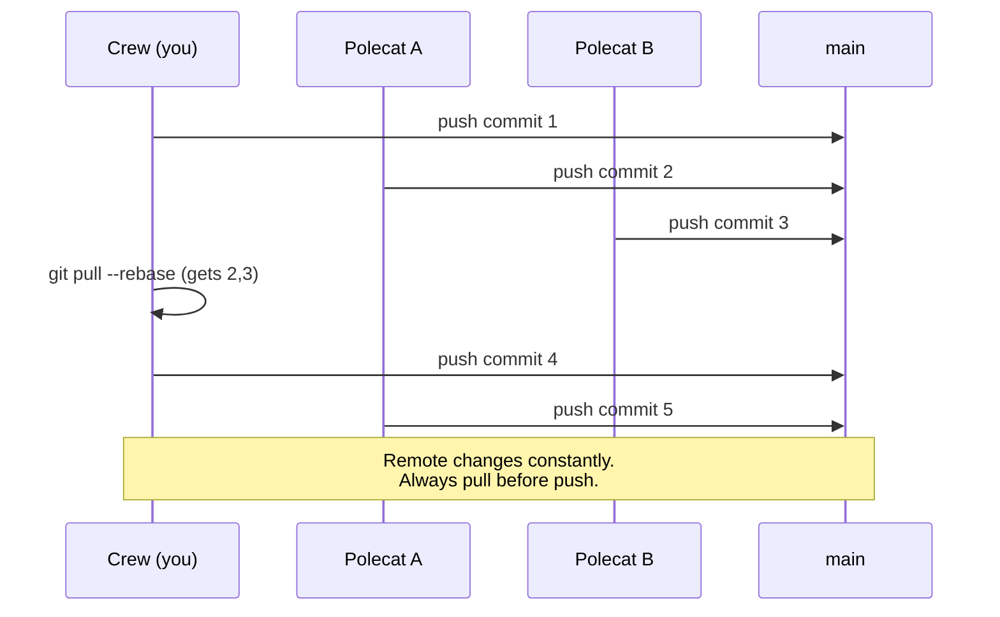
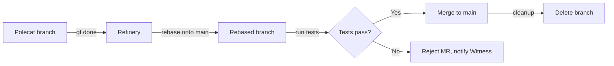
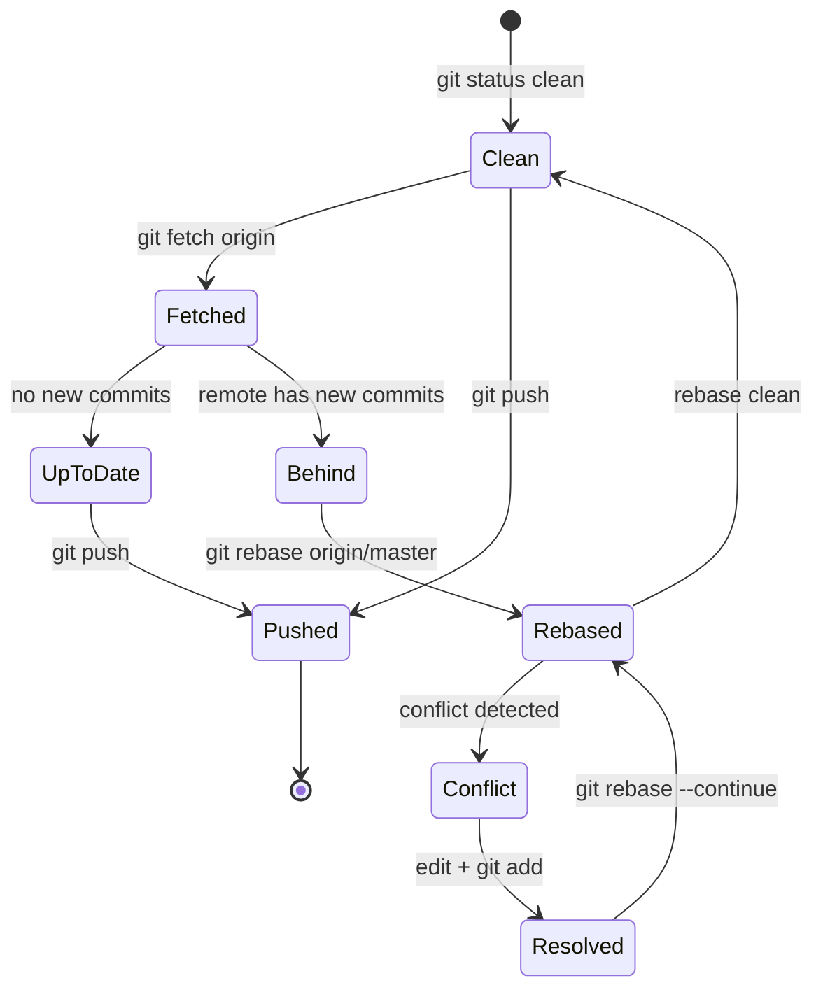
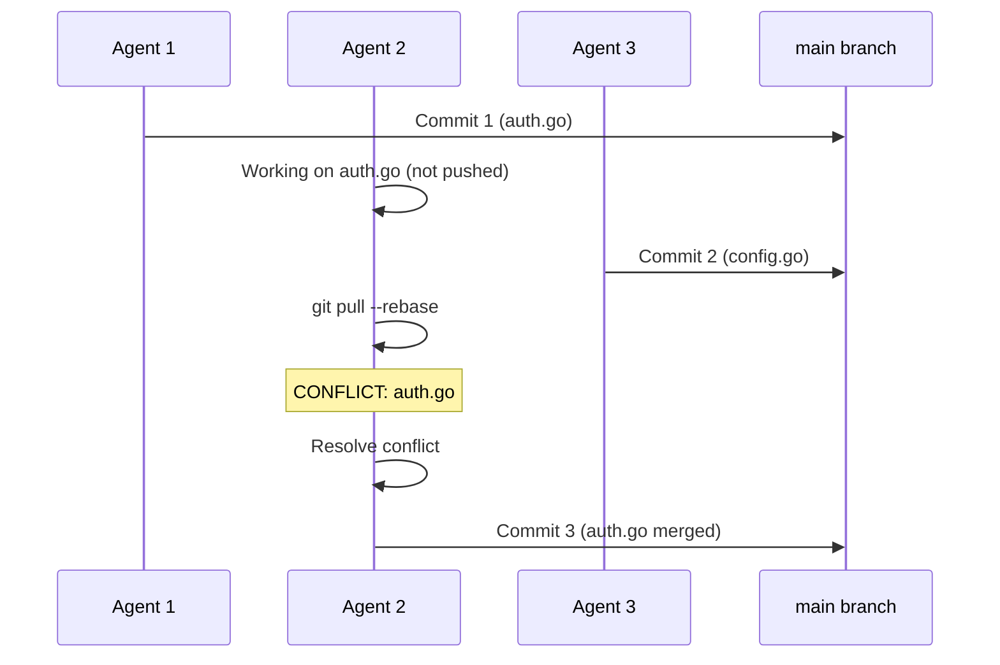
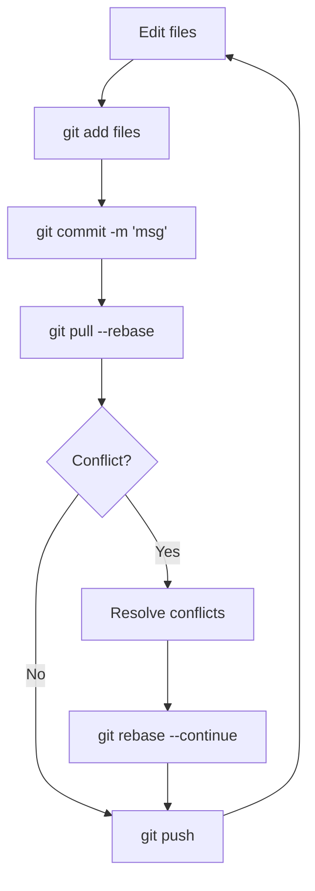
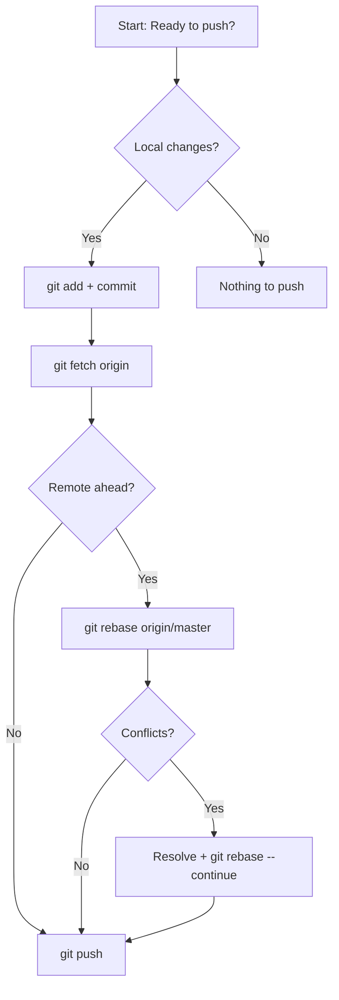

# Multi-Agent Git Workflow

Gas Town's multi-agent architecture creates unique git workflow challenges. Multiple agents (crew members, polecats, refinery) work simultaneously on the same repository, leading to frequent remote changes and potential merge conflicts. This guide provides strategies for managing git in this environment.

---

## The Challenge

:::tip[Blog Post]

For a higher-level overview with practical tips, see [Git Workflows for Multi-Agent Development](/blog/git-workflows-multi-agent).

:::

In a traditional single-developer workflow, you push code when you're done working. In Gas Town:

- **Polecats** push completed work constantly (every few minutes)
- **Crew workers** share the same repository
- **Refinery** merges to main automatically
- **Remote state** changes faster than you can type `git status`

This creates race conditions where your local branch diverges from remote almost immediately.



---

## Golden Rules

:::warning
In Gas Town, unpushed work is invisible to every other agent. The longer you wait to push, the more merge conflicts you accumulate and the more work you risk losing.
:::

:::danger[Force Push is Never Safe]
Never use `git push --force` or `git push --force-with-lease` on main or any shared branch in a multi-agent environment. Force pushing rewrites history that other agents may have already based their work on, creating unrecoverable divergence and potentially losing committed work from other polecats.
:::

### 1. Pull Before Every Push

**Always pull before pushing**, even if you just pulled 5 minutes ago:

```bash
# ❌ WRONG: Push without checking remote
git commit -m "Add feature"
git push  # Will fail if remote changed

# ✅ CORRECT: Always pull first
git commit -m "Add feature"
git pull --rebase
git push
```

**Why `--rebase`?** It keeps git history linear, which is essential when multiple agents are pushing simultaneously. Merge commits create noise and complicate the history.

### 2. Commit Frequently, Push Immediately

In multi-agent environments, **work that isn't pushed doesn't exist**. If your local branch has unpushed commits:

- Other agents can't build on your work
- You're accumulating merge conflicts
- A session restart loses your context (but git preserves commits)

**Best practice:**

```bash
# Every logical unit of work = commit + push
git add <files>
git commit -m "Implement X"
git pull --rebase && git push

# Don't accumulate multiple commits locally
# Push each one immediately
```

### 3. Expect Merge Conflicts

With agents working simultaneously, merge conflicts are normal, not exceptional. Don't be surprised when:

```bash
git push
# ! [rejected] master -> master (fetch first)
```

This just means someone else pushed first. It's not a failure—it's the system working.

---

## Handling Frequent Remote Changes

:::info[Pull Frequency in Multi-Agent Environments]

In a Gas Town rig with 5+ active polecats, the remote main branch can advance 10-20 commits per hour during peak productivity. This means your local branch can fall behind within minutes of checking out. Adjust your mental model from "pull occasionally when needed" to "pull before every push without exception" to avoid constant rebase conflicts.

:::

### Detecting When Remote Changed

```bash
# Check if remote has new commits
git fetch
git status

# Output shows if you're behind:
# Your branch is behind 'origin/master' by 3 commits
```

### Rebasing Onto Remote

```bash
# Safe rebase workflow
git fetch origin
git rebase origin/master

# If conflicts occur (see below)
```

### When You're Too Far Behind

If remote has diverged significantly (20+ commits):

```bash
# Check what you have locally that isn't pushed
git log origin/master..HEAD

# If it's important work, create a branch
git branch backup/my-work

# Then reset to remote and cherry-pick what you need
git reset --hard origin/master
git cherry-pick <commit-hash>
```

---

## Conflict Resolution Strategies

### Add/Add Conflicts

**Symptom:** Multiple agents create the same file with different content.

```text
Auto-merging docs/new-guide.md
CONFLICT (add/add): Merge conflict in docs/new-guide.md
```

**Resolution:**

```bash
# Option 1: Keep both versions (manual merge)
# Edit the file to combine content from both
vim docs/new-guide.md
git add docs/new-guide.md
git rebase --continue

# Option 2: Take remote version (if your version is obsolete)
git checkout --theirs docs/new-guide.md
git add docs/new-guide.md
git rebase --continue

# Option 3: Take your version (if remote is wrong)
git checkout --ours docs/new-guide.md
git add docs/new-guide.md
git rebase --continue
```

**Prevention:** Before creating new files, check if they exist on remote:

```bash
git fetch
git ls-tree origin/master | grep <filename>
```

### Content Conflicts

**Symptom:** Same file modified by multiple agents.

```text
Auto-merging src/main.go
CONFLICT (content): Merge conflict in src/main.go
```

**Resolution:**

```bash
# View conflict markers
cat src/main.go
# <<<<<<< HEAD
# Your changes
# =======
# Remote changes
# >>>>>>> origin/master

# Edit to resolve
vim src/main.go

# Mark as resolved
git add src/main.go
git rebase --continue
```

**Prevention:** Coordinate work through beads dependencies. If two tasks touch the same file, make one depend on the other:

```bash
bd dep add task-2 task-1  # task-2 depends on task-1
```

### Aborting and Retrying

If a rebase goes wrong:

```bash
# Abort the rebase
git rebase --abort

# Start over with a fresh fetch
git fetch
git rebase origin/master
```

---

:::info

If you are working in a crew workspace and see unexpected files in `git status`, another agent may have pushed changes to shared configuration files. Always run `git diff` before staging to avoid accidentally committing someone else's in-progress work.

:::

## Crew Worker Workflow

Crew workers push directly to main (no feature branches):

```bash
# Start of work session
cd ~/gt/<rig>/crew/<name>
git pull  # Get latest

# Do work, commit, push frequently
# ... edit files ...
git add <files>
git commit -m "Description"
git pull --rebase && git push

# Repeat for each logical unit of work
```

### When Push Fails

```bash
git push
# ! [rejected]

# Pull with rebase
git pull --rebase

# If conflicts occur, resolve them
git status  # Shows conflicts
vim <conflicted-file>
git add <conflicted-file>
git rebase --continue

# Push again
git push
```

### Keeping Your Branch Fresh

```bash
# Pull regularly, even when not pushing
# Prevents accumulating drift

# Every 10-15 minutes or before starting new work
git fetch && git pull --rebase
```

---

## Polecat Workflow

Polecats work on branches and submit via the refinery:

```bash
# Polecats create feature branches
git checkout -b polecat/<name>/<bead-id>

# Work and commit
git add -A
git commit -m "Implement feature"

# Push to their branch
git push origin polecat/<name>/<bead-id>

# When done, use gt done (refinery handles merge)
gt done
```

Polecats don't merge to main themselves. The refinery:
1. Rebases the polecat's branch onto latest main
2. Runs tests
3. Merges if tests pass
4. Cleans up the branch



---

## Reducing Merge Conflicts





### Strategy 1: File-Level Coordination

Assign related work to the same agent:

```bash
# If tasks A and B both touch auth.go
# Assign both to the same polecat or crew member

gt sling task-a <rig> --agent alice
gt sling task-b <rig> --agent alice
```

### Strategy 2: Serialization via Dependencies

Make tasks sequential when they touch the same code:

```bash
# task-b waits for task-a to complete
bd dep add task-b task-a
```

### Strategy 3: Small, Focused Changes

Break large tasks into smaller beads:

```bash
# ❌ WRONG: One bead that touches 20 files
bd create --title "Refactor authentication system"

# ✅ CORRECT: Multiple focused beads
bd create --title "Extract auth helpers"
bd create --title "Add session validation"
bd create --title "Update auth middleware"
bd dep add auth-2 auth-1  # Sequential
bd dep add auth-3 auth-2
```

---

## Checking Git State

### Before Starting Work

```bash
# Ensure you're up to date
git fetch
git status
# Should show: "Your branch is up to date with 'origin/master'"

# If behind:
git pull --rebase
```

### During Work

```bash
# Check what you've changed
git status

# Check what you're about to commit
git diff
git diff --staged
```

### Before Pushing

```bash
# Check for new remote commits
git fetch
git log HEAD..origin/master  # Shows what's new on remote

# If empty: safe to push
# If not empty: pull first
git pull --rebase
```

---

:::note
When resolving merge conflicts during a rebase, always run your tests before completing the rebase with `git rebase --continue`. A conflict resolution that compiles but breaks tests will propagate the failure to every subsequent polecat that rebases onto your commit.
:::

:::tip[Conflict Prevention via Scheduling]
If you notice the same files conflicting repeatedly across multiple polecats, consider time-boxing conflicting work instead of relying solely on bead dependencies. Assign all tasks touching a hot file to complete in sequence during the same 2-hour window, then let the next batch start fresh after merges settle. This reduces churn better than many fine-grained dependencies.
:::

## The Commit-Push-Pull Cycle

In a multi-agent environment, every agent follows this tight loop to minimize divergence from remote.



## When to Use Branches

**Crew workers:** Never. Push directly to main.

**Polecats:** Always. Use `polecat/<name>/<bead-id>` format.

**Cross-rig work (`gt worktree`):** Uses branches automatically. Submit via refinery when done.

---

## Emergency Recovery

:::tip
Git's reflog is your safety net. Even after a bad rebase or reset, `git reflog` shows every state your HEAD has been in. You can almost always recover.
:::

### Lost Work After Session Restart

Commits are safe even if the session dies:

```bash
# View recent commits (even if detached)
git reflog

# Find your work
git log --all --oneline | grep <keyword>

# Recover a commit
git cherry-pick <commit-hash>
```

### Diverged Completely from Remote

```bash
# Save your work first
git branch backup/my-work

# Reset to remote
git fetch origin
git reset --hard origin/master

# Cherry-pick your commits if needed
git cherry-pick <commit-hash>
```

### Rebase Gone Wrong

```bash
# Abort immediately
git rebase --abort

# Check reflog for pre-rebase state
git reflog

# Reset to before the rebase
git reset --hard HEAD@{N}  # where N is the step before rebase started
```

---

## Tools and Commands Reference

| Command | Purpose |
|---------|---------|
| `git pull --rebase` | Get remote changes, replay yours on top |
| `git fetch` | Download remote changes without merging |
| `git status` | Check local vs remote state |
| `git log origin/master..HEAD` | Show unpushed commits |
| `git log HEAD..origin/master` | Show commits on remote you don't have |
| `git reflog` | View history of HEAD changes (recovery tool) |
| `git rebase --abort` | Cancel a rebase in progress |
| `git rebase --continue` | Continue rebase after resolving conflicts |
| `git cherry-pick <hash>` | Apply a specific commit to current branch |
| `git branch backup/<name>` | Save current state before risky operations |

---

## Best Practices Summary

1. **Always `git pull --rebase`** before pushing
2. **Push immediately** after every commit (don't accumulate local commits)
3. **Expect conflicts** as normal, not exceptional
4. **Use dependencies** to serialize conflicting work
5. **Keep changes small** to minimize conflict surface area
6. **Check remote state** before starting work (`git fetch && git status`)
7. **Commit frequently** (every logical unit of work)
8. **Never force push** to main (for crew) or shared branches
9. **Save state** before risky operations (`git branch backup/...`)
10. **Use reflog** for recovery if things go wrong

---

## When to Ask for Help

If you encounter:
- Repeated merge conflicts on the same files (coordination issue)
- Git commands failing with "unknown" errors (possible corruption)
- Lost commits that reflog can't find (rare, but escalate)
- Rebase loops (aborting and retrying doesn't help)

Escalate to:
```bash
# For crew workers: ask the overseer
gt mail send --human -s "Git issue" -m "Description"

# For polecats: ask the witness
gt mail send <rig>/witness -s "Git issue" -m "Description"
```

---

## Philosophy: Git in Multi-Agent Systems

Traditional git workflows assume:
- One person controls when changes happen
- You can "finish" before someone else starts
- Remote changes are infrequent

Gas Town inverts these assumptions:
- **Many agents** push simultaneously
- **No one controls** the global push schedule
- **Remote changes** are constant

The workflow adapts by:
- Rebasing (not merging) to keep history linear
- Pushing immediately (not batching)
- Expecting conflicts (not avoiding them)
- Using beads dependencies for coordination

This requires more discipline but enables true parallel development.

### Git Workflow Decision Steps



## Related

- [Architecture Guide](architecture.md) -- How the Refinery merge pipeline processes code from polecats to main
- [Operations: Troubleshooting](../operations/troubleshooting.md) -- Resolving merge conflicts, git worktree issues, and push failures
- [Polecats](../agents/polecats.md) -- How ephemeral workers use feature branches and git worktrees
- [Refinery](../agents/refinery.md) -- The merge queue agent that serializes all merges to main

### Blog Posts

- [Git Workflows for Multi-Agent Development](/blog/git-workflows-multi-agent) -- Practical guide to rebasing, conflict resolution, and the landing rule in multi-agent repos
- [The Refinery: How Merges Actually Work in Gas Town](/blog/refinery-deep-dive) -- Deep dive into how the Refinery serializes parallel agent work into clean history
- [5 Common Pitfalls When Starting with Gas Town](/blog/common-pitfalls) -- Avoid frequent mistakes including git workflow anti-patterns
- [Scaling Gas Town Beyond 30 Agents](/blog/scaling-beyond-30) -- Architectural patterns for managing git at scale with dozens of concurrent agents
- [Code Review with Gas Town Polecats: 10 Perspectives in Parallel](/blog/code-review-workflow) -- How code review integrates with Git workflows in multi-agent development
