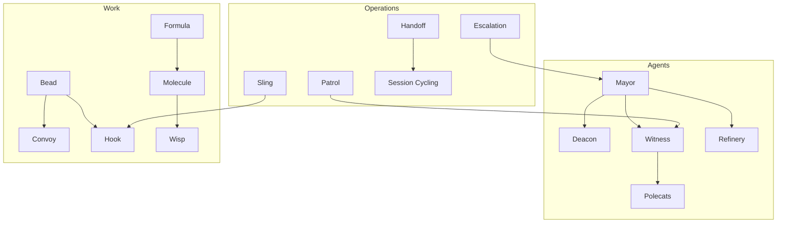
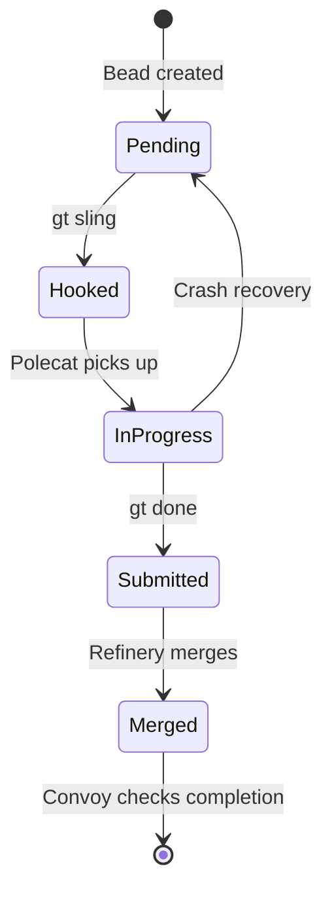
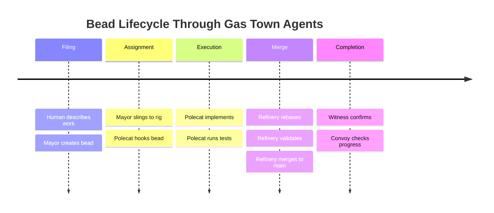
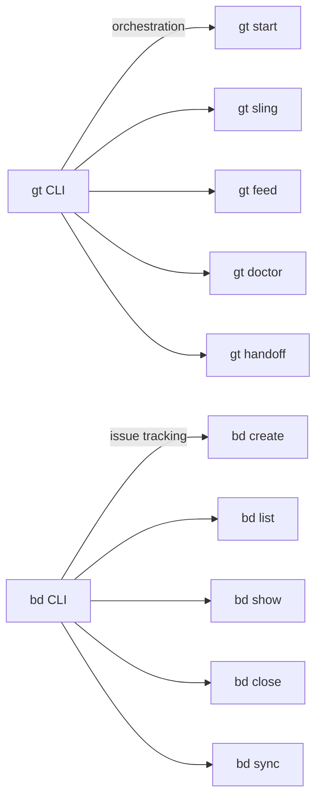

# Glossary

A comprehensive reference for Gas Town terminology, drawn from the documentation and Steve Yegge's articles on multi-agent AI orchestration.



---

## Agents

| Term | Definition |
|------|------------|
| **Mayor** | The top-level orchestrator agent. Receives instructions from the human, breaks work into beads, creates convoys, and coordinates all other agents. You interact with Gas Town primarily through the Mayor. |
| **Deacon** | The background health coordinator. Monitors agent health, handles escalations, and coordinates recovery when agents crash. Named after a religious figure who keeps order. |
| **Witness** | Per-rig monitoring agent. Watches polecats, validates their work, detects crashes, and reports status. Inspired by Mad Max's "Witness me!" |
| **Refinery** | The merge queue agent. Processes completed work from polecats, rebasing and merging to main one at a time. Prevents merge chaos from parallel agents. |
| **Polecats** | Ephemeral worker agents. Spawn, claim a bead, execute a molecule, submit work, then exit. Named after the pole-swinging warriors in Mad Max. |
| **Dogs** | Cross-rig utility agents that handle tasks spanning multiple rigs (e.g., dependency updates, cross-project refactoring). |
| **Crew** | Human-paired agents for interactive, collaborative work sessions. Unlike polecats, crew agents are long-lived and maintain context with a human operator. |
| **Boot** | Triage agent that assesses incoming work, classifies complexity, and recommends assignment strategies. |
| **Daemon** | The background Go process that manages agent lifecycles, runs health checks, and provides the `gt` CLI interface. |

:::tip
Use your browser's search (Ctrl+F) to quickly find terms. For deeper explanations, follow the links in the Related section at the bottom.
:::



## Core Concepts

| Term | Definition |
|------|------------|
| **Bead** | An atomic unit of tracked work — an issue, task, bug, or feature. Stored in git via the `bd` CLI. Beads are the fundamental work primitive in Gas Town. |
| **Convoy** | A batch of related beads that travel together. Created when the Mayor breaks a large request into individual tasks. Tracks overall progress of a batch. |
| **Hook** | A persistent pointer from an agent to its current bead. The hook is what makes Gas Town crash-safe — agents read their hook on startup to know what they were working on. |
| **Molecule** | A running instance of a multi-step workflow. Tracks which steps are done, in progress, or pending. Persists in beads so agents can resume after crashes. |
| **Formula** | A TOML-defined template for creating molecules. Formulas are blueprints; molecules are live instances. Gas Town ships with 30+ built-in formulas. |
| **Gate** | An async coordination primitive. A gate blocks a molecule step until a condition is met (e.g., "wait for code review approval" or "wait for dependent bead to complete"). |
| **Rig** | A project container wrapping a git repository. Each rig has its own set of polecats, a witness, and a refinery. A Gas Town workspace typically runs 2-5 rigs. |
| **Town** | The top-level workspace directory containing all rigs, the Mayor, the Deacon, and shared configuration. Typically located at `~/gt`. |
| **Worktree** | A git worktree providing file-level isolation for each polecat. Each polecat gets its own worktree so agents never edit shared files simultaneously. |
| **Wisp** | A sub-bead — a lightweight tracking unit that represents a single step within a molecule. Ephemeral by default (not exported to JSONL). |
| **Mail** | The asynchronous messaging system between agents. Messages are stored as beads and routed by address (e.g., `mayor/`, `myrig/witness`). |
| **Guzzoline** | Slang for the specifications, plans, and designs that Crew members create. Polecats consume guzzoline — they execute the plans Crew produces. |
| **DND** | Do Not Disturb mode. When enabled, an agent suppresses non-critical notifications and nudges. Toggle with `gt dnd`. |
| **Seance** | A command (`gt seance`) that lets you query predecessor sessions for context, useful when picking up work from a crashed or cycled agent. |

The following diagram shows how a typical work item flows through Gas Town's key agents during its lifecycle:



## The MEOW Stack

| Term | Definition |
|------|------------|
| **MEOW Stack** | **M**olecules, **E**pics, **O**rchestration, **W**orkflows — Gas Town's layered abstraction model. Each layer builds on the one below, from individual molecule steps up to full workflow orchestration. |
| **Protomolecule** | A higher-order orchestration pattern that coordinates multiple molecules working in parallel at the convoy level. |
| **Pour** | The act of creating a molecule instance from a formula template. "Pour the shiny formula" creates a new shiny molecule. |
| **Squash** | Compressing a completed molecule into a single digest bead. Used by patrol agents to keep the beads database clean. |
| **Burn** | Archiving a completed molecule. The molecule is marked done and no longer appears in active status. |

:::info
The MEOW Stack page is the best resource for understanding how Molecules, Epics, Orchestration, and Workflows compose into Gas Town's layered abstraction model. See [The MEOW Stack](../concepts/meow-stack.md) for the full breakdown.
:::

## Design Principles

:::note
These principles are not just theory — they are enforced by specific Gas Town primitives. See [Design Principles](../architecture/design-principles.md) for how each one is implemented.
:::

| Term | Definition |
|------|------------|
| **GUPP** | Gas Town Universal Propulsion Principle — every operation must move the system forward or leave it unchanged. No operation should move backward. |
| **NDI** | Nondeterministic Idempotence — operations may produce different outputs each time (because AI is nondeterministic), but the system state after execution is equivalent. |
| **Nudge** | A synchronous message that interrupts an agent with new context or instructions. The escape hatch for stuck agents. |
| **Let It Crash** | Erlang-inspired philosophy: rather than preventing every failure, design for recovery. Polecats are expected to crash; the system handles it gracefully. |
| **Discovery over Tracking** | Agents observe reality each patrol cycle rather than maintaining fragile in-memory state. |
| **Scotty Principle** | Named after the Star Trek engineer: never proceed past a failure. The Refinery does not merge code that fails validation. Polecats run preflight tests before starting. |

## Operations

| Term | Definition |
|------|------------|
| **Landing the Plane** | The mandatory session completion workflow. Includes filing remaining work, running quality gates, updating issues, pushing to remote, and writing handoff notes. |
| **Patrol** | A recurring monitoring cycle. Witnesses, Refinery, and Deacon all run patrol molecules — looping through check-act cycles. |
| **Escalation** | A routing mechanism for problems that an agent cannot resolve on its own. Escalations travel up the agent hierarchy until someone (or the human) handles them. |
| **Sling** | Assigning a bead to an agent. `gt sling gt-a1b2c myrig` sends the bead to the specified rig for a polecat to pick up. |
| **Feed** | The live activity stream showing real-time events from all agents across all rigs. |
| **Trail** | A summary of recent activity, more condensed than the live feed. |
| **Prime** | Reloading an agent's full context from its CLAUDE.md file, hooks, and beads state. Run `gt prime` after compaction, crashes, or new sessions. |
| **Handoff** | Transferring context from one session to the next. Writes summary notes that the next session picks up automatically. |
| **Session Cycling** | Refreshing an agent's context window without losing work. The hook persists across sessions; handoff mail carries context notes. |
| **Death Warrant** | A structured cleanup request filed by the Deacon when an agent becomes a zombie. Boot processes warrants to recover work before terminating the process. |
| **Park** | Pausing a rig. The rig's agents stop, but state is preserved. `gt rig park myrig`. |

## Software Survival 3.0

| Term | Definition |
|------|------------|
| **Software Survival 3.0** | Steve Yegge's thesis that competitive selection pressure now favors teams that effectively use multi-agent AI. The third era of software selection pressure. |
| **The 8 Stages** | A maturity model for AI-assisted development, from Stage 1 (zero AI) through Stage 8 (building your own orchestrator). Gas Town targets Stage 7+ users. |
| **Survival Formula** | (Savings x Usage x H) / (Awareness + Friction) — the formula determining whether a software tool survives. |
| **Plot Armor** | A survival ratio so high (in the thousands) that a tool becomes effectively indestructible. No LLM will waste tokens re-synthesizing what the tool already does perfectly. `grep` is the canonical example. Extreme velocity from AI orchestration can provide plot armor. |
| **Human Coefficient (H)** | A multiplier in the survival formula representing human preference for human-made output. Higher H means the domain values human involvement, giving software in that domain an extra survival advantage beyond pure efficiency. |

## Mad Max Naming

| Gas Town Term | Mad Max Origin | System Role |
|---------------|---------------|-------------|
| **Gas Town** | The oil refinery citadel | The workspace — central hub of operations |
| **Mayor** | Ruler of Gas Town | The coordinator who runs everything |
| **Rig** | War rig (armored truck) | A project being managed |
| **Polecat** | Warriors on poles raiding vehicles | Ephemeral workers doing quick tasks |
| **Refinery** | Where crude oil becomes fuel | Where code is merged to main |
| **Witness** | "Witness me!" (validation cry) | The monitor who watches and validates |
| **Convoy** | Group of vehicles traveling together | A batch of tasks moving through the system |
| **Deacon** | A religious authority figure | The health monitor who keeps order |

## Usage Patterns

| Term | Definition |
|------|------------|
| **Three Developer Loops** | The nested feedback loops for Gas Town operations: Outer Loop (days-weeks, strategic planning), Middle Loop (hours-days, agent coordination), Inner Loop (minutes, task delegation and output review). |
| **PR Sheriff** | An ad-hoc Crew role with a permanent hook to manage pull requests. On each session startup, the PR Sheriff checks open PRs, classifies them by complexity, and slings easy wins to other Crew or polecats. |
| **Vibe Coding** | A development approach where you let the AI do the work while focusing on direction and review. Gas Town embraces vibe coding as a core philosophy -- tolerating some work loss in exchange for throughput. |
| **Guzzoline** | Slang for the specifications, plans, and design work that Crew members produce. Polecats consume this guzzoline to execute well-specified tasks. From the Mad Max fuel terminology. |

:::warning
Gas Town terminology is intentionally distinct from generic software terms. When searching documentation or asking agents for help, use the Gas Town-specific terms (e.g., "bead" instead of "ticket," "sling" instead of "assign," "convoy" instead of "sprint") for more precise results.
:::

:::caution

Some terms in the glossary have evolved across Gas Town versions. If you encounter a term in an older blog post or GitHub issue that does not match a definition here, the glossary reflects the current meaning. When in doubt, check the linked concept page for full context.

:::

## CLI Quick Reference



The two primary CLIs for interacting with Gas Town:

```bash
# Gas Town orchestration
gt <command> [options]

# Beads issue tracking
bd <command> [options]
```

| Command | Purpose |
|---------|---------|
| `gt` | The main Gas Town CLI |
| `bd` | The Beads issue tracking CLI |
| `gt start` | Start the Mayor and Deacon |
| `gt start --all` | Start the full agent fleet |
| `gt down` | Pause all agents (preserve state) |
| `gt shutdown` | Full stop and cleanup |
| `gt mayor attach` | Attach terminal to Mayor session |
| `gt sling <bead> <rig>` | Assign work to a rig |
| `gt feed` | Live activity stream |
| `gt trail` | Recent activity summary |
| `gt doctor` | System health check |
| `gt costs` | Token usage and cost tracking |
| `gt prime` | Reload agent context |
| `gt handoff` | Write handoff notes |
| `gt nudge <agent> <msg>` | Send sync message to agent |
| `gt mol status` | Show current molecule progress |
| `gt formula run <name>` | Pour a formula into a molecule |
| `gt may at` | Attach to Mayor (short for `gt mayor attach`) |
| `gt crew at <name>` | Attach to a Crew workspace (use `--rig <rig>` if needed) |
| `gt rig park <rig>` | Pause a rig (preserve state, stop agents) |
| `gt rig unpark <rig>` | Resume a parked rig |
| `gt escalate <msg>` | Create an escalation for problems agents cannot resolve |
| `gt polecat list` | List active polecats across rigs |
| `gt mail inbox` | Check your inbox |
| `gt done` | Signal work ready for merge queue |

## Related

- [Architecture Guide](architecture.md) -- Narrative walkthrough of how all the components work together
- [System Overview](../architecture/overview.md) -- Five-layer reference breakdown of the Gas Town architecture
- [The 8 Stages of AI Coding](eight-stages.md) -- Maturity model for AI-assisted development that Gas Town targets
- [Background & Philosophy](philosophy.md) -- Why Gas Town exists and the design thinking behind it

### Blog Posts

- [Welcome to the Gas Town Blog](/blog/welcome) -- Introducing the Gas Town documentation blog
- [Understanding GUPP: Why Crashes Don't Lose Work](/blog/understanding-gupp) -- How the Gas Town Universal Propulsion Principle makes multi-agent development crash-safe
- [Why Beads? AI-Native Issue Tracking](/blog/why-beads) -- Why Gas Town has its own issue tracker
- [The Witness Explained](/blog/witness-explained) -- How the Witness watchdog monitors agent health
- [The Deacon: Background Coordinator](/blog/deacon-patrol) -- Deacon patrol cycles and gate evaluation
- [Understanding Rigs](/blog/understanding-rigs) -- How rigs organize projects and agent infrastructure
- [Molecules and Formulas](/blog/molecules-and-formulas) -- The molecule engine that powers Gas Town workflows
- [What Stage Are You?](/blog/eight-stages-self-assessment) -- Self-assessment for AI coding maturity
