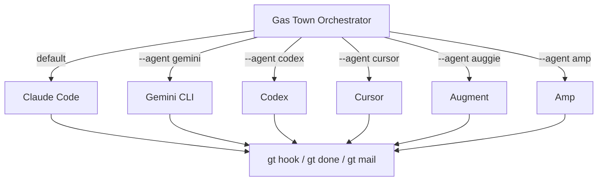
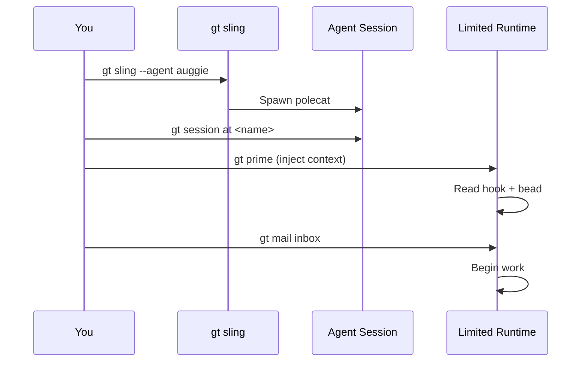
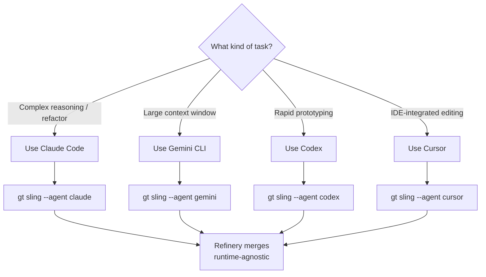
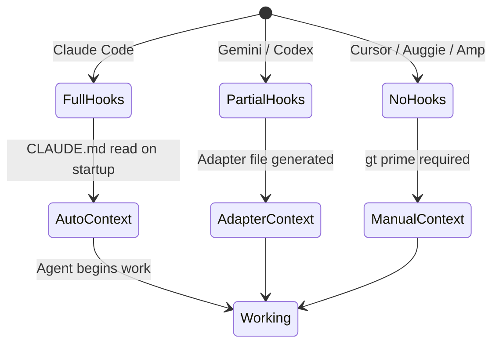
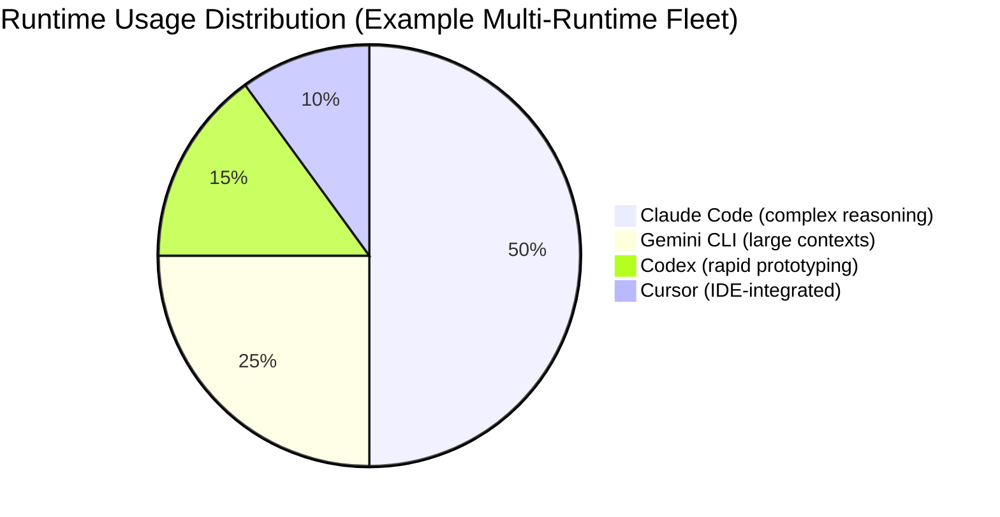
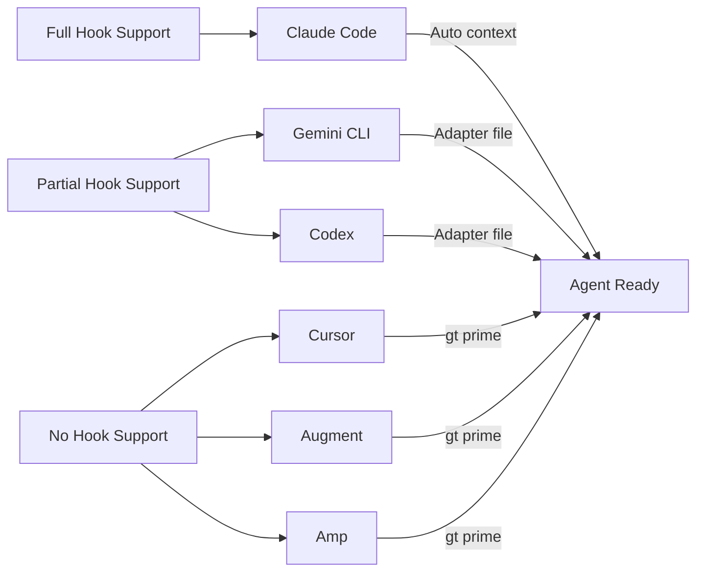

# Multi-Runtime Support

Gas Town is not locked to a single AI coding agent. While Claude Code is the default and most thoroughly supported runtime, Gas Town supports multiple agent runtimes -- allowing you to mix and match based on task requirements, cost, or preference.



---

## Supported Runtimes

| Runtime | CLI Command | Provider | Hook Support | Prompt Mode |
|---------|-------------|----------|-------------|-------------|
| **Claude Code** | `claude` | Anthropic | Full | CLAUDE.md |
| **Gemini CLI** | `gemini` | Google | Partial | GEMINI.md / prompt injection |
| **Codex** | `codex` | OpenAI | Partial | AGENTS.md / prompt injection |
| **Cursor** | `cursor` | Cursor | Limited | .cursorrules |
| **Auggie** | `auggie` | Augment | Limited | Prompt injection |
| **Amp** | `amp` | Sourcegraph | Limited | Prompt injection |

### Runtime Capabilities

| Capability | Claude | Gemini | Codex | Cursor | Auggie | Amp |
|-----------|--------|--------|-------|--------|--------|-----|
| Session hooks (startup/shutdown) | Yes | Partial | Partial | No | No | No |
| File-based context (CLAUDE.md) | Yes | Via adapter | Via adapter | Via .cursorrules | No | No |
| Mail integration | Yes | Yes | Yes | Limited | Limited | Limited |
| Nudge support | Yes | Yes | Yes | No | No | No |
| `gt done` integration | Yes | Yes | Yes | Yes | Yes | Yes |
| `gt prime` support | Yes | Yes | Yes | Partial | Partial | Partial |

---

## Configuration

### Default Runtime

Set the default runtime for the entire town:

```bash
gt config default-agent claude
```

This applies to all new polecats unless overridden at the rig or sling level.

### Per-Rig Configuration

Each rig can specify its own default runtime in `settings/config.json`:

```json
{
  "rigs": {
    "myproject": {
      "default_agent": "claude",
      "agent_config": {
        "claude": {
          "model": "opus",
          "max_tokens": 200000
        }
      }
    },
    "ml-pipeline": {
      "default_agent": "gemini",
      "agent_config": {
        "gemini": {
          "model": "2.5-pro"
        }
      }
    }
  }
}
```

### Per-Agent Configuration

```bash
# Set the runtime for a specific agent type
gt config agent set gemini "gemini"
gt config agent set codex "codex"

# Get current agent configuration
gt config agent get claude
```

---

## Using `--agent` with Sling

Override the runtime when slinging work to a polecat:

```bash
# Default runtime
gt sling gt-a1b2c myproject

# Specify a runtime
gt sling gt-a1b2c myproject --agent gemini
gt sling gt-d3e4f myproject --agent codex
gt sling gt-g5h6i myproject --agent claude
```

This spawns the polecat using the specified runtime instead of the rig or town default.

:::tip[When to Mix Runtimes]

- Use **Claude** for complex architectural work requiring deep reasoning
- Use **Gemini** for tasks involving large context windows or Google ecosystem integration
- Use **Codex** for rapid prototyping or OpenAI-ecosystem projects
- Use **Cursor** when you need tight IDE integration for a specific task

:::

---

## Runtime-Specific Considerations

### Claude Code (Default)

Claude Code has the deepest Gas Town integration:

- **Startup hooks:** Claude reads CLAUDE.md automatically on session start, giving it full Gas Town context
- **Session persistence:** Supports long-running sessions with context compaction
- **Native commands:** `gt prime`, `gt hook`, `gt done` work natively within Claude sessions
- **Prompt mode:** CLAUDE.md files in the project root and agent directories

```bash
# No special configuration needed
gt sling gt-a1b2c myproject --agent claude
```

### Gemini CLI

Gemini CLI integration uses adapters to bridge Gas Town's hook system:

- **Startup hooks:** Partial support via GEMINI.md adapter files
- **Context injection:** Gas Town generates a GEMINI.md context file that Gemini reads on startup
- **Prompt mode:** Supports both file-based context and prompt injection

```bash
# Configure Gemini
gt config agent set gemini "gemini"

# The adapter creates a GEMINI.md alongside CLAUDE.md
gt sling gt-a1b2c myproject --agent gemini
```

### Codex

OpenAI's Codex CLI integration:

- **Startup hooks:** Partial support via AGENTS.md adapter
- **Context injection:** Gas Town writes AGENTS.md files for Codex to read
- **Prompt mode:** Supports file-based context via AGENTS.md

```bash
gt config agent set codex "codex"
gt sling gt-a1b2c myproject --agent codex
```

### Cursor

Cursor agent operates differently from CLI-based agents:

- **No startup hooks:** Cursor does not read startup hooks in the same way
- **Context via .cursorrules:** Gas Town generates .cursorrules files with context
- **Limited nudge support:** Cursor sessions cannot receive real-time nudges

```bash
gt config agent set cursor "cursor"
gt sling gt-a1b2c myproject --agent cursor
```

:::warning[Cursor Limitations]

Cursor runs as an IDE extension, not a standalone CLI process. Gas Town's tmux-based session management has limited visibility into Cursor sessions. Health monitoring and nudge support are constrained.

:::

### Auggie and Amp

These runtimes have more limited Gas Town integration:

- **No native hook support:** Context must be injected manually
- **Prompt injection mode:** Gas Town prepends context to the agent's initial prompt
- **Limited monitoring:** Witness health checks have reduced coverage

```bash
gt config agent set auggie "auggie"
gt config agent set amp "amp"
```

---

## Startup Fallback for Hook-Limited Runtimes

Runtimes without full hook support (Cursor, Auggie, Amp) require a startup fallback to ensure agents receive their context and work assignments.

### `gt prime` -- Manual Context Injection

:::tip[Prime-First Discipline for Limited Runtimes]

When working with hook-limited runtimes like Cursor, Auggie, or Amp, establish a habit of running `gt prime` immediately after attaching to any session—even if you think the agent already has context. Manual context injection is cheap compared to the cost of an agent working with stale or incomplete information. Make `gt prime` the first command you run in every limited-runtime session without exception.

:::

After spawning an agent with a hook-limited runtime, manually inject context:

```bash
# In the agent's terminal/session
gt prime
```

This reads all relevant context (hooks, beads, mail, agent identity) and presents it as a structured prompt that the agent can process.

### `gt mail inbox` -- Check Pending Mail

For runtimes that support text input but not file-based hooks, check for pending messages after priming:

```bash
gt mail inbox
```

This shows all pending messages in the agent's mailbox. Read any relevant messages with `gt mail read <id>` to get assignment context.

### Recommended Startup Sequence for Limited Runtimes

```bash
# 1. Spawn the polecat
gt sling gt-a1b2c myproject --agent auggie

# 2. Attach to the session
gt session at <name> --rig myproject

# 3. Inject context
gt prime

# 4. Check pending mail
gt mail inbox

# 5. The agent now has full context and can begin work
```



:::note

For Claude Code and Gemini, this manual process is not necessary -- hooks handle context injection automatically.

:::

---

:::warning[Runtime Switching Mid-Task]
Avoid switching runtimes for the same bead mid-implementation. If a polecat running on Claude Code gets stuck and you release the bead to re-sling with Gemini, the new polecat may interpret the existing partial work differently, leading to inconsistent implementation or duplicated effort. When switching runtimes mid-task, add detailed handoff notes to the bead explaining what the previous attempt accomplished. For cross-runtime communication patterns, see [Agent Communication Patterns in Gas Town](/blog/agent-communication-patterns).
:::

## Runtime Selection Decision Tree



The following diagram shows how hook support degrades across runtimes and what fallback mechanisms are needed:



## Mixing Runtimes in a Single Rig

You can have polecats running different runtimes in the same rig simultaneously:

```bash
gt sling gt-a1b2c myproject --agent claude    # Complex refactor
gt sling gt-d3e4f myproject --agent gemini    # Documentation update
gt sling gt-g5h6i myproject --agent codex     # Quick bug fix
```

All three polecats work in separate git worktrees within the same rig, and all submit MRs to the same Refinery for merge.

:::warning[Merge Queue is Runtime-Agnostic]

The Refinery does not know or care which runtime produced the code. It validates and merges based on tests and conflict resolution, regardless of which AI wrote the code.

:::

---

## Configuration Reference

### Town-Level (`settings/config.json`)

```json
{
  "default_agent": "claude",
  "agents": {
    "claude": {
      "command": "claude",
      "model": "opus",
      "context_file": "CLAUDE.md",
      "hooks_supported": true
    },
    "gemini": {
      "command": "gemini",
      "model": "2.5-pro",
      "context_file": "GEMINI.md",
      "hooks_supported": "partial",
      "adapter": "gemini-adapter"
    },
    "codex": {
      "command": "codex",
      "context_file": "AGENTS.md",
      "hooks_supported": "partial",
      "adapter": "codex-adapter"
    },
    "cursor": {
      "command": "cursor",
      "context_file": ".cursorrules",
      "hooks_supported": false,
      "startup_fallback": true
    },
    "auggie": {
      "command": "auggie",
      "hooks_supported": false,
      "startup_fallback": true,
      "prompt_injection": true
    },
    "amp": {
      "command": "amp",
      "hooks_supported": false,
      "startup_fallback": true,
      "prompt_injection": true
    }
  }
}
```

### Per-Rig Override

```json
{
  "default_agent": "gemini",
  "agent_overrides": {
    "max_polecats": 5,
    "preferred_runtimes": ["gemini", "claude"]
  }
}
```

---

:::danger

Switching a rig's default runtime while polecats are actively working can cause hook deserialization failures. Always run `gt down` on the rig before changing the `default_agent` setting, then restart with `gt start --all`.

:::

:::caution[Runtime-Specific Hook Limitations]
When mixing runtimes within a single rig, be aware that hook-limited runtimes (Cursor, Auggie, Amp) require manual context injection on every session start. If you have both Claude and Cursor polecats active simultaneously, the Cursor polecats need explicit `gt prime` calls while Claude polecats start automatically. This asymmetry can create workflow inconsistencies if not managed carefully.
:::

## Multi-Runtime Best Practices

1. **Start with Claude Code.** It has the deepest integration and is the most thoroughly tested. Add other runtimes once you are comfortable with the basics.

2. **Use the right runtime for the task.** Claude excels at complex reasoning and multi-step refactors. Gemini handles large contexts well. Match the runtime to the work.

3. **Test runtime compatibility.** Before relying on a new runtime in production, run a test polecat and verify that `gt done`, hook reading, and merge submission all work correctly.

4. **Monitor runtime-specific issues.** Different runtimes have different failure modes. Watch `gt feed` for patterns specific to a runtime.

5. **Keep fallback procedures documented.** If you use hook-limited runtimes, document the startup sequence for your team so everyone knows the manual context injection steps.

The following pie chart shows a typical multi-runtime fleet composition balancing different runtimes based on task characteristics:



### Runtime Capability Comparison



## Related

- [Installation](../getting-started/installation.md) -- Supported runtimes and how to configure the default agent
- [Hooks](../concepts/hooks.md) -- How hooks attach work to agents and vary by runtime capability
- [Polecats](../agents/polecats.md) -- Ephemeral workers that can run on any supported runtime
- [Configuration](../cli-reference/configuration.md) -- CLI commands for setting default agents and rig-level overrides

### Blog Posts

- [Multi-Runtime Workflows with Gas Town](/blog/multi-runtime-workflows) -- How Gas Town orchestrates work across Claude Code, Gemini CLI, Codex, and other runtimes
- [Gas Town vs Traditional CI/CD: What's Different?](/blog/gas-town-vs-cicd) -- How Gas Town's agent-driven model complements traditional CI/CD pipelines
- [Hook-Driven Architecture in Gas Town](/blog/hook-driven-architecture) -- How hooks vary by runtime and why full hook support matters for agent autonomy
- [Agent Communication Patterns in Gas Town](/blog/agent-communication-patterns) -- How mail and nudge channels work across different runtimes with varying integration depths
- [Building Your First Custom Formula](/blog/custom-formulas) -- How custom formulas enable multi-runtime workflow orchestration
