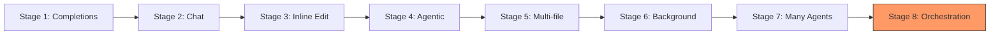
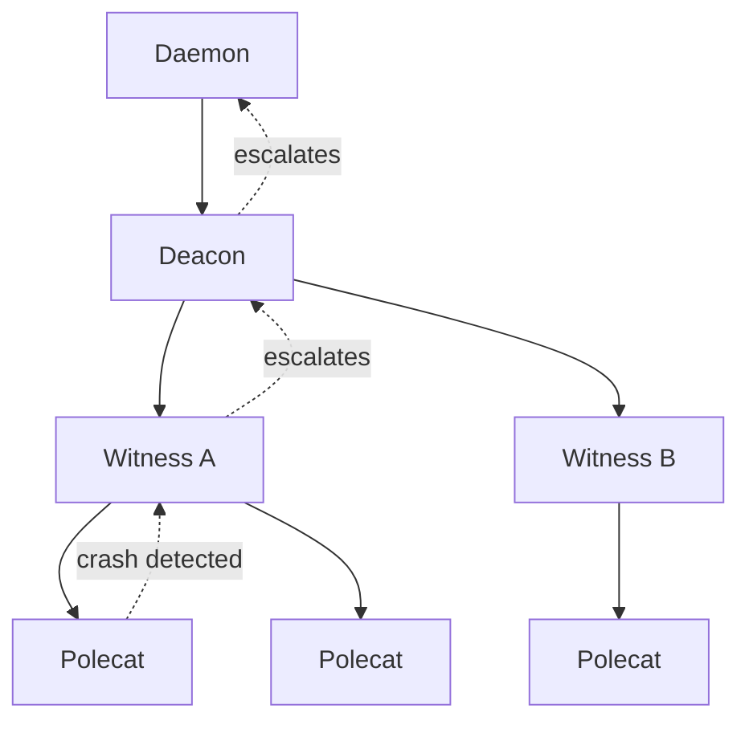
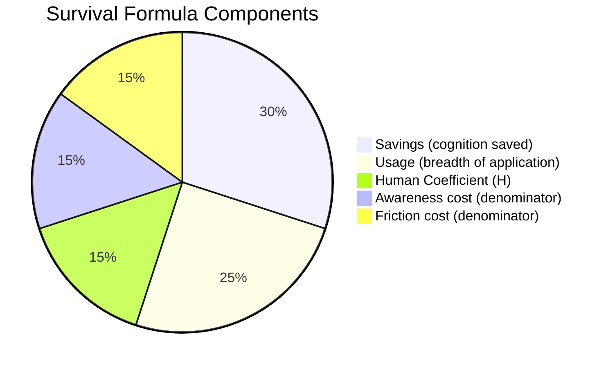

# Background & Philosophy

Gas Town is not just a tool -- it is a thesis about the future of software development. This guide covers why Gas Town exists, how it evolved, the intellectual foundations behind its design, and the community response to its ideas.



---

## Why Gas Town Exists: The Inevitability Argument

Gas Town's creator, Steve Yegge, makes a straightforward argument: multi-agent AI orchestration is **inevitable**. The progression from code completions to chat to agents to orchestrators follows an exponential curve that has been consistent since 2023.

The argument:

1. AI coding capabilities improve exponentially
2. Each improvement enables a new "stage" of AI-assisted development
3. Competitive pressure forces adoption of each stage within 6-12 months
4. Multi-agent orchestration (Stage 8) is the next inevitable step after hand-managing many agents (Stage 7)

Therefore, someone needs to build the orchestration infrastructure. Gas Town is one such attempt.

:::note[Not a Prediction -- An Observation]

Yegge argues this is not a prediction about the future but an observation of an already-visible trend. The exponential curve has been running for three years. Extrapolating it forward is not speculation; it is pattern recognition.

:::

---

## Development History

Gas Town has gone through four major architectural revisions, each driven by hard-won lessons about what works and what does not in multi-agent coordination.

### v1: The Prototype

As described in [Welcome to Gas Town](https://steve-yegge.medium.com/welcome-to-gas-town-4f25ee16dd04), Yegge began building his first orchestrator in August 2025. The first version was a collection of bash scripts managing Claude Code sessions in tmux. It proved the concept -- multiple agents could work in parallel on the same project -- but coordination was fragile and everything broke constantly.

**Lessons learned:**

- Agents need persistent state that survives crashes
- Manual coordination does not scale beyond 5 agents
- Merge conflicts are the #1 operational problem

### v2: Beads

The second version introduced **Beads**, the git-backed issue tracking system. This gave agents a shared, persistent record of work state. Beads became the coordination primitive -- instead of agents talking directly to each other, they communicated through shared work items.

**Lessons learned:**

- Shared state works, but agents need explicit communication too
- A merge queue is essential once you have more than 3 parallel workers
- Health monitoring cannot be an afterthought

### v3: Python

The third version rewrote the core in Python, adding the agent hierarchy (Mayor, Deacon, Witness), the Refinery merge queue, and the mail/nudge communication system. This was the first version that could reliably run 10+ agents.

**Lessons learned:**

- Python's GIL and process model created performance bottlenecks at scale
- The Erlang/OTP supervision pattern (implemented in Python) was the right model
- The system needed to be faster and more reliable for production use

### v4: Go (Current)

The current version is written in Go, providing:

- Fast daemon process with low overhead
- Native concurrency for lifecycle management
- Single binary distribution
- Sub-millisecond command response times

Go was chosen for operational characteristics, not language preference. The daemon needs to be fast, reliable, and simple. Go excels at all three.

Gas Town is the fourth complete, functioning orchestrator Yegge built in 2025. Each failure taught hard lessons that informed the next iteration.

---

## Mad Max Naming and Theming

Gas Town's naming comes from the Mad Max: Fury Road universe. As Yegge describes in [Welcome to Gas Town](https://steve-yegge.medium.com/welcome-to-gas-town-4f25ee16dd04):

> "Gas Town is a new take on the IDE for 2026. Gas Town helps you with the tedium of running lots of Claude Code instances."

The fictional Gas Town is an oil refinery citadel controlled by a warlord. The metaphor maps surprisingly well to a multi-agent orchestration system:

| Mad Max | Gas Town Concept |
|---------|------------------|
| **Gas Town** | The workspace -- the central hub of operations |
| **Mayor** | The coordinator who runs Gas Town |
| **Rigs** | War rigs -- the vehicles (projects) being managed |
| **Polecats** | The warriors who swing between vehicles on poles, performing quick raids |
| **Refinery** | Where crude output is processed into usable product (code is merged to main) |
| **Witness** | "Witness me!" -- the monitor who watches and validates |
| **Convoy** | A group of vehicles (tasks) traveling together |
| **Deacon** | A religious figure who keeps order -- the health monitor |

The alternative name "Gastown" (one word) references Vancouver B.C.'s historic Gastown district, a nod to the software industry's Pacific Northwest roots.

:::tip[Embracing the Theme]

The Mad Max theme is intentional. Managing 20 AI agents simultaneously is chaotic, high-stakes, and occasionally explosive. The theme sets appropriate expectations. If you want a calm, predictable development experience, Gas Town is not it.

:::

---

## Erlang/OTP Inspiration

Gas Town's architecture borrows directly from Erlang/OTP, the telecommunications platform known for extreme reliability (nine-nines uptime):

### Supervisor Trees

```text
                      Daemon
                        |
                      Deacon
                     /      \
              Witness:A    Witness:B
              /    \          |
        Polecat  Polecat   Polecat
```



Each level monitors the level below it. When a child crashes, its supervisor decides what to do (restart, escalate, or ignore). This creates a self-healing system where individual agent failures do not cascade.

### Mailbox Pattern

Agents communicate through mailboxes -- asynchronous message queues. An agent can send mail to any other agent, and the recipient processes messages on its own schedule. This decouples agents temporally -- they do not need to be active simultaneously to communicate.

### "Let It Crash" Philosophy

Rather than writing defensive code to prevent every possible failure, Gas Town follows Erlang's "let it crash" philosophy:

- Polecats are expected to crash sometimes
- Witnesses detect the crash and handle recovery
- Work persists on hooks -- nothing is lost
- A fresh polecat can pick up where the crashed one left off

### Process Isolation

Each agent runs in its own session with its own state. A crash in one agent cannot corrupt another agent's state. This isolation is what makes Gas Town reliable at scale.

---

## Software Survival 3.0

Yegge's "Software Survival 3.0" thesis, published on [Medium](https://steve-yegge.medium.com/software-survival-3-0-97a2a6255f7b) in January 2026, extends beyond coding tools to a broader claim about the evolutionary pressures shaping all software in the AI era.

### The Three Eras

| Era | Selection Pressure | Survivors |
|-----|-------------------|-----------|
| **1.0** (1960s-2000s) | Can you build it at all? | Teams with engineering capability |
| **2.0** (2000s-2020s) | Can you build it faster? | Teams with agile processes and tooling |
| **3.0** (2025+) | Can you build it with AI? | Teams that harness multi-agent AI |

### The Core Thesis

Inference costs tokens, which cost energy, which cost money. For the purposes of computing software survival odds, tokens, energy, and money are all equivalent -- and all are perpetually constrained.

This resource constraint creates a selection pressure that shapes the entire software ecosystem. The rule is simple: **software tends to survive if it saves cognition**.

Teams that effectively use multi-agent AI ship faster. Shipping faster wins. This is not a moral argument ("you should use AI") but an evolutionary one. The selection pressure is already operating.

### The Squirrel Selection Model

Yegge calls his survival framework the **Squirrel Selection Model** -- a deliberately humble name acknowledging it as a "Good Enough" model, while arguing it is better than what most C-suites are working with today. The model is grounded in an evolutionary argument: in any environment with constrained resources, entities that use those resources efficiently tend to outcompete those that do not.

### The Survival Formula

The model expresses software fitness as a ratio of cognitive value to cognitive cost:

```text
Survival(T) = (Savings x Usage x H) / (Awareness + Friction)
```

Where:

| Variable | Meaning |
|----------|---------|
| **Savings** | How much cognition (tokens, compute, human thought) the tool saves per use |
| **Usage** | How broadly and frequently the tool applies across different situations |
| **H** | The Human Coefficient -- a multiplier for domains where humans prefer human-made output |
| **Awareness** | The cost of knowing the tool exists (discovery, learning it is available) |
| **Friction** | The cost of actually using the tool (setup, API complexity, error handling) |

`Survival(T)` is a **fitness function** -- when the ratio exceeds 1, the tool tends to survive. When it falls below 1, the tool is selected against; LLMs will synthesize alternatives or route around it.

The Usage term amortizes the awareness cost and lowers the threshold for token savings. A tool does not need to save much per invocation if it is invoked constantly.

### Plot Armor

Tools with extremely high survival ratios -- in the thousands -- acquire what Yegge calls **"plot armor."** They become effectively indestructible.

`grep` is the canonical example. It compresses a nontrivial insight (regular expression matching over streams of text), runs on a radically cheaper substrate than GPU inference, and applies to a near-universal niche. Its survival ratio is so high that no LLM will ever waste tokens re-synthesizing what grep already does perfectly. grep has plot armor.

The concept is borrowed from fiction writing: some characters are so central to the narrative that they cannot die regardless of the danger they face. In software terms, some tools are so efficient that no amount of AI advancement threatens them -- it would always be cheaper to invoke them than to replicate them.

### The Six Levers

The survival formula gives you **six levers** you can pull to improve your software's chances of survival in the AI era:

#### Lever 1: Compressed Insights

Your software survives by compressing hard-won insights into reusable form. The software industry has accumulated decades of knowledge that would be expensive to rediscover from scratch. Tools that encode this knowledge densely are worth preserving.

**Git** is the prime example. Its model -- the DAG of commits, refs as pointers, the index, the reflog -- represents decades of accumulated wisdom about how to track changes. An LLM could theoretically re-derive version control concepts, but it would be wildly wasteful compared to just using git.

#### Lever 2: Cheaper Substrate

Software survives by running on a cheaper computation substrate than GPU inference. Pattern matching over text, image transformation, data parsing -- these are tasks where CPUs beat GPUs by orders of magnitude. It would be irrational to spin up inference to do what `grep`, ImageMagick, or a JSON parser already does.

Tools that leverage this lever include parsers, complex transformers, and many Unix CLI tools. They do their work on traditional compute that costs a fraction of what LLM inference would cost for equivalent output.

#### Lever 3: Broad Usage (Near-Universal Niche)

Niche tools may require incredible savings per invocation to compensate for their narrow applicability. Conversely, tools that apply broadly -- to many situations, many domains, many workflows -- can survive with modest per-use savings because the Usage multiplier in the formula does the heavy lifting.

**Code search engines** exemplify all three levers together: they solve a nontrivial problem with lots of hard-to-discover edge cases (compressed insights), they do it on a cheaper computation substrate than inference (cheaper substrate), and they have found a large, near-universal niche (broad usage). As LLMs produce 10x to 100x as much code, agents will need good search as much as humans ever did.

#### Lever 4: Awareness (Pre-Sales)

Agent attention is becoming a key battleground. For a tool to be used, agents must know it exists. In a niche domain without much competition -- say DNA sequencing -- any tool that saves a few tokens might be quickly noticed and see heavy use. But in crowded domains, awareness is not automatic. Big mediocre players may have all the recognition, and you may have to pay extra to be noticed by agents.

Awareness is the pre-sales problem in the survival formula. Your tool might be excellent, but if neither humans nor agents know about it, the numerator might as well be zero.

#### Lever 5: Reducing Friction (Post-Sales)

If Awareness is a pre-sales problem, then Friction is the post-sales problem. An agent may be perfectly aware that it has a useful tool, but even a small amount of friction may change its calculation. Agents always act like they are in a hurry, and if something appears to be failing, they will rapidly switch to workarounds.

Friction includes API complexity, poor documentation, unreliable behavior, and slow response times. Every bit of friction pushes the denominator higher and the survival ratio lower. Tools that are easy to invoke and predictable in their behavior have an inherent survival advantage.

#### Lever 6: The Human Coefficient (H)

The Human Coefficient is a fundamentally different selection pressure -- not efficiency, but **human preference**. There will be a large set of domains where people prefer a human's work even when an AI can do "better" by some measurable standard.

Even if AIs become the best teachers, some people will insist on human teachers. Even if AI-generated art is technically flawless, some collectors will prefer human-made art. The Human Coefficient is a multiplier that captures this preference -- software operating in high-H domains has an extra survival advantage that pure efficiency calculations miss.

You can still benefit from the other five levers, but in high-H domains, the human element is itself a form of savings that the formula accounts for.

### Temporal: A Case Study

Yegge uses [Temporal](https://temporal.io/) -- the workflow orchestration engine -- as a detailed case study for applying the survival formula.

Temporal scores highly on the first three levers:

- **Compressed Insights**: Temporal encodes deep knowledge about distributed workflow orchestration -- retry logic, state management, failure recovery, and durable execution. These are problems with subtle edge cases that took years of engineering to solve correctly.
- **Cheaper Substrate**: Temporal handles complex distributed coordination in traditional compute, which is far cheaper than re-synthesizing equivalent orchestration logic through LLM inference every time.
- **Broad Usage**: As agentic workflows take center focus in 2026, Temporal's applicability is near-universal. Yegge describes it as "as broadly useful as PostgreSQL" for the emerging world of agent-driven software.

However, Temporal faces challenges on levers 4 and 5. Compared to PostgreSQL -- which has been around for decades and has massive training data representation -- Temporal has comparatively higher awareness and friction costs. It is less well-known, and LLMs have less training data about its APIs and patterns. This means Temporal's raw survival ratio is moderated by the denominator, even though its numerator is strong.

The case study illustrates a key insight: **a tool can be genuinely excellent (high numerator) and still face survival pressure if its denominator is too high.** The six levers are not just about building good software -- they are about the full equation.

### Competition and Survivability Thresholds

The survival formula does not operate in a vacuum. Your software's survivability threshold **floats above 1** when competitors exist.

A tool with a survival ratio of 1.2 is technically viable in isolation -- it saves more cognition than it costs. But if a competitor achieves a ratio of 2.5 in the same niche, the 1.2 tool is effectively dead. Agents and developers will choose the higher-ratio option every time.

This means survival is not a fixed bar. It is a relative competition:

- In an **uncontested niche**, a ratio slightly above 1 may suffice
- In a **crowded market**, you need to significantly outperform alternatives
- **Dominant incumbents** with high ratios raise the bar for everyone else

The competitive dynamic also explains why some categories consolidate rapidly. Once a tool establishes a high survival ratio and gains awareness (low denominator from widespread adoption), it becomes very difficult to displace -- it has effectively acquired plot armor through competitive dominance.

### Implications for Software Teams

The Software Survival 3.0 framework leads to concrete strategic advice:

- **Build something that would be crazy to re-synthesize.** Compress genuine insights. Encode hard-won knowledge. The denser your insight compression, the higher your Savings term.
- **Make it easy to find.** Invest in awareness. Agent-discoverable documentation, MCP tool listings, and prominent placement in training data all lower the Awareness cost in the denominator.
- **Make it easy to use.** Reduce friction ruthlessly. Clean APIs, predictable behavior, fast response times. Every bit of friction you remove improves your survival ratio.
- **Identify your niche breadth.** Understand whether your Usage multiplier compensates for your per-invocation Savings. Broad tools can survive with modest savings; niche tools need to save dramatically per use.
- **Consider the Human Coefficient.** If you operate in a domain where human preference matters, lean into it. The H multiplier is a legitimate survival advantage.



### The Vibe Coding Commitment

Gas Town embraces what Yegge calls "vibe coding" -- the practice of letting AI do the work while you focus on direction and review. As he writes in [Welcome to Gas Town](https://steve-yegge.medium.com/welcome-to-gas-town-4f25ee16dd04):

> "Working effectively in Gas Town involves committing to vibe coding. Work becomes fluid, an uncountable that you sling around freely."

> "Most work gets done; some work gets lost. Fish fall out of the barrel. Some escape back to sea, or get stepped on. The focus is throughput: creation and correction at the speed of thought."

This tolerance for imperfection in exchange for throughput is a conscious design choice, not a flaw.

### Broader Implications

- Solo developers with orchestrated AI can match the output of small teams
- Small teams with orchestrated AI can match the output of large teams
- Large teams that do not adopt AI orchestration will lose their advantage of scale
- The "10x developer" becomes the "100x developer" not through skill but through leverage

---

:::info
The survival formula is not just theoretical -- Gas Town itself is designed around it. The system compresses orchestration insights (Lever 1), runs coordination on traditional compute (Lever 2), and applies to any git-backed software project (Lever 3). Understanding the formula helps you evaluate whether Gas Town fits your team's needs.
:::

## Prediction Track Record

Yegge has publicly tracked his predictions about AI coding adoption:

### The Exponential Curve

| Year | Stage | Prediction | Outcome |
|------|-------|-----------|---------|
| 2023 | 1-2 | "Completions are just the beginning" | Correct -- chat and agents emerged within 12 months |
| 2024 | 3-4 | "IDE agents will go YOLO" | Correct -- Cursor, Windsurf, Cline all shipped autonomous modes |
| 2024 | 5 | "CLI agents will replace IDE agents for power users" | Correct -- Claude Code, Gemini CLI, Codex CLI all launched |
| 2025 | 6-7 | "Multi-agent is coming, hand-managed first" | Correct -- widespread adoption of 3-10 parallel agents |
| 2025-2026 | 8 | "Orchestration systems will emerge" | In progress -- Gas Town and competitors exist |

### Exponential Curve Intuition

```text
     Capability
         ^
         |                                    *
         |                                *
         |                            *
         |                        *
         |                    *
         |                *
         |            *
         |        *
         |    *
         | *
         +---------------------------------> Time
         2023  2024  2025  2026  2027
```

The key insight: **exponential curves look flat at the beginning and vertical at the end**. Each stage seemed like a modest step when it arrived, but looking back, the cumulative progress is staggering.

From completions (early 2023) to multi-agent orchestration (2025-2026) took less than three years.

---

## "You Will Die"

One of the most polarizing aspects of Gas Town's documentation is its honest warning:

> "You will die."

This is not hyperbole. It means:

- **Your first installation will break.** Gas Town is complex software managing complex AI agents.
- **You will lose work** until you learn the landing-the-plane discipline.
- **You will burn money** before you learn to manage costs effectively.
- **You will spend hours debugging** agent coordination issues.
- **You will question whether this is worth it** approximately once per day.

The warning serves as a filter: if reading "you will die" makes you want to stop, Gas Town is not for you yet. Come back at Stage 7.

If reading it makes you want to figure out how to survive, you are the target audience.

:::warning[This is Real]

Gas Town is not a polished consumer product. It is an advanced tool for power users who are willing to invest significant time and money to get 10x throughput. The learning curve is steep, the costs are real, and the failure modes are creative. Approach it with eyes open.

:::

---

## Community Reception

Gas Town launched on GitHub and was covered on Hacker News, Reddit, and several AI development communities. The reception was characteristically divided.

### The "Concept Car" Camp

> "This is fascinating as a concept but too early for production. It's showing us what 2027 will look like."

Proponents in this camp see Gas Town as a proof of concept -- valuable for exploring what multi-agent orchestration could be, but not ready for daily use by most teams.

### The "How We Code in 2 Years" Camp

> "I've been building exactly this with bash scripts. Gas Town formalizes what Stage 7 users already do."

Proponents in this camp are already managing multiple agents and recognize Gas Town as the next logical step from their ad-hoc scripts.

### The Skeptics

> "Managing 20 AI agents is a solution looking for a problem. One good developer with one agent is fine."

Skeptics question whether the complexity of orchestration is justified by the throughput gains. This maps to historical skepticism about every new development paradigm.

### By the Numbers

As of early 2026:

- **7.3k stars** on GitHub
- **600+ forks**
- Active development with regular releases
- Growing community of contributors

---

## Further Reading

The following articles by Steve Yegge provide the foundational thinking behind Gas Town:

- [Welcome to Gas Town](https://steve-yegge.medium.com/welcome-to-gas-town-4f25ee16dd04) -- Launch announcement and overview
- [Gas Town Emergency User Manual](https://steve-yegge.medium.com/gas-town-emergency-user-manual-cf0e4556d74b) -- Practical usage guide and operational patterns
- [Software Survival 3.0](https://steve-yegge.medium.com/software-survival-3-0-97a2a6255f7b) -- The broader thesis on AI's impact on software development
- [The 8 Stages of AI Coding](eight-stages.md) -- Maturity model for AI-assisted development
- [GitHub Repository](https://github.com/steveyegge/gastown) -- Source code and issue tracker

## Related

- [The 8 Stages of AI Coding](eight-stages.md) -- The maturity model that defines Gas Town's target audience
- [Design Principles](../architecture/design-principles.md) -- The twelve principles that implement the philosophy
- [Architecture Guide](architecture.md) -- How the philosophy translates into system architecture
- [Cost Management](cost-management.md) -- Practical cost implications of multi-agent orchestration

### Blog Posts

- [Welcome to the Gas Town Blog](/blog/welcome) -- Introducing the Gas Town documentation blog and multi-agent orchestration tips
- [Understanding GUPP: Why Crashes Don't Lose Work](/blog/understanding-gupp) -- How the Gas Town Universal Propulsion Principle makes multi-agent development crash-safe by design
- [Gas Town vs Traditional CI/CD: What's Different?](/blog/gas-town-vs-cicd) -- How Gas Town's agent-driven model complements and extends traditional CI/CD pipelines
- [The Eight Stages of AI Coding: A Self-Assessment](/blog/eight-stages-self-assessment) -- Evaluate where you fall on the AI coding maturity curve that underpins Gas Town's philosophy
