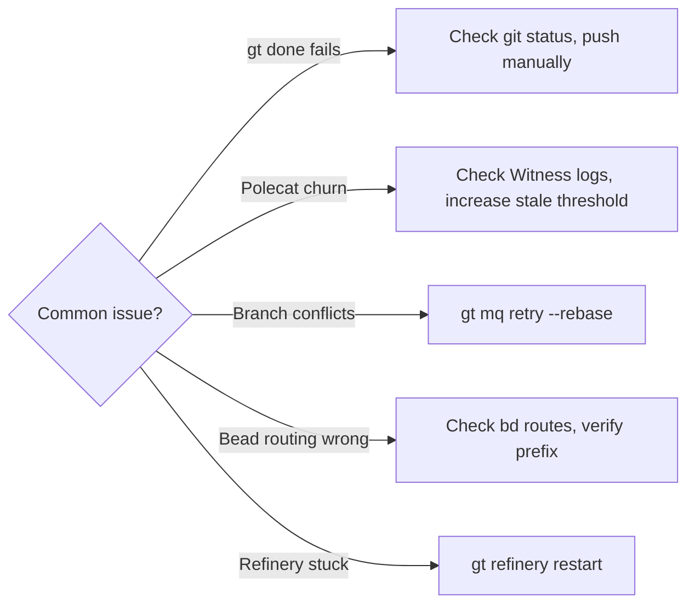
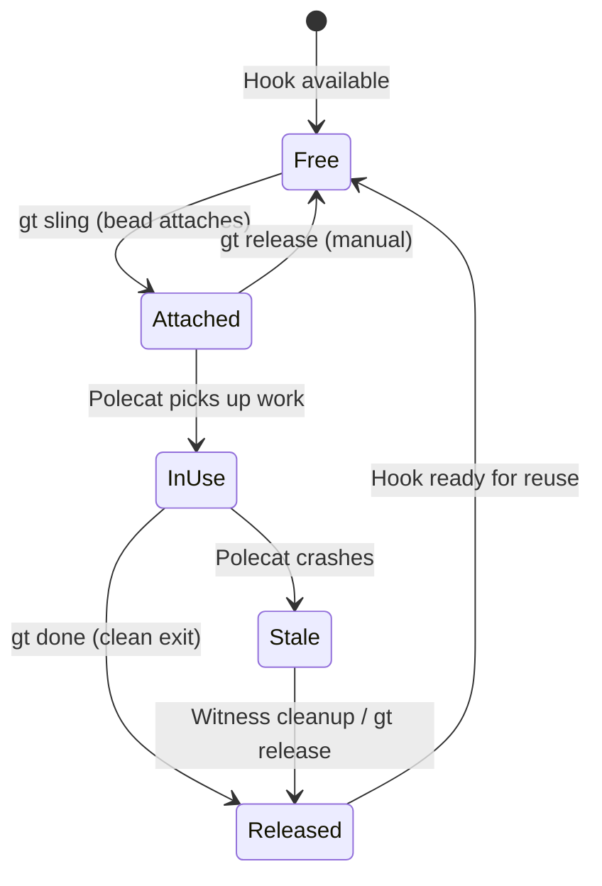
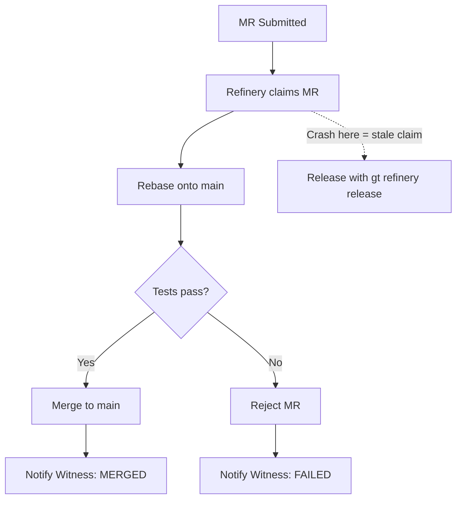
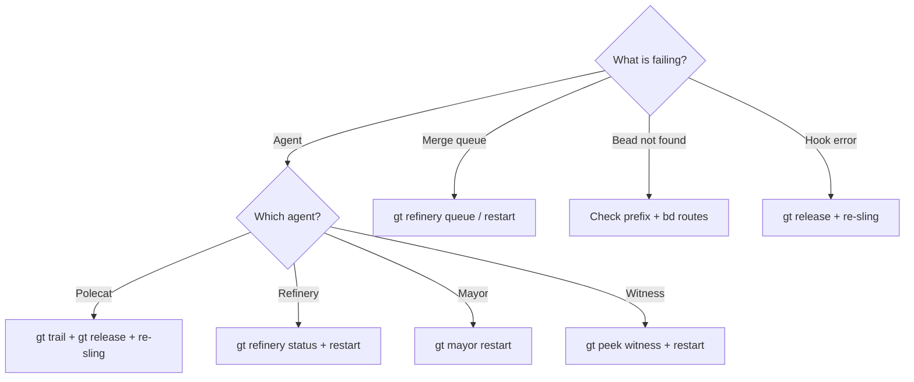
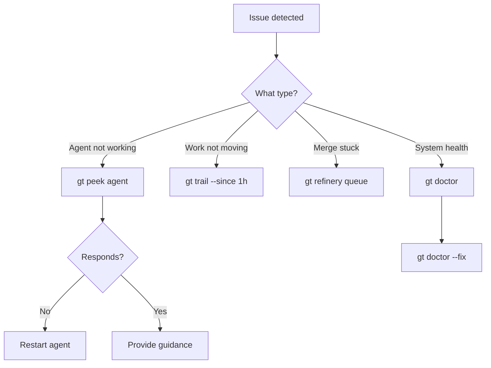

# Troubleshooting

This guide covers the most frequently encountered Gas Town problems and their solutions. For a comprehensive reference of all troubleshooting topics, see [Operations: Troubleshooting](../operations/troubleshooting.md).



---

## Dashboard URL `gt.villamarket.ai` Times Out

**Symptom:** Attempting to access `https://gt.villamarket.ai` results in a timeout (curl exit code 28).

**Cause:** There is no hosted dashboard at `gt.villamarket.ai`. The `gt dashboard` command starts a **local** web server on your machine, not a cloud service.

**Solution:**

Run the dashboard locally:

```bash
# Start the local dashboard
gt dashboard

# Or with a custom port
gt dashboard --port 9000
```

Then access it at `http://localhost:8420` (or your custom port).

:::note

The dashboard is only available while the `gt dashboard` command is running. It is not a persistent hosted service.

:::

---

## `gt done` Fails: "Not Inside a Rig Directory"

**Symptom:** A polecat finishes its work, runs `gt done`, and gets:

```text
Error: not inside a rig directory
```

This happens regardless of which directory you run the command from -- worktree, polecat root, rig root, or town root.

**Cause:** `gt done` infers the rig from the current working directory. In some configurations (particularly polecat worktrees nested under `polecats/<name>/`), the directory detection fails to resolve to a valid rig path.

**Workaround:**

1. **Ensure your work is committed and pushed first:**

    ```bash
    git status              # Verify clean
    git push origin HEAD    # Push the branch
    ```

2. **Notify the Witness manually:**

    ```bash
    gt mail send <rig>/witness -s "DONE: <bead-id>" -m "Work complete. Branch pushed. gt done fails (bug ga-w8vv)."
    ```

3. **Escalate if needed:**

    ```bash
    gt escalate "gt done fails: not inside rig directory" -s medium --related <bead-id>
    ```

The Witness will handle merge queue submission and polecat cleanup on your behalf.

:::note

This is a known issue tracked as **ga-w8vv**. Until it is fixed, the workaround above is the standard procedure for polecats that hit this error. For more troubleshooting patterns, see [Common Pitfalls When Starting with Gas Town](/blog/common-pitfalls).

:::

---

## Polecat Churn Cycle

**Symptom:** A polecat spawns, crashes or fails quickly, gets cleaned up by the Witness, the work is re-slung to a new polecat, which also fails -- creating a loop of spawn-fail-respawn.

**Cause:** Usually one of:

- The bead describes work that is fundamentally impossible (missing dependency, invalid API, nonexistent file)
- The test suite is broken on `main`, so every polecat fails preflight
- The codebase has a configuration issue that prevents any agent from working
- A merge conflict keeps reoccurring because the underlying problem is not resolved

**Diagnosis:**

```bash
# Check recent polecat activity for a pattern
gt trail --since 1h

# Look at the bead's history -- has it been slung multiple times?
bd show <bead-id>

# Check if main is green
cd <rig>/refinery/rig
git checkout main && npm test   # or your project's test command
```

**Solutions:**

1. **Break the cycle by releasing the bead:**

    ```bash
    gt release <bead-id>
    ```

    This unhooks the bead and stops it from being automatically re-slung.

2. **Fix the root cause before re-slinging.** If `main` is broken, fix it first. If the bead is impossible, update or close it:

    ```bash
    bd update <bead-id> --description "Updated requirements: ..."
    # or
    bd close <bead-id> --reason "Not feasible: <explanation>"
    ```

3. **Check for a systemic issue:**

    ```bash
    gt doctor
    bd list --status=in_progress   # Look for beads that keep cycling
    ```

:::tip

If you see the same bead ID appearing repeatedly in `gt trail`, that is a churn cycle. The bead is the problem, not the polecats.

:::

---

## `origin/main` vs `origin/master`

:::caution[Branch Name Mismatch Detection]

The `main` vs `master` branch mismatch is one of the most common silent failures in new Gas Town installations. Polecats will work for hours, commit changes to local branches, and attempt to push—but the push fails silently or targets a non-existent remote branch. Always verify the remote default branch name during rig setup and configure Gas Town to match it. Five minutes of verification prevents hours of lost polecat work.

:::

**Symptom:** Git commands fail with errors like:

```text
fatal: couldn't find remote ref main
```

or polecats push to the wrong branch.

**Cause:** Some repositories use `main` as the default branch, others use `master`. Gas Town defaults to `main` but the remote repository may use `master`.

**Diagnosis:**

```bash
# Check what the remote default branch is
git remote show origin | grep "HEAD branch"

# Check what branches exist
git branch -r
```

**Solutions:**

1. **Verify the remote default branch and use it consistently:**

    ```bash
    # If the remote uses master
    git branch -r | grep origin/master
    git branch -r | grep origin/main
    ```

2. **Set the rig's default branch in configuration** if it differs from `main`:

    ```bash
    # Check current rig configuration
    gt rig show <rig>
    ```

3. **For polecats that encounter this mid-work:** adjust the target branch in your git commands:

    ```bash
    # If origin/master is the correct target
    git rebase origin/master
    git push origin HEAD
    ```

:::warning

The Refinery merges to the repository's default branch. If there is a mismatch between what agents assume (`main`) and what the remote uses (`master`), merges will fail silently or target the wrong branch. Verify this during rig setup.

:::

---

## Bead Routing: Town vs Rig

**Symptom:** `bd show <id>` returns "not found" even though you know the bead exists, or `bd create` puts the bead in the wrong database.

**Cause:** Beads exist at two levels with different prefixes:

| Level | Location | Prefix | Example |
|-------|----------|--------|---------|
| **Town** | `~/gt/.beads/` | `hq-*` | `hq-abc123` |
| **Rig** | `<rig>/.beads/` | Per-rig | `ga-xyz789` (gastowndocs) |

The `bd` CLI routes based on the prefix in the bead ID. If you use the wrong prefix or are in the wrong directory, the command routes to the wrong database.

**Diagnosis:**

```bash
# Check routing rules
cat ~/gt/.beads/routes.jsonl

# Debug routing for a specific bead
BD_DEBUG_ROUTING=1 bd show <bead-id>
```

**Solutions:**

1. **Use the correct prefix.** Every rig has a unique prefix. Check yours:

    ```bash
    bd list   # Shows beads in the current rig's database
    ```

2. **Route explicitly with `--rig`:**

    ```bash
    bd show <bead-id> --rig gastowndocs     # Force rig-level lookup
    bd create --rig gastown --title "..."    # Create in a specific rig
    ```

3. **File in the right place.** The rule: file the bead in the rig that **owns the code** where the fix would be committed.

    | Issue is about... | File in |
    |-------------------|---------|
    | This rig's code | Default (current rig) |
    | `bd` CLI bugs | `beads` rig |
    | `gt` CLI bugs | `gastown` rig |
    | Cross-rig coordination | Town level (`hq-*`) |

---

## Hook Slot Failures



**Symptom:** `gt sling` fails with an error about hooks, or a polecat starts but finds nothing on its hook.

**Common errors:**

```text
hook already attached
```

```text
no work on hook
```

**Cause:** Hooks are persistent pointers from an agent to its current bead. Hook conflicts happen when:

- A previous polecat crashed without releasing its hook
- A bead is already hooked to another agent
- The hook file was corrupted during an unclean shutdown

**Diagnosis:**

```bash
# Check what's on the hook
gt hook

# Check hooks across a rig
gt hook --agent <polecat> --rig <rig>
```

**Solutions:**

1. **"hook already attached"** -- Release the stale hook first:

    ```bash
    gt release <bead-id>

    # Then re-sling
    gt sling <bead-id> <rig>
    ```

2. **"no work on hook"** -- The polecat was spawned but work was not attached:

    ```bash
    # Check if mail contains the assignment
    gt mail inbox

    # If mail has the work, hook it manually
    gt mol attach-from-mail <mail-id>

    # If no mail either, escalate to Witness
    gt mail send <rig>/witness -s "HELP: empty hook" -m "Polecat spawned with no work"
    ```

3. **Corrupted hook state** -- If the hook seems wrong or inconsistent:

    ```bash
    # Let the Witness clean up
    gt mail send <rig>/witness -s "Hook state inconsistent" -m "Details..."

    # Or if you have direct access, check the hook file
    ls -la <rig>/polecats/<name>/.hook*
    ```

:::tip

Hooks survive crashes -- that is their purpose. If a polecat crashes, the Witness detects the zombie, cleans up, and the hook persists for the next polecat. You should rarely need to manually manage hooks.

:::

---

## Refinery Stuck Merges

**Symptom:** The merge queue has items but nothing is being merged. `gt refinery queue` shows pending MRs but none are progressing.

**Diagnosis:**

```bash
# Check Refinery status
gt refinery status <rig>

# Check the merge queue
gt refinery queue <rig>

# Check for blocked MRs
gt refinery blocked <rig>

# Check Refinery session health
gt peek refinery --rig <rig>
```

**Common causes and solutions:**

### 1. Refinery Session Crashed

The Refinery agent may have crashed or lost context.

```bash
# Restart it
gt refinery restart <rig>
```

### 2. Merge Conflict in the First MR

The Refinery processes MRs strictly in order. If the first MR has an unresolvable conflict, it blocks everything behind it.

```bash
# Check what's at the head of the queue
gt refinery queue <rig>

# If the first MR is stuck on conflicts, skip it
gt refinery release <mr-id>

# Re-sling the problematic bead for a fresh attempt
gt sling <bead-id> <rig>
```

### 3. Validation Failures

Tests or linting fail during the Refinery's validation step.

```bash
# Attach to the Refinery to see what happened
gt refinery attach <rig>

# Check if main itself is broken
cd <rig>/refinery/rig
git pull origin main
npm test   # or your project's test command
```

If `main` is broken, fix it first -- no MR can pass validation against a broken `main`.

### 4. Stale Claim

An MR was claimed by a Refinery worker that crashed before completing.

```bash
# Check for unclaimed MRs
gt refinery unclaimed <rig>

# Release the stale claim
gt refinery release <mr-id>
```

The Refinery processes MRs through a strict sequential pipeline. Understanding the flow helps you pinpoint where a stuck merge is blocked.



:::note

The Refinery merges MRs **one at a time**, rebasing each onto the latest `main`. This is intentional -- it prevents race conditions. If your queue is backing up, the bottleneck is usually validation speed (test suite runtime) or unresolved conflicts.

:::

---

The following diagram illustrates the diagnostic decision process for the most common Gas Town failure scenarios:



## Quick Diagnostic Reference

| Problem | First Command |
|---------|---------------|
| General health check | `gt doctor` |
| Something not running | `gt rig list` |
| Work not progressing | `gt trail --since 1h` |
| Polecat issues | `gt polecat list <rig>` |
| Merge queue stuck | `gt refinery queue <rig>` |
| Bead not found | `BD_DEBUG_ROUTING=1 bd show <id>` |
| Agent unresponsive | `gt peek <agent>` |
| Open escalations | `gt escalate list` |

For the full troubleshooting reference, see [Operations: Troubleshooting](../operations/troubleshooting.md).

The following Gantt chart shows typical troubleshooting timelines for different severity issues:

```mermaid
gantt
    title Troubleshooting Response Timeline by Severity
    dateFormat X
    axisFormat %M min

    section P0 Critical
    Detection           :0, 1
    Diagnosis           :1, 3
    Fix Applied         :3, 8
    Verification        :8, 10

    section P1 High
    Detection           :0, 5
    Diagnosis           :5, 15
    Fix Applied         :15, 40
    Verification        :40, 50

    section P2 Medium
    Detection           :0, 15
    Diagnosis           :15, 60
    Fix Applied         :60, 180
    Verification        :180, 200
```



:::tip[Document Your Fixes]
When you resolve a recurring issue, add a note to the rig's CLAUDE.md explaining the failure pattern and solution. Future polecats can reference this documentation instead of re-discovering the same fix. Over time, this builds institutional knowledge that reduces troubleshooting time for similar problems.
:::

### Troubleshooting Decision Flow



## Related

- [Operations: Troubleshooting](../operations/troubleshooting.md) -- Comprehensive reference covering all troubleshooting topics
- [Monitoring & Health](../operations/monitoring.md) -- Real-time feeds, health checks, and diagnostic commands
- [Escalation System](../operations/escalations.md) -- How to create and manage priority-routed escalations
- [Starting & Stopping](../operations/lifecycle.md) -- Lifecycle commands for recovering stuck agents and rigs

### Blog Posts

- [5 Common Pitfalls When Starting with Gas Town](/blog/common-pitfalls) -- Avoid the most frequent mistakes new Gas Town users make
- [Incident Response with Gas Town: When Things Go Wrong](/blog/incident-response) -- A practical guide to diagnosing and recovering from common Gas Town failures
- [Understanding the Witness](/blog/witness-explained) -- How the Witness detects and recovers from the polecat issues covered in this guide
- [Hook Persistence: Why Work Survives Crashes](/blog/hook-persistence) -- How hooks preserve work state through crashes and restarts, preventing the data loss scenarios covered here
- [Monitoring Your Gas Town Fleet](/blog/monitoring-fleet) -- How fleet monitoring helps identify and troubleshoot issues
