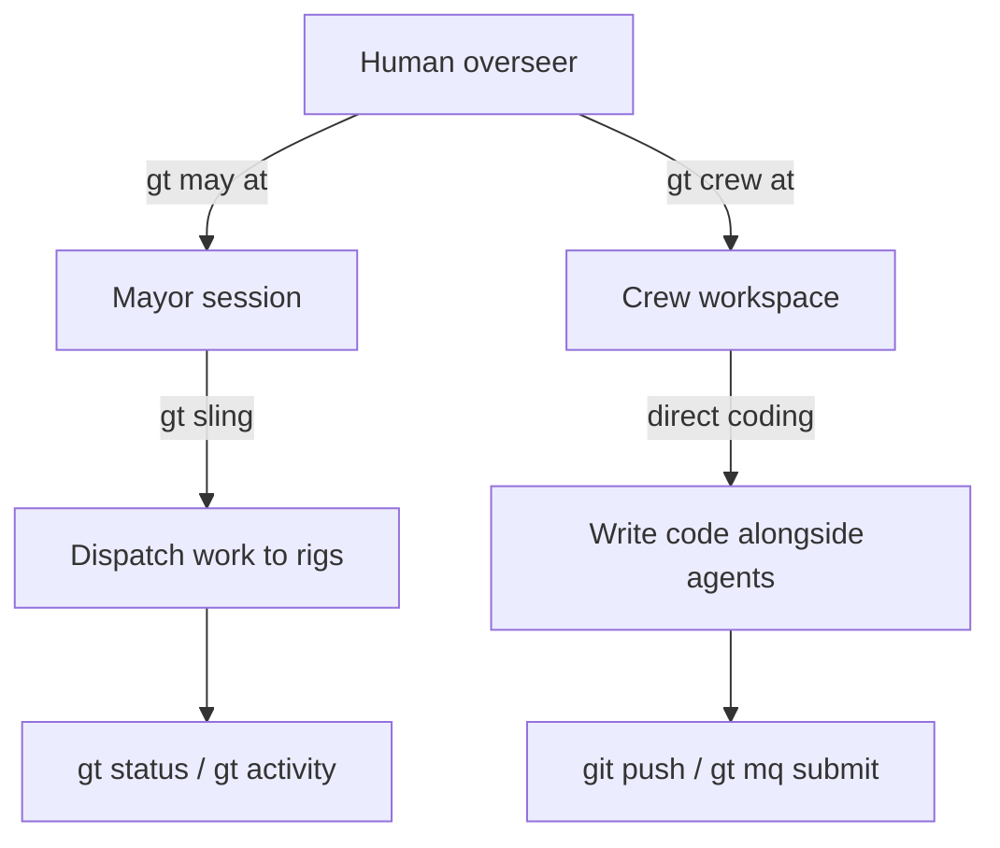
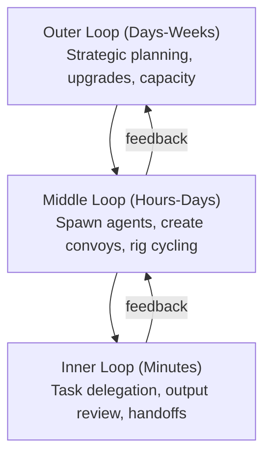
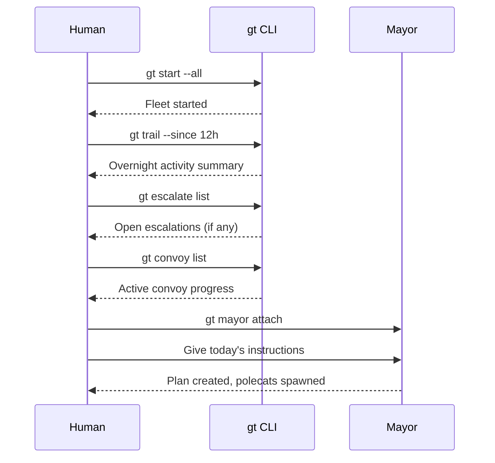
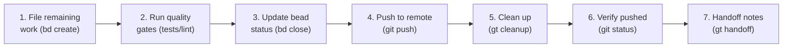

# Usage Guide

This guide covers practical day-to-day Gas Town usage patterns -- from working with the Mayor, to managing multiple rigs, to the mandatory session completion workflow. It assumes you have a working installation (see [Getting Started](../getting-started/index.md)) and are familiar with the basic concepts.



:::info[Source]

Much of the operational advice in this guide comes from the [Gas Town Emergency User Manual](https://steve-yegge.medium.com/gas-town-emergency-user-manual-cf0e4556d74b) by Steve Yegge, written after the first two weeks of Gas Town's public release.

:::

---

## Entry Points

Your two main entry points into Gas Town are:

```bash
gt may at    # Attach to the Mayor
gt crew at <name> --rig <rig>   # Attach to a Crew workspace
```

**`gt may at`** (short for `gt mayor attach`) drops you into the Mayor's tmux session. From there you can give instructions, check progress, and coordinate all your rigs. This is the primary interface for most Gas Town work.

**`gt crew at`** (short for `gt crew at <name> --rig <rig>`) attaches you to a named Crew workspace -- a persistent, long-lived development environment where you work hands-on with code alongside your AI agents.

These two commands represent the two modes of Gas Town operation: **directing** (via the Mayor) and **doing** (via Crew). Most sessions involve both -- you direct work through the Mayor, then drop into Crew workspaces for design decisions, code review, or hands-on implementation.

:::tip[Mayor-Only Mode]

You technically only need the Mayor. Running with just the Mayor is a good tutorial and introduction to Gas Town. The Mayor can file and fix issues itself, or you can ask it to sling work to polecats. Even alone, it still gets all the benefits of GUPP, MEOW, and the full agent lifecycle.

:::

---

## The Three Developer Loops

Gas Town operations follow three nested feedback loops. Understanding these loops helps you work at the right cadence for each type of task.

### Outer Loop (Days to Weeks)

The outer loop covers strategic planning and infrastructure-level decisions:

- **System upgrades** -- Gas Town ships updates frequently; upgrade daily if you are actively using it
- **Capacity planning** -- How many rigs, how many polecats per rig, which projects are active
- **Town-level maintenance** -- Cleanup, cost review, architectural decisions
- **Workflow evolution** -- Your workflows will change as you gain experience; expect to adjust weekly

The outer loop is where you decide *what* to build and *how* to organize your fleet.

### Middle Loop (Hours to Days)

The middle loop covers the active work session:

- **Agent spawning decisions** -- When to spin up polecats, when to throttle back
- **Mayor + Polecat coordination** -- Breaking work into beads, creating convoys, monitoring progress
- **Capacity throttling** -- Adjusting agent count based on workload and cost targets
- **Rig cycling** -- Moving between rigs as work progresses; with one rig fully spinning, move to the next and start the same loop

The middle loop is where you turn plans into tracked work and keep the fleet productive.

### Inner Loop (Minutes)

The inner loop is the moment-to-moment operational cadence:

- **Frequent handoffs** -- Use `gt handoff` after every task in every worker; only let sessions go long if they need to accumulate important context for a big design or decision
- **Clear task specification** -- Be specific when delegating to agents
- **Output review** -- Read what agents produce; some finish simple tasks and just need another assignment, others surface questions or complex summaries that require your time
- **Real-time adjustments** -- Redirect agents, escalate blockers, reassign work

The inner loop is where execution happens. Speed here comes from clear instructions and fast feedback cycles.



```text
Outer Loop (Days-Weeks)
│  Strategic planning, upgrades, capacity decisions
│
├── Middle Loop (Hours-Days)
│   │  Spawning agents, creating convoys, rig cycling
│   │
│   └── Inner Loop (Minutes)
│       Task delegation, output review, handoffs
```

---

## Working with the Mayor

The Mayor is your primary interface for multi-agent coordination. You talk to the Mayor in natural language, and it handles issue creation, work assignment, convoy management, and progress tracking.

### Starting a Session

```bash
gt mayor attach
```

This attaches your terminal to the Mayor's tmux session. You can now interact with it directly.

### Giving Instructions

Be specific and action-oriented:

```text
Good:  "Fix the 5 failing tests in the auth module and add input
        validation to the user registration endpoint."

Bad:   "Make the code better."
```

The Mayor will:

1. Break your request into discrete beads (issues)
2. Create a convoy to track the batch
3. Assign work to polecats across appropriate rigs
4. Monitor progress and handle escalations
5. Report back when the convoy completes

### Checking on Progress

You can ask the Mayor directly:

```text
"What's the status of the auth fixes?"
"How many polecats are running right now?"
"Are there any blocked items?"
```

Or use CLI commands from any terminal:

```bash
gt convoy list
gt feed
gt trail --since 30m
```

### Detaching from the Mayor

Press `Ctrl+B` then `D` to detach from the tmux session (the Mayor continues running in the background).

---

## Managing Multiple Rigs

A common Gas Town setup involves 2-5 rigs (projects) running simultaneously.

### Listing Rigs

```bash
gt rig list
```

Sample output:

```text
Rigs (3):
  myapp        active   3 polecats   witness: up   refinery: up
  api-server   active   1 polecat    witness: up   refinery: up
  docs         parked   -            witness: -    refinery: -
```

### Working Across Rigs

```bash
# Sling work to a specific rig
gt sling gt-a1b2c myapp
gt sling gt-d3e4f api-server

# Check a specific rig's status
gt rig status myapp

# View a rig's merge queue
gt mq list --rig api-server
```

### Rig-Specific Operations

```bash
# Start agents for one rig
gt rig start api-server

# Park a rig you're not currently using
gt rig park docs

# Bring it back later
gt rig unpark docs
gt rig start docs
```

:::tip[Focus Mode]

Park rigs you are not actively working on. This reduces resource consumption and keeps the feed cleaner.

:::

---

## Session Management and Handoffs

Gas Town agents are designed for long-running sessions with context preservation.

### Context Recovery

When an agent loses context (after compaction, crash, or long idle):

```bash
gt prime
```

This reloads the agent's full context from its CLAUDE.md file, hooks, and beads state. All persistent agents run `gt prime` automatically on startup.

### Handoffs Between Sessions

When transitioning from one work session to another (e.g., end of day):

```bash
# From within an agent session
gt handoff
```

This:

1. Summarizes current state
2. Writes handoff notes to the agent's context
3. Ensures hooks are up to date
4. The next session picks up the handoff notes automatically

### Agent Session Restart

```bash
# Restart the Mayor session
gt mayor restart

# Restart with a different agent
gt mayor restart --agent claude
```

---

## Day-to-Day Usage Patterns

### Morning Startup

```bash
# 1. Start the fleet
gt start --all

# 2. Check overnight activity
gt trail --since 12h

# 3. Review escalations
gt escalate list

# 4. Check convoy progress
gt convoy list

# 5. Attach to Mayor and give today's instructions
gt mayor attach
```

### During Active Development

```bash
# Watch the live feed (keep this in a dedicated terminal)
gt feed

# Periodically check costs
gt costs --today

# If something looks wrong
gt doctor

# Quick status check
gt rig list
```

### End of Day

```bash
# 1. Check what's still running
gt polecat list

# 2. Review convoy status
gt convoy list

# 3. Option A: Leave it running overnight
#    (check gt costs first to estimate overnight spend)

# 4. Option B: Pause until morning
gt down
```

---

The following diagram shows how a typical morning startup session flows through Gas Town's monitoring commands:



## Working with Crew

Crew workspaces are your most powerful tool for sustained, hands-on development within Gas Town. While polecats handle well-specified tasks autonomously, your Crew members are where design work, code review, and complex decision-making happen. See the [Crew agent docs](../agents/crew.md) for setup and commands.

### The Crew Cycle

When you have multiple Crew workspaces running across your rigs, the natural workflow is a **cycling pattern**: rotating through each Crew member in sequence, giving tasks, reviewing output, and moving on.

Here is what a typical Crew cycle looks like:

1. **Attach to a Crew workspace**: `gt crew at <name>` (use `--rig` if needed)
2. **Give a meaty task** -- design decisions, multi-file refactors, documentation, code review
3. **Detach and move to the next Crew** -- while the first one works, attach to the next
4. **Cycle back** -- by the time you have visited each Crew, the earlier ones are finishing

As you cycle through, you will find Crew members in various states:

- **Still working** -- Let them continue; move on
- **Finished with simple output** -- Hand off immediately with `gt handoff` and give the next task
- **Finished with questions or complex summaries** -- Reserve time to read carefully and respond

The Crew for a rig are organized on a tmux cycle group, making it easy to rotate between them with tmux key bindings. Start with 3 Crew per rig and scale up to 7-8 as you become comfortable with the cycling rhythm.

```bash
# Add a new Crew member to a rig
gt crew add alice

# Cycle through Crew members (in tmux, use Ctrl+B then N/P for next/prev)
gt crew at alice
# ... give task, detach ...
gt crew at bob
# ... give task, detach ...
gt crew at carol
# ... cycle back to alice when ready ...
```

:::tip[Crew vs. Polecats]

Use **Crew** for thoughtful work: design, review, complex refactors, and tasks where you need back-and-forth dialog. Use **Polecats** for well-specified, fast tasks where the acceptance criteria are clear up front. Your Crew creates the *guzzoline* (specifications and plans) that the polecat swarms consume.

:::

### The PR Sheriff Pattern

A useful ad-hoc role for Crew members is the **PR Sheriff** -- a Crew workspace that has a permanent hook with standing orders to manage pull requests.

On every session startup, the PR Sheriff:

1. Checks all open PRs across the rig's repository
2. Classifies them into **easy wins** (straightforward, tests pass, small diff) and **needs human review** (complex changes, failing CI, architectural implications)
3. Slings the easy wins to other Crew or polecats for processing
4. Flags the complex ones for your attention

```bash
# Create a PR Sheriff bead with standing orders
bd create --title "PR Sheriff Standing Orders" --type task \
  --description "On each session: check open PRs, classify by complexity, sling easy wins to crew"

# Hook it permanently to a Crew member
gt crew at dave
gt hook <bead-id>
```

The PR Sheriff pattern keeps your PR backlog from growing unbounded. Instead of PRs piling up while you focus on new work, they get triaged and handled continuously.

---

## Landing the Plane (Session Completion)



Landing the plane is the **mandatory** workflow for completing a Gas Town session. Skipping any step risks losing work, leaving stale state, or creating confusion for the next session.

:::danger[Mandatory Workflow]

Every Gas Town session must end with a proper landing. Incomplete landings lead to orphaned work, missed pushes, and broken state.

:::

### The 7-Step Landing Checklist

#### Step 1: File Issues for Remaining Work

Any incomplete work or follow-up items must be tracked:

```bash
# Create beads for remaining work
bd create --title "TODO: finish API pagination" --type task --priority 2
bd create --title "TODO: add tests for edge case X" --type task
```

Do not leave work undocumented. If it is not in a bead, it will be forgotten.

#### Step 2: Run Quality Gates

Ensure all code passes quality checks before pushing:

```bash
# Run tests
cd ~/gt/myproject/refinery/rig
npm test          # or: go test ./...  or: pytest

# Run linting
npm run lint      # or your project's lint command

# Check for build errors
npm run build
```

#### Step 3: Update Issue Status

Close completed beads and update in-progress ones:

```bash
# Close completed beads
bd close gt-a1b2c --reason "Implemented and merged"
bd close gt-d3e4f

# Update in-progress beads
bd defer gt-g5h6i    # Defer until later (waiting for API spec)
```

#### Step 4: Push to Remote (MANDATORY)

This is the most critical step. **All changes must be pushed to the remote repository.**

```bash
# Pull latest and rebase
git pull --rebase

# Sync beads (export to JSONL)
bd sync --flush-only

# Push everything
git push
```

:::danger[Always Push]

Work that is committed locally but not pushed is effectively invisible to other developers and agents. A machine crash or cleanup will lose it. **Always push.**

:::

#### Step 5: Clean Up

```bash
# Clean up stale resources
gt cleanup

# Stop polecats that have finished
gt shutdown --polecats-only
```

#### Step 6: Verify All Changes Committed and Pushed

Double-check that nothing was missed:

```bash
# Check for uncommitted changes
git status

# Verify remote is up to date
git log --oneline origin/main..HEAD
# Should show nothing (all commits pushed)
```

#### Step 7: Hand Off with Context

Write handoff notes for the next session:

```bash
gt handoff
```

Or if you are the human operator, leave a note in the Mayor's mail:

```bash
gt mail send mayor/ -s "End of day handoff" -m "All auth work landed. Remaining: API pagination (gt-g5h6i) deferred until spec is ready. Tests all green."
```

### Landing Checklist Summary

| Step | Command | Purpose |
|------|---------|---------|
| 1 | `bd create` | File remaining work |
| 2 | `npm test` / `go test` | Run quality gates |
| 3 | `bd close` / `bd update` | Update issue status |
| 4 | `git pull --rebase && bd sync --flush-only && git push` | **Push to remote** |
| 5 | `gt cleanup` | Clean up resources |
| 6 | `git status` + `git log` | Verify everything pushed |
| 7 | `gt handoff` | Hand off with context |

---

## 5 Tips for Effective Gas Town Usage

These tips come directly from operational experience with Gas Town in its first weeks of production use.

### 1. Learn tmux

tmux is the backbone of Gas Town's session management. Every agent, every Crew workspace, and the Mayor itself runs in a tmux session. Investing time in tmux proficiency pays off immediately:

- **Learn a new keybinding or feature each day** -- pane splitting, window navigation, copy mode
- **Customize it** -- ask your agent to help you set up a tmux configuration that works for you
- **Learn how to copy text out of the terminal** -- this trips people up more than anything else
- **Use tmux cycle groups** to rotate efficiently between Crew members and agents

```bash
# Essential tmux operations for Gas Town
Ctrl+B D       # Detach from session (agent keeps running)
Ctrl+B N/P     # Next/previous window (cycle through agents)
Ctrl+B [       # Enter copy mode (scroll through output)
Ctrl+B %       # Split pane vertically
Ctrl+B "       # Split pane horizontally
```

:::tip[tmux Is Your Friend]

The tmux tip is the single highest-leverage investment you can make. Gas Town without tmux proficiency is like driving with the parking brake on.

:::

### 2. Bring Your Own Workflow

Gas Town does not force any particular workflow, any more than an IDE does. The basic pattern is always the same -- file beads, then ask agents to implement them -- but the details are entirely up to you.

Expect your workflows to change frequently. In early Gas Town usage, workflows evolve just about every week as you discover what works for your projects and your working style. This is normal and encouraged.

### 3. Start with the Mayor

Do most of your talking to the Mayor until you are comfortable with it. The Mayor is your coordination layer -- it handles issue creation, work assignment, and progress tracking.

You can run Gas Town in **Mayor-only mode** as a tutorial and introduction:

```bash
gt may at
# Give the Mayor instructions directly
# It can file issues, fix code, and sling work to polecats
```

Once you are comfortable with Mayor interactions, expand to using Crew and polecats for parallel execution.

### 4. Handoff Liberally

Use `gt handoff` after every task in every worker. Only let sessions go long if they need to accumulate important context for a big design or decision.

Polecats take this to the extreme -- they self-destruct after submitting their work. For all other workers, there are several ways to hand off:

```bash
# From within an agent session
gt handoff

# Or say "let's hand off" in conversation

# Or shell out
!gt handoff
```

The worker will be spun up on a fresh shift, preserving the tmux session. Short sessions with frequent handoffs prevent context bloat, reduce token costs, and keep agents sharp.

### 5. Work with Your Crew

This is the biggest tip. Your Crew are your named, long-lived workers on each project rig. They are your design team, and they create the specifications and plans that polecat swarms execute.

The difference between a productive Gas Town session and a frustrating one often comes down to how effectively you use your Crew:

- **Give Crew members meaty tasks** -- design reviews, architecture decisions, documentation, complex refactors
- **Cycle through them regularly** -- do not let Crew sit idle; rotate through giving tasks and reviewing output
- **Scale up gradually** -- start with 3 Crew per rig, work up to 7-8 as you get comfortable
- **Use Crew for human-judgment work** -- anything that requires back-and-forth dialog or nuanced decisions

Your Crew are the bridge between your intent and the fleet's execution. Invest time in them.

---

## Quick Reference Commands

### Lifecycle

| Command | Description |
|---------|-------------|
| `gt start` | Start Mayor + Deacon |
| `gt start --all` | Start full fleet |
| `gt down` | Pause (keep state) |
| `gt shutdown` | Stop + cleanup |
| `gt shutdown --all` | Full stop including crew |

### Work Management

| Command | Description |
|---------|-------------|
| `gt sling <bead> <rig>` | Assign work to a rig |
| `gt hook` | Check current hook |
| `gt done` | Mark work complete, submit MR |
| `gt release <bead>` | Release a stuck bead |
| `gt convoy list` | List active convoys |
| `gt convoy stranded` | Find convoys with unassigned work |

### Monitoring

| Command | Description |
|---------|-------------|
| `gt feed` | Live activity stream |
| `gt trail` | Recent activity summary |
| `gt peek <agent>` | View agent output |
| `gt doctor` | Health check |
| `gt costs` | Token usage |
| `gt rig list` | Rig status overview |

### Communication

| Command | Description |
|---------|-------------|
| `gt mail inbox` | Check your inbox |
| `gt mail send <to> -s <subj> -m <msg>` | Send a message |
| `gt nudge <agent> <msg>` | Send sync message |
| `gt escalate <msg>` | Create escalation |
| `gt broadcast <msg>` | Message all agents |

### Beads (Issue Tracking)

| Command | Description |
|---------|-------------|
| `bd create` | Create a new issue |
| `bd list` | List issues |
| `bd show <id>` | Show issue details |
| `bd close <id>` | Close an issue |
| `bd sync --flush-only` | Export beads to JSONL for git |

### Session

| Command | Description |
|---------|-------------|
| `gt prime` | Reload agent context |
| `gt handoff` | Write handoff notes |
| `gt may at` | Attach to Mayor |
| `gt crew at <name>` | Attach to a Crew workspace |
| `gt session at <name>` | Attach to a polecat session |

## Related

- [Quick Start](../getting-started/quickstart.md) -- Initial setup and first steps with Gas Town
- [Mayor Workflow](../workflows/mayor-workflow.md) -- The fully automated MEOW workflow for complex coordination
- [Cost Management](cost-management.md) -- Monitor and optimize token costs during daily usage
- [Crew Collaboration](../workflows/crew-collaboration.md) -- Patterns for humans working alongside AI agents in crew workspaces

### Blog Posts

- [Your First Convoy in 5 Minutes](/blog/first-convoy) -- A quick walkthrough of creating beads, bundling a convoy, and watching polecats deliver code
- [The Crew Workflow: Human Developers in Gas Town](/blog/crew-workflow) -- How human developers work alongside AI agents using persistent crew workspaces
- [5 Common Pitfalls When Starting with Gas Town](/blog/common-pitfalls) -- Avoid the most frequent mistakes new Gas Town users make
- [Session Cycling: How Gas Town Agents Handle Context Limits](/blog/session-cycling) -- How agents hand off work when context fills, and why frequent handoffs improve productivity
