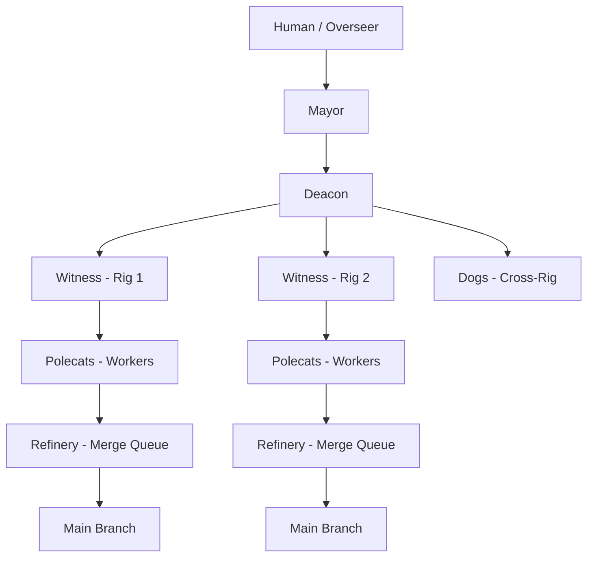

# Gas Town Documentation

**Gas Town** is a multi-agent orchestration system that coordinates fleets of AI coding agents working on your projects simultaneously. Built on top of [Claude Code](https://claude.ai/), it scales from a single agent to 20-30 concurrent workers — all managed through the `gt` CLI.

---

## What is Gas Town?

Gas Town solves the hard problems of multi-agent AI development:

| Challenge | Gas Town Solution |
|-----------|-------------------|
| Agents lose context on restart | Work persists in git-backed hooks |
| Manual coordination breaks at scale | Built-in mailboxes, identities, handoffs |
| Chaos beyond 4-10 agents | Scales to 20-30 agents comfortably |
| Lost work state | Stored in Beads issue tracking system |
| No merge coordination | Refinery serializes merges to main |

## How It Works



You talk to the **Mayor**, who coordinates everything. The Mayor creates **Convoys** (batches of work), assigns tasks to **Polecats** (ephemeral workers), while **Witnesses** monitor health and the **Refinery** handles merges.

## Quick Start

```bash
# Install
brew install gastown

# Create workspace
gt install ~/gt --git
cd ~/gt

# Add a project
gt rig add myproject https://github.com/you/repo.git

# Start the Mayor and give instructions
gt mayor attach
```

Then tell the Mayor what to build. It handles the rest.

## Key Concepts at a Glance

- **Town** — Your workspace directory containing all projects
- **Rigs** — Project containers wrapping git repositories
- **Beads** — Git-backed issue tracking (`bd` CLI)
- **Convoys** — Batches of related work items tracked together
- **Hooks** — Persistent work state that survives crashes and restarts
- **Polecats** — Ephemeral worker agents that spawn, complete a task, then exit
- **Molecules** — Multi-step workflow execution units

## Navigation

| Section | Description |
|---------|-------------|
| [Getting Started](getting-started/index.md) | Installation, setup, and first convoy |
| [Architecture](architecture/index.md) | System design and agent hierarchy |
| [CLI Reference](cli-reference/index.md) | Complete `gt` command reference |
| [Agents](agents/index.md) | Detailed guide to each agent role |
| [Core Concepts](concepts/index.md) | Beads, hooks, convoys, molecules, and more |
| [Workflows](workflows/index.md) | Common workflow patterns |
| [Operations](operations/index.md) | Running, monitoring, and troubleshooting |
| [Guides](guides/index.md) | Usage guide, philosophy, and tips |

## Origin

Gas Town is created by [Steve Yegge](https://steve-yegge.medium.com/) and named after the oil refinery citadel in Mad Max. The alternative name "Gastown" references Vancouver B.C.'s historic Gastown district.

- [Welcome to Gas Town](https://steve-yegge.medium.com/welcome-to-gas-town-4f25ee16dd04) — Launch announcement
- [Gas Town Emergency User Manual](https://steve-yegge.medium.com/gas-town-emergency-user-manual-cf0e4556d74b) — Practical usage guide
- [Software Survival 3.0](https://steve-yegge.medium.com/software-survival-3-0-97a2a6255f7b) — Philosophy and predictions
- [GitHub Repository](https://github.com/steveyegge/gastown) — Source code
