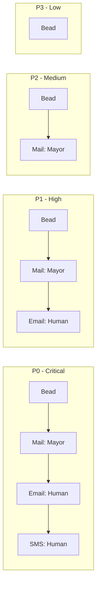
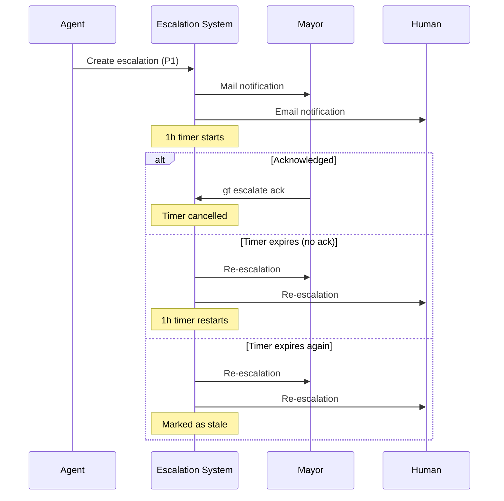
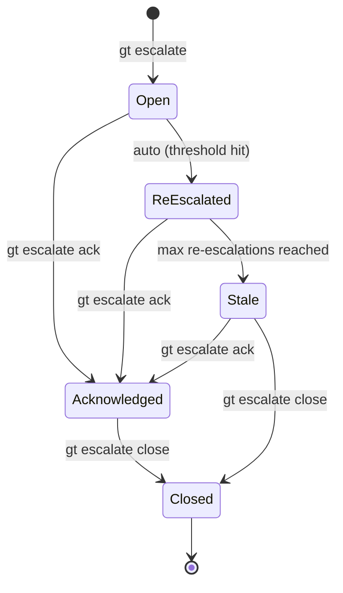
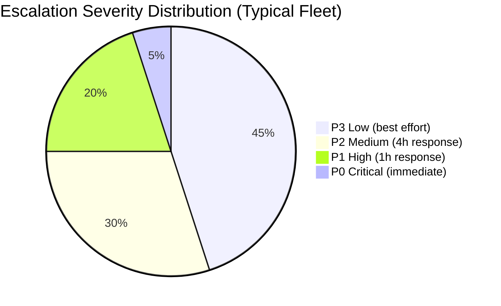

# Escalation System

Gas Town's escalation system provides priority-routed alerts that flow upward through the supervision hierarchy. When an agent encounters a problem it cannot resolve, it creates an escalation that routes to the appropriate handler based on severity. This ensures critical issues reach the human operator quickly while low-severity problems are tracked without interruption.

---

## Creating Escalations

### `gt escalate`

Create a new escalation from any context.

```bash
# Create an escalation with default severity (medium/P2)
gt escalate "Refinery merge failing on myproject - rebase conflict"

# Create with specific severity
gt escalate --severity critical "Database migration broke all tests"
gt escalate --severity high "Polecat toast stuck for 30+ minutes"
gt escalate --severity low "Flaky test in auth module"

# Attach to a bead
gt escalate --bead gt-a1b2c "Blocked: needs API key configuration"

# Attach to a rig
gt escalate --rig myproject "All polecats failing to spawn"
```

:::note

Agents create escalations automatically when they detect problems they cannot resolve. Manual `gt escalate` is for cases where you (or the Mayor) need to flag something explicitly.

:::

---

## Severity Levels

Gas Town uses four severity levels, aligned with standard incident management practices:

| Level | Code | Description | Response Time |
|-------|------|-------------|---------------|
| **Critical** | P0 | System down, data loss risk, all work blocked | Immediate |
| **High** | P1 | Major functionality broken, significant work blocked | < 1 hour |
| **Medium** | P2 | Degraded operation, workaround available | < 4 hours |
| **Low** | P3 | Minor issue, cosmetic, or improvement suggestion | Best effort |

### When Each Severity is Used

#### P0 -- Critical

- The daemon is unresponsive and agents are not receiving heartbeats
- Database corruption detected in beads
- All polecats in a rig are failing simultaneously
- Merge to main produced broken code that blocks all downstream work
- Data loss or irreversible state corruption

#### P1 -- High

- A Witness or Refinery is down and not auto-recovering
- Multiple polecats stuck on the same blocker
- Merge queue backed up with conflicts that require human judgment
- Agent repeatedly crashing on restart
- External service dependency is down (GitHub API, etc.)

#### P2 -- Medium

- A single polecat is stuck but others are progressing
- Flaky tests causing intermittent merge failures
- Non-critical agent running slowly or consuming excess resources
- Configuration issue affecting one rig but not others

#### P3 -- Low

- Cosmetic issues in generated code
- Optimization suggestions from agents
- Stale worktrees that need cleanup
- Documentation gaps noticed during work

---

## Routing Configuration

Escalation routing is configured in `settings/escalation.json` at the town level.

```json
{
  "routing": {
    "critical": {
      "channels": ["bead", "mail:mayor", "email:human", "sms:human"],
      "auto_escalate_after": "15m",
      "max_re_escalations": 3
    },
    "high": {
      "channels": ["bead", "mail:mayor", "email:human"],
      "auto_escalate_after": "1h",
      "max_re_escalations": 2
    },
    "medium": {
      "channels": ["bead", "mail:mayor"],
      "auto_escalate_after": "4h",
      "max_re_escalations": 2
    },
    "low": {
      "channels": ["bead"],
      "auto_escalate_after": null,
      "max_re_escalations": 0
    }
  },
  "contacts": {
    "human": {
      "email": "you@example.com",
      "sms": "+1234567890"
    }
  },
  "quiet_hours": {
    "enabled": false,
    "start": "22:00",
    "end": "08:00",
    "timezone": "America/Los_Angeles",
    "override_for": ["critical"]
  }
}
```

### Routing Paths by Severity



Each channel in the routing path is attempted in order. If the escalation is not acknowledged within the `auto_escalate_after` window, it re-escalates through the same channels.

:::tip[Customize Routing]

You can add custom channels like Discord or Slack webhooks by adding entries to the `channels` array and configuring the integration in `settings/integrations.json`.

:::

---

:::tip[Escalation Hygiene]
Review and close resolved escalations daily. Stale escalations clutter the system and reduce signal-to-noise ratio for new issues. A clean escalation inbox makes critical problems stand out immediately, while a backlog of old unacknowledged escalations creates alert fatigue.
:::

## Managing Escalations

### `gt escalate list`

View all open escalations.

```bash
# List all open escalations
gt escalate list

# Filter by severity
gt escalate list --severity critical
gt escalate list --severity high

# Filter by rig
gt escalate list --rig myproject

# Include closed escalations
gt escalate list --all

# JSON output
gt escalate list --json
```

Sample output:

```text
Open Escalations (3):

  ESC-001  P0  CRITICAL  "Database migration broke all tests"
           Rig: myproject  Bead: gt-a1b2c  Age: 12m  ACK: no
           Route: bead -> mail:mayor -> email:human (pending)

  ESC-002  P1  HIGH      "Polecat toast stuck 35m"
           Rig: myproject  Bead: gt-d3e4f  Age: 35m  ACK: yes (mayor)
           Route: bead -> mail:mayor (acknowledged)

  ESC-003  P2  MEDIUM    "Flaky test in auth module"
           Rig: docs  Age: 2h  ACK: no
           Route: bead -> mail:mayor (pending)
```

### `gt escalate ack`

Acknowledge an escalation. This stops re-escalation and signals that someone is handling it.

```bash
# Acknowledge by ID
gt escalate ack ESC-001

# Acknowledge with a note
gt escalate ack ESC-001 --note "Looking into the migration issue"

# Acknowledge all open escalations
gt escalate ack --all
```

:::warning

Acknowledging an escalation does **not** resolve it. It only signals that the issue is being actively worked on. Use `gt escalate close` when the issue is resolved.

:::

### `gt escalate close`

Close a resolved escalation.

```bash
# Close by ID
gt escalate close ESC-001

# Close with resolution note
gt escalate close ESC-001 --note "Fixed: migration script had wrong column type"

# Close with a linked commit
gt escalate close ESC-001 --commit abc1234
```

### `gt escalate stale`

Find escalations that have gone unacknowledged past their threshold.

```bash
gt escalate stale
```

Sample output:

```text
Stale Escalations (1):

  ESC-003  P2  MEDIUM  "Flaky test in auth module"
           Age: 4h 12m (threshold: 4h)
           Re-escalations: 1 of 2
           Next re-escalation in: 3h 48m
```

---

## Auto Re-Escalation

When an escalation is not acknowledged within its severity's `auto_escalate_after` window, Gas Town automatically re-sends notifications through the configured channels.

### How It Works

1. An escalation is created and notifications are sent through the routing channels
2. A timer starts based on the severity's `auto_escalate_after` value
3. If the timer expires without an `ack`, the escalation is re-sent
4. This repeats up to `max_re_escalations` times (default: 2 for P1/P2)
5. After max re-escalations, the escalation is marked as `stale` but remains open

### Default Thresholds

| Severity | Auto Re-Escalate After | Max Re-Escalations | Total Window |
|----------|----------------------|---------------------|--------------|
| P0 Critical | 15 minutes | 3 | ~1 hour |
| P1 High | 1 hour | 2 | ~3 hours |
| P2 Medium | 4 hours | 2 | ~12 hours |
| P3 Low | Never | 0 | N/A |

:::note

The 4-hour default threshold for medium-severity escalations means an unacknowledged P2 will re-escalate twice, at the 4h and 8h marks. After the second re-escalation (at 8h), it becomes stale.

:::

### Re-Escalation Flow



---

## Escalation Lifecycle



---

## Common Escalation Scenarios

These are real-world scenarios you will encounter and how to handle them.

### Scenario: Flaky Test Causing Repeated Merge Failures

A test intermittently fails in the Refinery, causing merges to bounce. Polecats' work is correct but the gate keeps rejecting it.

**What you will see:**

- Multiple P2 escalations from the Refinery about merge failures
- The same test name appearing in different escalation messages
- Merge queue growing as items back up behind the flaky test

**What to do:**

```bash
# Acknowledge the escalations
gt escalate ack ESC-001 --note "Flaky test identified: test_auth_timeout"

# Fix the flaky test (or skip it temporarily)
# Work from a crew workspace to fix main directly
cd ~/gt/myproject/crew/yourname
# Fix the test, commit, push to main

# Close the escalation
gt escalate close ESC-001 --note "Fixed flaky test: added retry logic to test_auth_timeout"
```

### Scenario: Polecat Stuck in a Loop

A polecat keeps trying the same approach to a problem, failing, and trying again. The Witness has nudged it but it cannot break out.

**What you will see:**

- P1 escalation from the Witness about a stale polecat
- `gt peek` shows the polecat repeating similar actions

**What to do:**

```bash
# Acknowledge
gt escalate ack ESC-002 --note "Reviewing stuck polecat"

# Stop the polecat and release its work
gt polecat nuke toast --rig myproject
gt release gt-a1b2c

# Add more detail to the bead before re-slinging
bd update gt-a1b2c --notes "Previous attempt failed because <reason>. Try <alternative approach>."

# Re-sling to a fresh polecat
gt sling gt-a1b2c myproject

gt escalate close ESC-002 --note "Respawned with updated guidance"
```

### Scenario: Cost Spike During Off-Hours

You return to find an escalation about token costs exceeding the daily budget.

**What you will see:**

- P1 or P2 escalation with cost details
- `gt costs` showing a spike

**What to do:**

```bash
# Check what caused the spike
gt costs --since 12h --by-agent
gt trail --since 12h

# If a runaway agent, stop it
gt polecat nuke <name> --rig myproject

# Acknowledge and close
gt escalate ack ESC-003 --note "Cost spike from runaway polecat"
gt escalate close ESC-003 --note "Stopped runaway polecat, reviewing task scoping"
```

---

:::danger

Do not set `auto_escalate_after` to less than 5 minutes for any severity level. Very short re-escalation windows can create notification storms that flood your inbox and the Mayor's mailbox, degrading system performance and making it harder to identify genuine critical issues.

:::

The following diagram shows the relative urgency and notification breadth of each severity level:



## Tuning Escalation Thresholds

The default thresholds work well for most setups, but you may want to adjust them based on your operational pattern.

### When to Tighten Thresholds (Shorter Timers)

- You are actively monitoring and want faster alerts
- The project is in a critical phase (launch, migration)
- You have multiple rigs and need early warning

```json
{
  "routing": {
    "high": {
      "auto_escalate_after": "30m",
      "max_re_escalations": 3
    }
  }
}
```

### When to Loosen Thresholds (Longer Timers)

- Running overnight unattended (combine with quiet hours)
- Low-priority project where delays are acceptable
- Reducing alert fatigue from a noisy rig

```json
{
  "routing": {
    "medium": {
      "auto_escalate_after": "8h",
      "max_re_escalations": 1
    }
  }
}
```

### Per-Rig Overrides

You can override escalation settings at the rig level by placing an `escalation.json` in `<rig>/settings/`. Rig-level settings merge with (and override) town-level defaults.

---

## Escalation Best Practices

1. **Acknowledge promptly.** Even if you cannot fix the issue immediately, acknowledging stops the re-escalation timer and signals to the system that a human is aware.

2. **Use severity levels correctly.** P0 should be reserved for genuine emergencies. Over-using P0 leads to alert fatigue and reduces the signal value of critical escalations.

3. **Configure quiet hours** if you run Gas Town overnight. Critical escalations override quiet hours by default, but you can control this in the routing configuration.

4. **Review `gt escalate stale` daily.** Stale escalations represent issues that fell through the cracks -- they need attention.

5. **Close with notes.** Future-you will appreciate knowing how past escalations were resolved. Use `--note` and `--commit` flags to leave a trail.

6. **Let agents escalate.** Do not suppress agent escalations. If an agent is escalating too frequently, the root cause is usually a systemic issue (flaky tests, misconfigured rig, etc.) rather than the agent being too aggressive.

## Related

- [Agent Hierarchy](../architecture/agent-hierarchy.md) -- The supervision tree that defines escalation paths between agents
- [Monitoring & Health](monitoring.md) -- Detecting the problems that trigger escalations
- [Troubleshooting](troubleshooting.md) -- Resolving the issues that escalations surface
- [Deacon](../agents/deacon.md) -- The town-level health monitor that routes escalations

### Blog Posts

- [The Escalation System: How Gas Town Surfaces Problems Before They Snowball](/blog/escalation-system) -- Practical guide to severity levels, routing configuration, and handling real-world incidents
- [Incident Response with Gas Town: When Things Go Wrong](/blog/incident-response) -- A practical guide to diagnosing and recovering from common Gas Town failures
- [Monitoring Your Gas Town Fleet](/blog/monitoring-fleet) -- Practical guide to monitoring agent health, tracking progress, and catching problems early
- [The Deacon's Patrol: Keeping Gas Town Healthy](/blog/deacon-patrol) -- How the Deacon detects problems and routes escalations through the supervision hierarchy
