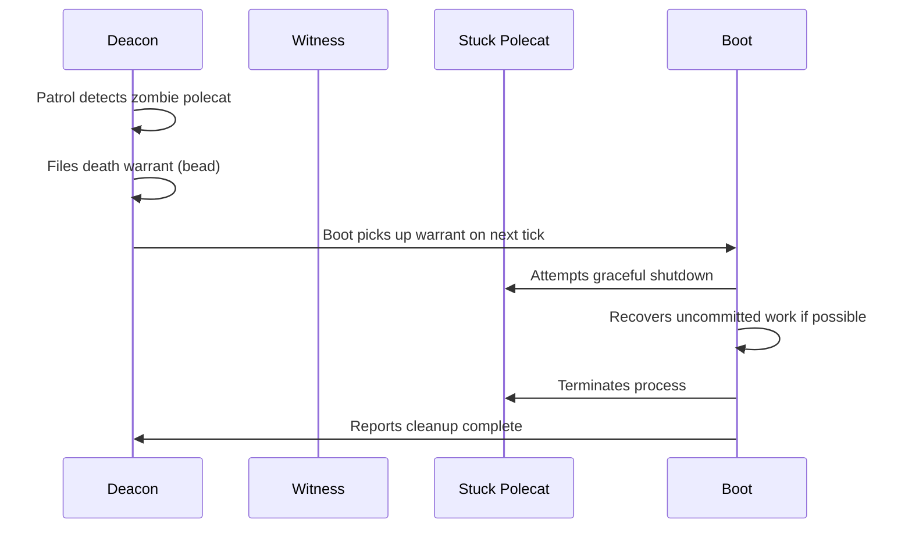
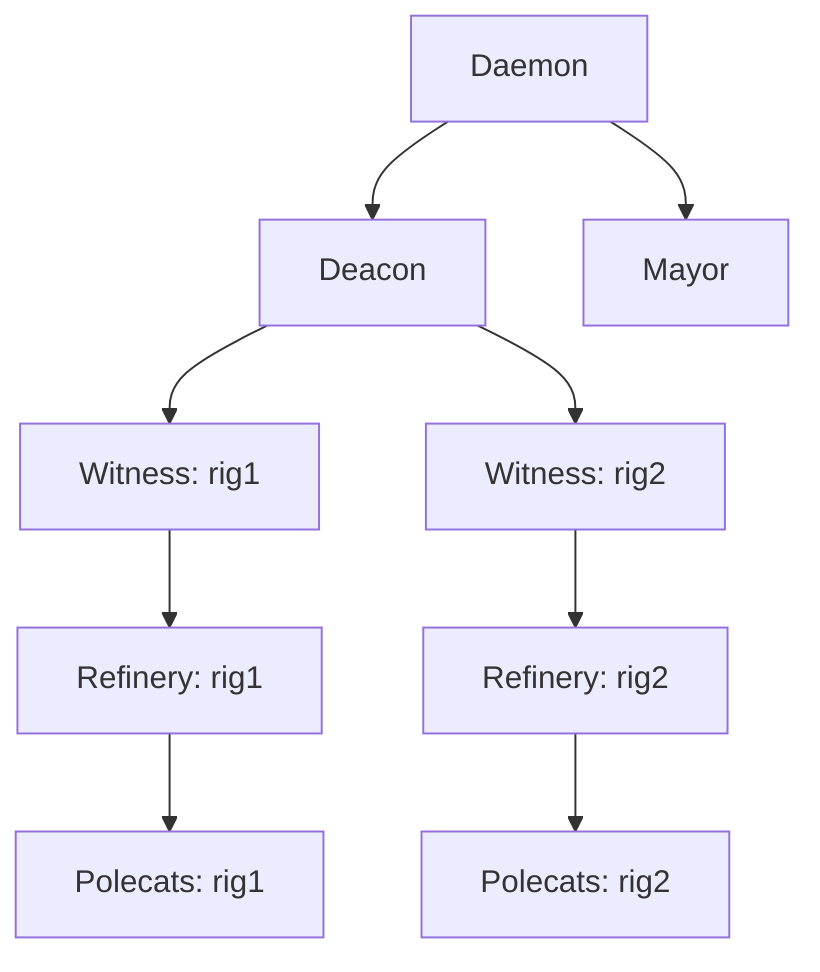
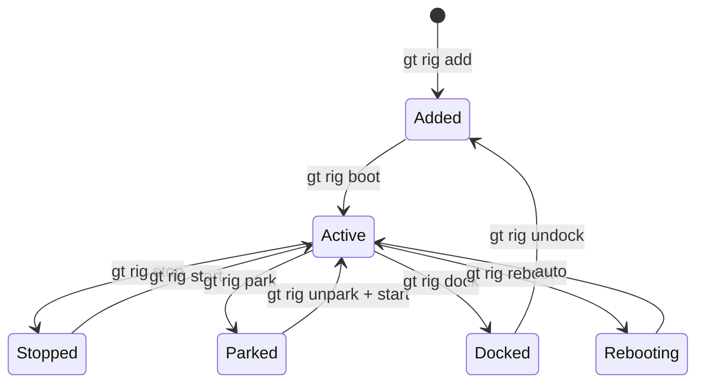

# Starting & Stopping

Gas Town provides granular control over the system lifecycle -- from starting the entire fleet to managing individual agents and rigs. Understanding the distinction between **pause** (`gt down`) and **shutdown** (`gt shutdown`) is critical: pausing preserves worktrees and state for fast restart, while shutdown cleans up resources.

---

## Town-Level Lifecycle

### Starting Gas Town

#### `gt start` -- Core Agents

Starts the **Deacon** and **Mayor**, the two town-level persistent agents.

```bash
gt start
```

What happens:

1. The daemon process starts (if not already running)
2. A Deacon session launches in tmux
3. A Mayor session launches in tmux
4. Both agents run `gt prime` to load context

:::note

`gt start` does **not** start per-rig agents (Witnesses, Refineries). Use `gt start --all` to include them.

:::

#### `gt start --all` -- Full Fleet

Starts everything: Deacon, Mayor, plus all Witnesses and Refineries across all active rigs.

```bash
gt start --all
```

What happens:

1. Daemon starts
2. Deacon and Mayor sessions launch
3. For each active (non-parked) rig:
    - Witness session starts
    - Refinery session starts
4. All agents prime and begin patrol cycles

```bash
# Start with verbose output to watch the boot sequence
gt start --all --verbose
```

:::tip

After `gt start --all`, run `gt rig list` to confirm all rigs show the expected agent status.

:::

### Stopping Gas Town

Gas Town offers two stopping modes with very different behaviors:

#### `gt down` -- Pause (Preserve State)

Stops all running agent processes but **keeps worktrees intact**. Use this when you plan to resume soon.

```bash
gt down
```

| What it stops | What it keeps |
|---------------|---------------|
| Mayor session | Git worktrees |
| Deacon session | Hook attachments |
| Witness sessions | Bead state |
| Refinery sessions | Mail queues |
| Daemon process | Config and context |

Resume with:

```bash
gt start --all
```

:::info[When to use `gt down`]

Use `gt down` when taking a break, switching tasks, or performing maintenance. All work state is preserved and agents resume where they left off.

:::

#### `gt shutdown` -- Stop and Clean Up

Stops all processes **and** removes worktrees, cleaning up disk resources.

```bash
gt shutdown
```

This removes polecat worktrees and temporary state. Persistent state (beads, config, hooks) is preserved.

#### `gt shutdown --all` -- Full Cleanup

Stops everything including crew sessions and removes all ephemeral resources.

```bash
gt shutdown --all
```

| Flag | Behavior |
|------|----------|
| `gt shutdown` | Stop agents, remove polecat worktrees |
| `gt shutdown --all` | Also stop crew sessions, full cleanup |
| `gt shutdown --polecats-only` | Only stop and clean up polecats |

:::warning

`gt shutdown --all` stops crew sessions. Make sure human developers have committed and pushed their work before running this.

:::

#### `gt shutdown --polecats-only`

Targets only ephemeral workers. Useful when polecats are stuck but you want to keep persistent agents running.

```bash
gt shutdown --polecats-only
```

This is a surgical operation:

1. All running polecat sessions are terminated
2. Polecat worktrees are removed
3. Witnesses, Refineries, Mayor, and Deacon continue running
4. Hooked beads are released back to `pending` state

---

## Daemon Management

The daemon is a Go process that provides the heartbeat and lifecycle management layer underneath the agent sessions.

### `gt daemon start`

Start the background daemon process.

```bash
gt daemon start
```

The daemon:

- Sends heartbeats to the Deacon every 3 minutes
- Processes lifecycle requests (start/stop agents)
- Restarts crashed sessions when requested
- Polls external services (Discord, webhooks)

### `gt daemon stop`

Stop the daemon process.

```bash
gt daemon stop
```

:::warning

Stopping the daemon means no heartbeats reach the Deacon. The Deacon will detect the missing heartbeat and may escalate. Stop the Deacon first if doing planned maintenance.

:::

### `gt daemon status`

Check whether the daemon is running and view its state.

```bash
gt daemon status
```

Sample output:

```
Daemon: running (PID 12345)
Uptime: 4h 23m
Last heartbeat: 12s ago
Pending requests: 0
```

### `gt daemon logs`

View daemon log output.

```bash
# View recent logs
gt daemon logs

# Follow logs in real-time
gt daemon logs --follow

# Filter by level
gt daemon logs --level error
```

---

## Per-Agent Lifecycle

Individual agents can be started and stopped independently, which is useful for targeted restarts or debugging.

### Starting a Specific Agent

```bash
# Start the Mayor
gt mayor start

# Start the Deacon
gt deacon start

# Start a Witness for a specific rig
gt witness start --rig myproject

# Start a Refinery for a specific rig
gt refinery start --rig myproject
```

### Stopping a Specific Agent

```bash
# Stop the Mayor
gt mayor stop

# Stop the Deacon
gt deacon stop

# Stop a Witness
gt witness stop --rig myproject

# Stop a Refinery
gt refinery stop --rig myproject
```

### Restarting an Agent

```bash
# Restart the Mayor (stop + start)
gt mayor restart

# Restart with fresh context
gt mayor restart --fresh
```

:::note

When an agent restarts, it runs `gt prime` to reload context. All hook-attached work persists across restarts -- agents resume their work automatically.

:::

### Attaching to an Agent Session

```bash
# Attach to the Mayor session (interactive)
gt mayor attach

# Attach to a Witness
gt witness attach --rig myproject

# Attach to a specific polecat
gt polecat attach toast --rig myproject
```

---

## Death Warrants (Agent Cleanup)

When an agent becomes unresponsive, exceeds its timeout, or turns into a zombie process, Gas Town uses **death warrants** to coordinate cleanup. A death warrant is not an immediate kill -- it's a structured cleanup request that ensures work is recovered before the agent is terminated.

### How Death Warrants Work



1. **Detection**: The [Deacon](../agents/deacon.md) detects zombies during its patrol cycle -- sessions that are alive but not responding, or processes consuming resources without producing output.
2. **Filing**: The Deacon files a death warrant as a bead, not an immediate kill. This creates an audit trail.
3. **Execution**: [Boot](../agents/boot.md) processes death warrants on daemon ticks. It attempts graceful shutdown first, recovers any uncommitted work, then terminates the process.
4. **Recovery**: Hooked work is released back to `pending` status. The [Witness](../agents/witness.md) can then re-sling the work to a fresh polecat.

### Death Warrants for Dogs

[Dogs](../agents/dogs.md) (Deacon infrastructure helpers) that exceed their task timeout also receive death warrants:

```bash
gt dog list                  # Check dog states
# Dogs past timeout show "death warrant pending"
```

### Why Not Kill Immediately?

The warrant system exists because immediate kills risk data loss:

- A polecat may have uncommitted changes worth saving
- A dog may be mid-write on a critical file
- The cleanup process itself needs coordination (remove worktree, release hooks, update beads)

The warrant gives Boot time to do this safely.

---

## Per-Rig Lifecycle

Rigs (project containers) have their own lifecycle commands that control the agents running within them.

### `gt rig start`

Start all agents for a rig (Witness + Refinery).

```bash
gt rig start myproject
```

### `gt rig stop`

Stop all agents in a rig.

```bash
gt rig stop myproject
```

### `gt rig boot`

Cold-start a rig from scratch. Creates fresh worktrees and initializes all agent state.

```bash
gt rig boot myproject
```

This is used when first adding a rig or after a `gt rig dock`.

### `gt rig reboot`

Stop all rig agents, clean up, and restart fresh.

```bash
gt rig reboot myproject
```

Equivalent to `gt rig stop` + cleanup + `gt rig boot`.

:::tip

`gt rig reboot` is the fastest way to recover from a rig that is in a bad state. It preserves beads and configuration but gives agents a clean start.

:::

### `gt rig park`

Take a rig offline without removing it. Parked rigs are ignored by `gt start --all`.

```bash
gt rig park myproject
```

Use cases:

- Temporarily disable a project while focusing on others
- Reduce resource consumption during low-activity periods
- Prevent agents from working on a rig during manual maintenance

### `gt rig unpark`

Bring a parked rig back online.

```bash
gt rig unpark myproject
```

After unparking, run `gt rig start myproject` to launch agents.

### `gt rig dock`

Archive a rig. Stops agents, removes worktrees, and marks the rig as docked.

```bash
gt rig dock myproject
```

Docked rigs retain their configuration and bead history but consume no runtime resources.

### `gt rig undock`

Restore a docked rig to active status.

```bash
gt rig undock myproject
```

After undocking, run `gt rig boot myproject` to create worktrees and start agents.

---

## Startup Order and Dependencies

When starting Gas Town, components must come up in a specific order. `gt start --all` handles this automatically, but understanding the dependency chain helps when troubleshooting partial starts or doing manual recovery.

### Required Startup Order



| Order | Component | Depends On | Why |
|-------|-----------|------------|-----|
| 1 | Daemon | Nothing | Provides heartbeat and lifecycle management |
| 2 | Deacon | Daemon | Monitors daemon heartbeats, manages town health |
| 3 | Mayor | Daemon | Coordinates work distribution across rigs |
| 4 | Witnesses | Deacon | Monitor per-rig health; report to Deacon |
| 5 | Refineries | Witnesses | Process merge queue; Witness monitors their health |
| 6 | Polecats | Refineries | Do the work; Refinery merges their output |

:::note

If you start a Witness before the Deacon, it will still function but the Deacon will not know about it until its next patrol cycle. Starting in the correct order ensures immediate monitoring coverage.

:::

### What Each Agent Needs at Startup

Every agent runs `gt prime` on startup to load its role context. This requires:

- Its home directory to exist (worktree for polecats, rig directory for others)
- The beads database to be accessible
- Hook state to be intact (for polecats, their assigned work)
- Mail queue to be readable (for checking incoming messages)

If any of these are missing, the agent will log errors. Use `gt doctor` to identify missing prerequisites.

---

## Emergency Recovery

When the normal lifecycle commands are not working, use these procedures to recover the system.

### Scenario: Full System Unresponsive

Nothing is responding -- `gt` commands hang or error out.

```bash
# Step 1: Check if the daemon is alive
gt daemon status

# Step 2: If daemon is dead, start it
gt daemon start

# Step 3: If gt commands still hang, check for tmux
tmux list-sessions

# Step 4: Kill all tmux sessions and restart clean
tmux kill-server
gt start --all
```

### Scenario: Single Rig in Bad State

One rig is misbehaving but others are fine.

```bash
# Surgical shutdown of the problem rig
gt rig stop myproject

# Clean up orphaned resources
gt cleanup --rig myproject

# Fresh start for the rig
gt rig boot myproject
```

### Scenario: Polecats Spawning and Immediately Dying

Polecats start but crash within seconds, repeatedly.

```bash
# Stop the spawn cycle
gt shutdown --polecats-only --rig myproject

# Check what is causing the crash
gt trail --rig myproject --last 20

# Common cause: broken main branch
# Verify tests pass on main
cd ~/gt/myproject/crew/yourname
git fetch origin && git checkout origin/main
# Run project tests

# If main is broken, fix it before resuming polecat work
```

### Scenario: Lost Work from Crashed Polecat

A polecat crashed before pushing its changes.

```bash
# Check if the worktree still exists
ls ~/gt/myproject/polecats/*/myproject/

# If it exists, recover the work
cd ~/gt/myproject/polecats/<name>/myproject
git status
git log --oneline -5
# Commit and push if there are changes worth saving

# If the worktree is gone, check for orphaned commits
gt orphans --commits --rig myproject
gt orphans --recover <commit-hash>
```

---

## Graceful Degradation

Gas Town is designed to continue operating even when some components fail. Understanding what keeps working and what stops helps you prioritize recovery.

| Failed Component | What Still Works | What Stops |
|-----------------|-----------------|------------|
| Daemon | All agents continue running | No new agents can be spawned; no heartbeats |
| Deacon | Rigs operate independently | No town-wide health monitoring; no zombie cleanup |
| Mayor | Existing work continues | No new work distribution; convoys not coordinated |
| Witness (one rig) | Other rigs unaffected | Stale polecats in that rig are not detected |
| Refinery (one rig) | Polecats can still work | Completed work accumulates but does not merge |
| Single polecat | All other polecats fine | One bead's work is delayed |

:::tip

The system degrades gracefully because each agent operates independently with its own state. A failed Witness in one rig has zero impact on polecats in another rig. Prioritize recovering components based on what is actually blocked.

:::

---

## Lifecycle State Machine



---

## Lifecycle Quick Reference

| Command | Scope | Processes | Worktrees | State |
|---------|-------|-----------|-----------|-------|
| `gt start` | Town | Start Mayor + Deacon | Unchanged | Unchanged |
| `gt start --all` | Town + Rigs | Start all agents | Unchanged | Unchanged |
| `gt down` | Town | Stop all | **Kept** | Preserved |
| `gt shutdown` | Town | Stop all | **Removed** | Preserved |
| `gt shutdown --all` | Town + Crew | Stop all + crew | **Removed** | Preserved |
| `gt shutdown --polecats-only` | Polecats | Stop polecats | Polecat trees removed | Beads released |
| `gt rig start <name>` | Single rig | Start rig agents | Unchanged | Unchanged |
| `gt rig stop <name>` | Single rig | Stop rig agents | Unchanged | Unchanged |
| `gt rig boot <name>` | Single rig | Start fresh | **Created** | Initialized |
| `gt rig reboot <name>` | Single rig | Stop + restart | **Recreated** | Reset |
| `gt rig park <name>` | Single rig | Stop | Unchanged | Parked |
| `gt rig dock <name>` | Single rig | Stop | **Removed** | Archived |

## See Also

- **[Agent Hierarchy](../architecture/agent-hierarchy.md)** -- How agents are organized for lifecycle management
- **[Patrol Cycles](../concepts/patrol-cycles.md)** -- Periodic health monitoring that detects lifecycle issues
- **[Deacon](../agents/deacon.md)** -- The agent responsible for lifecycle coordination
