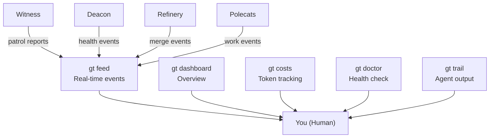
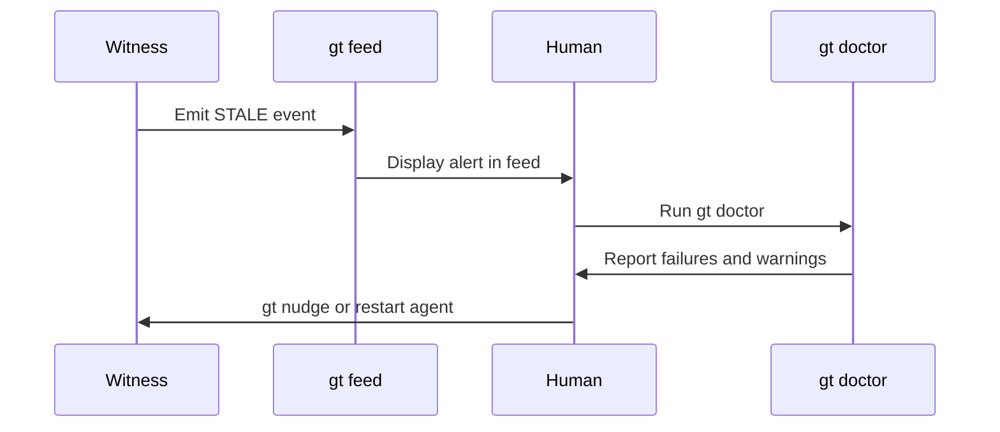
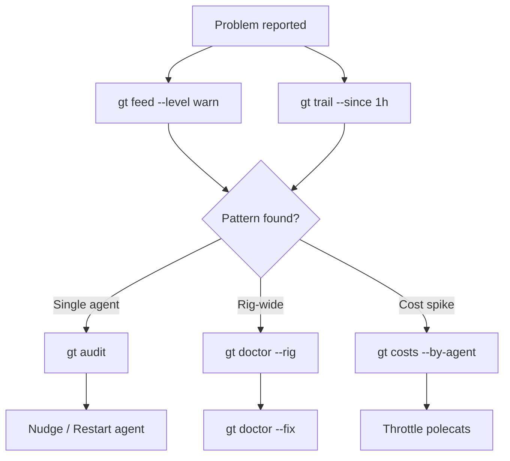
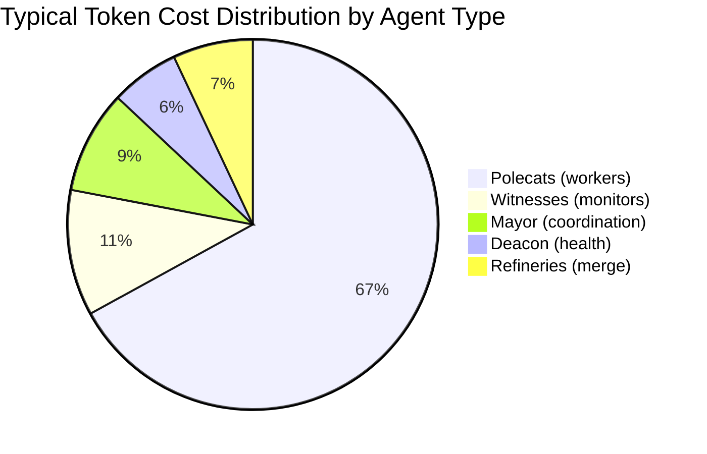
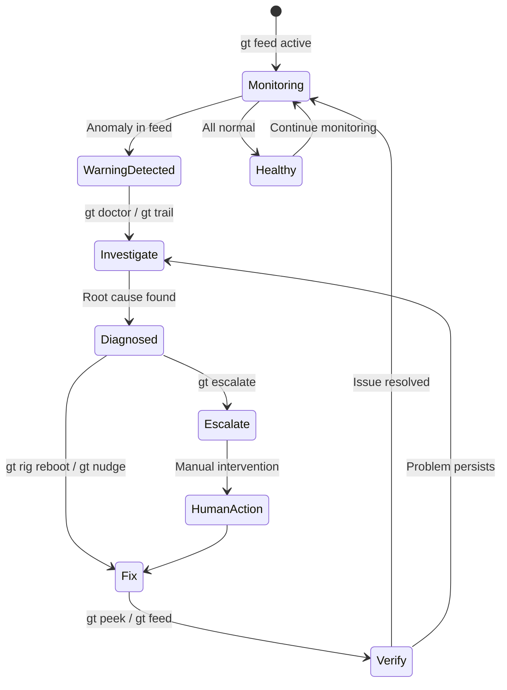

# Monitoring & Health

Gas Town provides a suite of monitoring tools to observe real-time activity, audit historical work, diagnose system health, and track costs. Effective monitoring is how you keep a fleet of 10-30 agents running smoothly without micromanaging each one.

---

## Monitoring Stack



## Real-Time Activity

### `gt feed` -- Activity Dashboard

The primary real-time monitoring command. Shows a live stream of events across all agents and rigs.

```bash
gt feed
```

The feed displays:

- Agent starts and stops
- Work assignments and completions
- Merge queue activity
- Escalations raised and resolved
- Convoy progress updates
- Error events

```bash
# Filter to a specific rig
gt feed --rig myproject

# Filter by event type
gt feed --type merge
gt feed --type escalation

# Show only errors and warnings
gt feed --level warn

# JSON output for piping to other tools
gt feed --json
```

Sample output:

```text
14:23:01 [myproject] polecat:toast  STARTED  gt-a1b2c "Fix login bug"
14:23:45 [docs]      polecat:bravo  DONE     gt-d3e4f "Update API docs"
14:24:02 [myproject] refinery       MERGE    gt-d3e4f merged to main
14:25:11 [myproject] witness        STALE    polecat:alpha idle 12m
14:25:12 [myproject] witness        NUDGE    polecat:alpha "check progress"
```

:::tip[Keep a Feed Running]

Open a dedicated terminal with `gt feed` running at all times. It is the fastest way to spot problems before they escalate.

:::

### `gt trail` -- Recent Agent Activity

Shows a summary of recent agent activity -- more concise than `gt feed`, focused on what happened rather than a live stream.

```bash
gt trail
```

```bash
# Show last N events
gt trail --last 50

# Filter by agent
gt trail --agent witness

# Filter by rig
gt trail --rig myproject

# Show activity in the last hour
gt trail --since 1h
```

Sample output:

```text
Last 1h activity (23 events):

  myproject  4 polecats spawned, 3 completed, 1 active
  myproject  2 merges completed, 0 pending
  docs       1 polecat spawned, 1 completed

  Escalations: 0 new, 0 open
  Convoys: 2 active, 1 completed
```

### `gt peek` -- View Recent Session Output

Peek at the most recent output from an agent session without attaching to it.

```bash
# Peek at the Mayor's recent output
gt peek mayor

# Peek at a specific polecat
gt peek polecat:toast --rig myproject

# Peek at the Witness
gt peek witness --rig myproject

# Show more lines
gt peek mayor --lines 100
```

:::note

`gt peek` is read-only. To interact with an agent, use `gt mayor attach` or `gt polecat attach`.

:::

---

## Activity & Audit

### `gt activity` -- Event System

The activity system provides structured event emission and querying. Every significant action in Gas Town emits an activity event.

```bash
# View recent activity
gt activity

# Emit a custom event
gt activity emit "deployment started" --type deploy --rig myproject

# Query events with filters
gt activity --type convoy --since 24h
gt activity --actor witness --rig myproject
```

Events are stored in `.events.jsonl` at the town level and queryable with standard JSON tools.

### `gt audit` -- Work History by Actor

Query the full work history of a specific actor (agent or human).

```bash
# Audit a specific agent
gt audit witness --rig myproject

# Audit a polecat by name
gt audit polecat:toast

# Audit all work in a time range
gt audit --since 2025-01-01 --until 2025-01-31

# Audit by bead
gt audit --bead gt-a1b2c

# JSON output
gt audit --json
```

Sample output:

```text
Audit: polecat:toast (myproject)

  2025-06-15 14:23  SPAWNED   hook: gt-a1b2c "Fix login bug"
  2025-06-15 14:41  COMMIT    3 files changed, +45 -12
  2025-06-15 14:52  MR_SUBMIT gt-a1b2c -> refinery
  2025-06-15 14:52  EXIT      COMPLETED (29m elapsed)

  Total: 1 task, 1 completed, 0 escalated
  Avg duration: 29m
```

### `gt log` -- Town Activity Log

View the structured town activity log, which captures higher-level operational events.

```bash
# View the log
gt log

# Follow in real-time
gt log --follow

# Filter by severity
gt log --level error
gt log --level warn

# Filter by component
gt log --component refinery
gt log --component daemon
```

---

## System Health

### `gt doctor` -- Health Checks

Run a comprehensive diagnostic check on your Gas Town installation.

```bash
gt doctor
```

The doctor checks:

| Check | What it verifies |
|-------|------------------|
| Dependencies | `git`, `bd`, `claude`, `tmux` versions |
| Daemon | Process running, heartbeat recent |
| Agents | Mayor, Deacon sessions alive |
| Rigs | Config valid, worktrees intact |
| Beads | Database accessible, no corruption |
| Hooks | No orphaned hooks, no stale attachments |
| Processes | No zombie Claude processes |
| Disk | Worktree disk usage, temp file cleanup |
| Network | Git remotes reachable |

```bash
# Check a specific rig
gt doctor --rig myproject

# Check only a specific subsystem
gt doctor --check daemon
gt doctor --check agents
gt doctor --check beads

# JSON output for automation
gt doctor --json

# Auto-fix what it can
gt doctor --fix
```

Sample output:

```text
Gas Town Doctor v1.2.0

  [PASS] Dependencies: all present
  [PASS] Daemon: running (PID 12345, heartbeat 8s ago)
  [PASS] Mayor: session active
  [PASS] Deacon: session active
  [WARN] myproject/witness: session idle 15m
  [PASS] myproject/refinery: session active, queue empty
  [PASS] docs/witness: session active
  [FAIL] docs/refinery: session not found
  [PASS] Beads: 3 databases healthy
  [WARN] 2 orphaned polecat worktrees found

Summary: 8 passed, 2 warnings, 1 failure
Run 'gt doctor --fix' to attempt automatic repairs.
```

:::warning

`gt doctor --fix` will attempt to restart failed agents, clean orphaned worktrees, and repair database issues. Review the output before running it in production.

:::

### Patrol Digests -- `gt patrol digest`

Persistent agents (Deacon, Witness, Refinery) run periodic patrol cycles. You can request a digest of recent patrol findings.

```bash
# Get the Deacon's patrol digest
gt patrol digest

# Get a specific agent's patrol digest
gt patrol digest --agent witness --rig myproject

# Request a fresh patrol cycle
gt patrol start
```

The patrol digest summarizes:

- Agent health status across all rigs
- Stale or stuck polecats detected
- Merge queue backlogs
- Unacknowledged escalations
- Resource usage anomalies

---

## Dashboard & Costs

### `gt dashboard` -- Convoy Tracking Web Dashboard

Launch a web-based dashboard for visual convoy and system tracking. For monitoring at scale, see [Monitoring Your Gas Town Fleet](/blog/monitoring-fleet).

```bash
gt dashboard
```

:::note[Local-Only Service]

`gt dashboard` runs a **local** web server on your machine. There is no hosted dashboard service. The dashboard is only accessible while the command is running and only from your local machine (or network, if configured).

:::

:::caution[Dashboard Performance with Large Fleets]
The dashboard refreshes all convoy and agent data every few seconds. With 15+ active polecats across multiple rigs, frequent refreshes can create noticeable CPU usage on older machines. If the dashboard feels sluggish, consider increasing the refresh interval in `settings/dashboard.json` or using command-line tools like `gt trail` for lower-overhead monitoring.
:::

This opens a local web server (default: `http://localhost:8420`) with:

- **Convoy overview** -- All active convoys with progress bars
- **Agent map** -- Visual hierarchy of running agents per rig
- **Merge queue** -- Real-time refinery pipeline status
- **Activity timeline** -- Scrollable event history
- **Escalation panel** -- Open and recent escalations

```bash
# Specify a custom port
gt dashboard --port 9000

# Run headless (no browser auto-open)
gt dashboard --no-open

# Stop the dashboard
gt dashboard stop
```

:::tip

The dashboard auto-refreshes. Keep it open on a second monitor for at-a-glance fleet visibility.

:::

### `gt costs` -- Claude Session Costs

Track token consumption and estimated costs across all agent sessions.

```bash
gt costs
```

```bash
# Show costs for the current day
gt costs --today

# Show costs for a specific period
gt costs --since 24h
gt costs --since 2025-06-01 --until 2025-06-15

# Break down by agent type
gt costs --by-agent

# Break down by rig
gt costs --by-rig

# JSON output
gt costs --json
```

Sample output:

```text
Gas Town Costs (last 24h)

  Total tokens:  2,450,000 input / 890,000 output
  Est. cost:     $47.20

  By agent:
    Mayor:       $4.10  (8.7%)
    Deacon:      $2.80  (5.9%)
    Witnesses:   $5.40  (11.4%)
    Refineries:  $3.20  (6.8%)
    Polecats:    $31.70 (67.2%)

  By rig:
    myproject:   $32.40 (68.6%)
    docs:        $14.80 (31.4%)
```

:::warning[Cost Awareness]

Gas Town at peak usage with 10+ polecats can burn approximately $100/hour in API costs. Monitor `gt costs` regularly and see the [Cost Management](../guides/cost-management.md) guide for optimization strategies.

:::

---

## Monitoring Quick Reference

| Command | Purpose | Mode |
|---------|---------|------|
| `gt feed` | Live event stream | Real-time |
| `gt trail` | Recent activity summary | Historical |
| `gt peek <agent>` | View agent output | Snapshot |
| `gt activity` | Structured event query | Historical |
| `gt audit <actor>` | Work history by actor | Historical |
| `gt log` | Town activity log | Historical / follow |
| `gt doctor` | System health check | Diagnostic |
| `gt patrol digest` | Patrol cycle summary | Periodic |
| `gt dashboard` | Web-based visual dashboard | Real-time |
| `gt costs` | Token usage and costs | Historical |

---

## What to Watch For

Knowing what the tools show you is only half the story. Knowing which signals matter is the other half.



### Red Flags (Investigate Immediately)

| Signal | Where to See It | What It Means |
|--------|----------------|---------------|
| `STALE` events in feed | `gt feed` | An agent has stopped making progress |
| Multiple escalations from one rig | `gt escalate list` | Systemic issue in that project |
| Refinery queue growing | `gt mq status` | Merges are failing or backing up |
| `[FAIL]` in doctor output | `gt doctor` | A subsystem is down |
| Cost spike in hourly rate | `gt costs --today` | Runaway agent or infinite loop |
| No events for 10+ minutes | `gt feed` | System may have stalled silently |

### Warning Signs (Check When Convenient)

| Signal | Where to See It | What It Means |
|--------|----------------|---------------|
| Increasing polecat durations | `gt audit` | Tasks may be too large or poorly scoped |
| Frequent context handoffs | `gt trail` | Tasks are filling context windows regularly |
| Escalations acknowledged but not closed | `gt escalate list --all` | Issues being noticed but not resolved |
| Orphaned worktrees accumulating | `gt orphans` | Cleanup not running often enough |

### Healthy System Indicators

A well-running Gas Town installation shows these patterns:

- Polecats spawn, work, and complete in steady cycles
- Merge queue stays near-empty (items move through quickly)
- Escalation count stays low (under 2-3 open at a time)
- Cost rate is stable and predictable
- `gt doctor` shows all green

---

## Log Analysis Patterns



When `gt feed` and `gt trail` are not enough, dig into the raw event log for patterns.

### Finding Repeated Failures

```bash
# Count events by type in the last 24h
gt activity --since 24h --json | jq -r '.type' | sort | uniq -c | sort -rn

# Find all error events for a specific rig
gt log --level error --component myproject --since 24h

# Find agents that restarted more than twice
gt trail --since 24h | grep RESTART
```

### Tracking a Specific Bead Through the System

```bash
# See the full lifecycle of a piece of work
gt audit --bead gt-a1b2c

# Check if it is stuck somewhere
bd show gt-a1b2c
gt mq show gt-a1b2c
```

### Correlating Events Across Agents

```bash
# See what happened around a specific time
gt trail --since 2h --last 100

# Cross-reference Witness actions with polecat events
gt activity --actor witness --since 1h --json
gt activity --type polecat --since 1h --json
```

---

The following diagram shows the relative token cost distribution across agent types in a typical Gas Town deployment:



## Monitoring Best Practices

1. **Always keep `gt feed` running** in a dedicated terminal. It is the fastest way to notice problems.

2. **Check `gt doctor` daily.** Run it first thing when starting a work session to catch overnight issues.

3. **Review `gt costs --today`** before and after intensive work sessions to understand burn rate.

4. **Use `gt trail --since 1h`** as a quick check when returning after a break.

5. **Set up `gt dashboard`** on a second screen for visual fleet tracking during active development sessions.

6. **Review patrol digests** when the Deacon or Witnesses flag anomalies -- they contain the context you need to decide on action.

7. **Watch for silence.** A quiet feed is not always good news. If no events appear for an extended period, verify the daemon is running and agents are active.

8. **Track trends, not just snapshots.** A single stale polecat is normal. Three stale polecats in the same rig within an hour suggests a systemic problem.

The following state diagram shows how monitoring tools interact in a typical problem detection and resolution flow:



## Related

- [Troubleshooting](troubleshooting.md) -- Detailed diagnosis and resolution for problems surfaced by monitoring
- [Escalation System](escalations.md) -- Priority-routed alerts that flow from monitoring to human attention
- [Cost Management](../guides/cost-management.md) -- Token cost tracking and optimization strategies
- [Agent Hierarchy](../architecture/agent-hierarchy.md) -- The supervision tree that drives patrol cycles and health checks

### Blog Posts

- [Monitoring Your Fleet](/blog/monitoring-fleet) -- Practical monitoring patterns for multi-agent deployments
- [Scaling Beyond 30 Agents](/blog/scaling-beyond-30) -- Monitoring strategies for large-scale deployments
- [The Witness Explained](/blog/witness-explained) -- Deep dive into the per-rig health monitor
- [Incident Response with Gas Town](/blog/incident-response) -- How to diagnose and recover from failures surfaced by the monitoring tools described here
