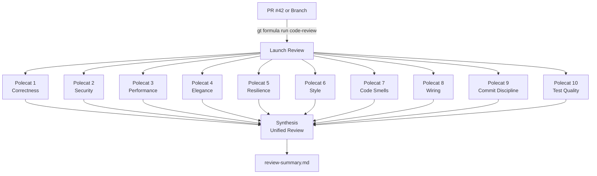
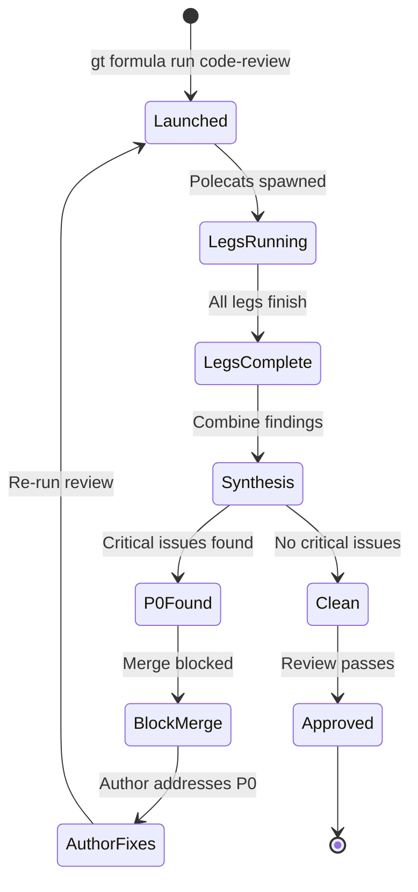
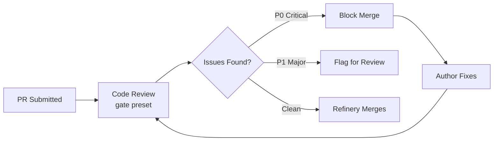
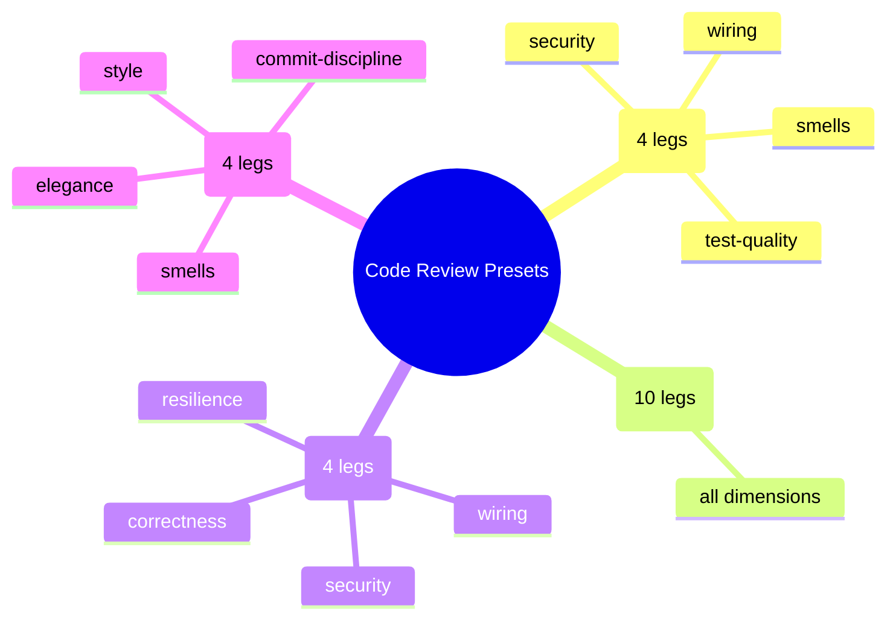
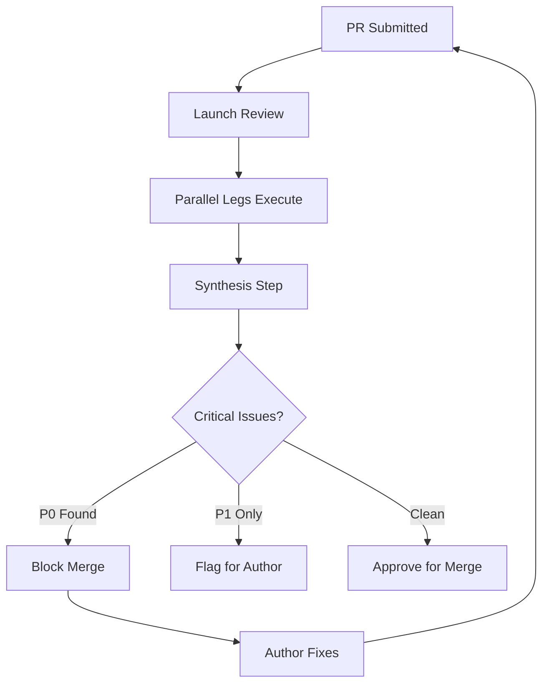

# Code Review Workflow

Gas Town provides a powerful **parallel code review** system using the `code-review` convoy formula. Instead of a single reviewer reading through a PR, Gas Town spawns multiple specialized reviewer polecats -- each examining the code from a different perspective -- then synthesizes their findings into a unified, prioritized review.

---

## When to Use This Workflow

- You want thorough, multi-perspective code review
- You have a PR or branch ready for review
- You want automated detection of issues that human reviewers commonly miss
- You need a structured review before merging to main

:::info[Prerequisites]

- Gas Town installed with at least one rig
- Tmux for parallel polecat spawning
- The rig's Witness and Refinery running

:::

## How It Works



Each polecat works in parallel, examining the code from its specialized perspective. When all legs complete, a synthesis step combines findings into a single prioritized document.

## Review Dimensions

The `code-review` formula examines code from 10 different perspectives:

### Analysis Legs (Read and Analyze Code)

| Leg | Focus | What It Catches |
|-----|-------|-----------------|
| **Correctness** | Logic and edge cases | Off-by-one errors, null handling, race conditions, dead code |
| **Performance** | Bottlenecks and efficiency | O(n^2) algorithms, N+1 queries, memory leaks, missing caching |
| **Security** | Vulnerabilities and attack surface | Injection, auth bypass, exposed secrets, OWASP Top 10 |
| **Elegance** | Design clarity and abstraction | Unclear naming, over-engineering, coupling, SOLID violations |
| **Resilience** | Error handling and failure modes | Swallowed errors, missing timeouts, partial failure states |
| **Style** | Convention compliance | Naming violations, formatting, import organization, doc gaps |
| **Code Smells** | Anti-patterns and tech debt | God classes, long methods, deep nesting, copy-paste code |

### Verification Legs (Check Implementation Quality)

| Leg | Focus | What It Catches |
|-----|-------|-----------------|
| **Wiring** | Installed-but-not-wired gaps | Dependencies added but never imported, old implementations not replaced |
| **Commit Discipline** | Commit quality and atomicity | Giant WIP commits, poor messages, unatomic changes |
| **Test Quality** | Test meaningfulness | Weak assertions, missing negative tests, tests that cannot fail |

## Running a Code Review

### Review a Pull Request

```bash
gt formula run code-review --pr=42
```

### Review a Branch

```bash
gt formula run code-review --branch=feature/auth-redesign
```

### Review Specific Files

```bash
gt formula run code-review --files="src/auth/*.go"
```

## Presets

Presets let you control which legs run, balancing thoroughness against speed and cost:

### Gate Preset (Light Review)

Fast, focused on blockers. Good for automatic merge-gate reviews:

```bash
gt formula run code-review --pr=42 --preset=gate
```

| Legs | Purpose |
|------|---------|
| wiring | Catch installed-but-not-used dependencies |
| security | Catch vulnerabilities |
| smells | Catch anti-patterns |
| test-quality | Verify tests are meaningful |

### Full Preset (Comprehensive)

All 10 legs. Use for major features, security-sensitive changes, or important releases:

```bash
gt formula run code-review --pr=42 --preset=full
```

### Security-Focused Preset

Heavy on security analysis:

```bash
gt formula run code-review --pr=42 --preset=security-focused
```

| Legs | Purpose |
|------|---------|
| security | Vulnerability analysis |
| resilience | Error handling and failure modes |
| correctness | Logic errors that could be exploited |
| wiring | Dependency gaps |

### Refactor Preset

Focus on code quality during refactoring:

```bash
gt formula run code-review --pr=42 --preset=refactor
```

| Legs | Purpose |
|------|---------|
| elegance | Design clarity |
| smells | Anti-patterns |
| style | Convention compliance |
| commit-discipline | Commit quality |

### Custom Leg Selection

Run specific legs only:

```bash
gt formula run code-review --pr=42 --legs=security,correctness,wiring,test-quality
```

## Review Output



### Individual Leg Findings

Each leg writes its findings to `.reviews/<review-id>/<leg-id>-findings.md`:

```text
.reviews/review-abc123/
├── correctness-findings.md
├── security-findings.md
├── performance-findings.md
├── elegance-findings.md
├── resilience-findings.md
├── style-findings.md
├── smells-findings.md
├── wiring-findings.md
├── commit-discipline-findings.md
├── test-quality-findings.md
└── review-summary.md          # Synthesized review
```

### Findings Format

Each leg's findings follow a standard format:

```markdown
# Correctness Review

## Summary
Brief overview of findings from this perspective.

## Critical Issues (P0 - Must fix before merge)
- **src/auth/login.go:42** -- SQL injection via string concatenation
  - Impact: Remote code execution
  - Fix: Use parameterized queries

## Major Issues (P1 - Should fix before merge)
- **src/auth/validate.go:18** -- Missing null check on user input
  - Impact: Panic on nil pointer
  - Fix: Add nil guard before accessing field

## Minor Issues (P2 - Nice to fix)
- ...

## Observations
- ...
```

### Synthesized Review

The `review-summary.md` combines all leg findings into a single document:

```markdown
# Code Review Summary: PR #42

## Executive Summary
Overall assessment and merge recommendation.

## Critical Issues (P0)
Deduplicated critical findings from all legs.

## Major Issues (P1)
Grouped by theme.

## Minor Issues (P2)
Briefly listed.

## Wiring Gaps
Dependencies added but not wired.

## Commit Quality
Assessment from commit-discipline leg.

## Test Quality
Assessment from test-quality leg.

## Positive Observations
What is done well.

## Recommendations
Actionable next steps.
```

## Integration with Merge Queue

The code review workflow integrates naturally with the Refinery merge queue:



### Automatic Gate Review

For automated pipelines, use the `gate` preset as a merge gate:

```bash
# In CI or merge queue configuration:
gt formula run code-review --pr=$PR_NUMBER --preset=gate

# Check for critical issues
# If P0 issues found, block the merge
# If clean, proceed to merge
```

### Manual Full Review

For important changes, run the full review before the author finishes:

```bash
gt formula run code-review --branch=feature/big-refactor --preset=full
```

Share the `review-summary.md` with the team for discussion.

## Example Session

```bash
# Start a code review for PR #42
$ gt formula run code-review --pr=42 --preset=full

Launching code review for PR #42...
Spawning 10 review polecats:
  ✓ correctness (polecat: rev-alpha)
  ✓ performance (polecat: rev-bravo)
  ✓ security (polecat: rev-charlie)
  ✓ elegance (polecat: rev-delta)
  ✓ resilience (polecat: rev-echo)
  ✓ style (polecat: rev-foxtrot)
  ✓ smells (polecat: rev-golf)
  ✓ wiring (polecat: rev-hotel)
  ✓ commit-discipline (polecat: rev-india)
  ✓ test-quality (polecat: rev-juliet)

Review in progress... Monitor with: gt mol status

# Check progress
$ gt mol status
Progress: 7/10 legs complete, 3 in progress

# When complete
$ cat .reviews/review-abc123/review-summary.md

# Review Summary: PR #42 "Add rate limiting"
#
# ## Executive Summary
# Overall solid implementation with 1 critical security issue
# and 2 major performance concerns. Recommend fixing P0 before merge.
# ...
```

The following diagram shows how the four presets compare in terms of which review legs they include:



:::info[Synthesis Quality Depends on Leg Findings]
The synthesis step that produces `review-summary.md` is only as good as the individual leg findings it combines. If a leg produces vague or superficial analysis, the synthesis will inherit that weakness. When creating custom review formulas, invest time in crafting clear, specific prompts for each leg to ensure high-quality synthesized output. For advanced convoy patterns, see [Advanced Convoy Orchestration Patterns](/blog/advanced-convoy-patterns).
:::

:::danger[Review Fatigue with Full Preset]
Running the `full` preset (10 parallel review legs) on every PR creates review fatigue for both humans processing the output and the team's budget. Reserve `full` reviews for release candidates, security-sensitive changes, and architectural refactors. Use `gate` preset as the default for routine PRs to maintain sustainable review velocity without burning through tokens on over-analysis.
:::

## Tips

:::tip[Start with Gate Preset]

The `gate` preset (4 legs) runs quickly and catches the most impactful issues. Use it as your default and escalate to `full` for major changes.

:::

:::tip[Review Before Merging]

Run the code review before polecats submit to the merge queue. This catches issues early when they are cheapest to fix.

:::

:::warning[Cost Awareness]

The `full` preset spawns 10 polecats plus a synthesis step. This uses significant compute. Use presets strategically -- `gate` for routine PRs, `full` for releases and major features.

:::

:::note[Custom Review Dimensions]

You can create your own code review formula with custom legs tailored to your codebase. For example, add legs for "accessibility", "i18n", or "API compatibility" based on your project's needs.


:::

The following Gantt chart shows a typical code review timeline with parallel leg execution and final synthesis:

```mermaid
gantt
    title Code Review Workflow Timeline (Full Preset)
    dateFormat X
    axisFormat %M min

    section Launch
    Spawn 10 Polecats   :0, 2

    section Parallel Review Legs
    Correctness         :2, 8
    Security            :2, 9
    Performance         :2, 7
    Elegance            :2, 8
    Resilience          :2, 7
    Style               :2, 6
    Code Smells         :2, 9
    Wiring              :2, 5
    Commit Discipline   :2, 6
    Test Quality        :2, 8

    section Synthesis
    Combine Findings    :9, 12
    Generate Summary    :12, 14
```



### Review Stage Progression



## Related

- [Formula Workflow](formula-workflow.md) -- How to run, create, and customize formula templates
- [Molecules](../concepts/molecules.md) -- The underlying step-tracking system that powers convoy formulas
- [Refinery](../agents/refinery.md) -- The merge queue agent that integrates with review gate presets
- [Polecats](../agents/polecats.md) -- The ephemeral workers that execute each review leg in parallel

### Blog Posts

- [Code Review with Gas Town Polecats: 10 Perspectives in Parallel](/blog/code-review-workflow) -- How the code-review formula spawns 10 specialized polecats to review code from different perspectives
- [The Refinery: How Merges Actually Work in Gas Town](/blog/refinery-deep-dive) -- Deep dive into the merge queue that integrates with review gate presets
- [Building Your First Custom Formula](/blog/custom-formulas) -- Step-by-step guide to creating custom TOML formulas for specialized workflows
- [Formula Design Patterns for Gas Town](/blog/formula-design-patterns) -- Advanced patterns for designing convoy formulas like the code-review workflow
- [Git Workflows for Multi-Agent Development](/blog/git-workflows-multi-agent) -- How Git workflows support multi-agent code review processes