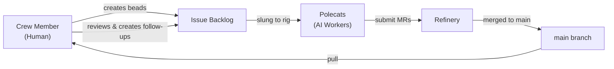

# Crew Collaboration

This workflow describes how human developers in [Crew workspaces](../agents/crew.md) work alongside AI polecats. The core pattern: humans produce **guzzoline** (specifications, designs, reviews) and polecats consume it (implementation, testing, fixes).

---

## When to Use This Workflow

Use crew collaboration when:

- You want to actively work alongside polecats in the same rig
- You need to review and guide AI output in real-time
- You're doing design work that feeds polecat implementation tasks
- You want to maintain code quality while scaling with AI workers

---

## The Guzzoline Pattern

Crew members produce specifications; polecats consume them.



### Step 1: Create Detailed Beads

Write clear, implementable beads with enough context for a polecat to execute:

```bash
bd create --title "Add rate limiting to /api/users endpoint" \
  --type task --priority 1 \
  --description "Add rate limiting middleware to the /api/users endpoint.
Use the existing ratelimit package. Config: 100 requests per minute per IP.
Return 429 with Retry-After header when exceeded.
Tests: unit test for the middleware, integration test hitting the endpoint."
```

### Step 2: Sling to Polecats

```bash
gt sling ga-abc12 myproject
```

### Step 3: Monitor and Guide

```bash
# Watch polecat progress
gt peek polecat:toast --rig myproject

# Check convoy status
gt convoy list

# Review merge queue
gt mq list --rig myproject
```

### Step 4: Pull and Review

```bash
# After polecat work merges to main
git pull

# Review the changes
git log --oneline -5
git diff HEAD~1
```

### Step 5: Create Follow-ups

If the polecat's work needs adjustment:

```bash
bd create --title "Fix: rate limiter missing IPv6 normalization" \
  --type bug --priority 1
```

---

## Parallel Work Pattern

The most productive crew collaboration involves working in parallel with polecats:

```text
You (Crew)                    Polecats
─────────────                 ─────────
Design feature A              Implement feature B (from earlier spec)
  ↓                             ↓
Create beads for A            Submit MR for B
  ↓                             ↓
Review B's MR (git pull)      Pick up feature A beads
  ↓                             ↓
File follow-ups for B         Implement feature A
  ↓                             ↓
Design feature C              ...
```

The key insight: while polecats implement your previous specs, you design the next batch. This creates a pipeline where neither you nor the polecats are ever idle.

---

## Direct Collaboration via Mail

When a polecat needs guidance or you need to redirect:

```bash
# Send instructions to a specific polecat
gt nudge polecat:toast --rig myproject "Focus on the API tests first, skip UI for now"

# Send work instructions via mail
gt mail send myproject/polecats/toast -s "Priority change" -m "
Drop the current task. Pick up ga-xyz instead - it's blocking the release."
```

---

## PR Sheriff Pattern

A crew member can take on a standing role as **PR Sheriff** -- reviewing and managing pull requests:

```bash
# On each session startup
gh pr list --state open

# Classify PRs
# - Simple fixes → approve and merge
# - Complex changes → review in detail
# - Polecat output → verify tests pass, check for quality
```

The PR Sheriff hooks this work to their session, creating a permanent review cadence.

---

## Quality Gates

Crew members are the quality backstop. While polecats run tests before submitting, crew reviews catch:

- **Architectural drift** -- Polecat implementations that don't match the system's design
- **Missing edge cases** -- Tests that pass but don't cover real-world scenarios
- **Security issues** -- Input validation, authentication gaps, injection risks
- **Code style** -- Patterns that work but don't match the project's conventions

```bash
# After pulling merged polecat work
git pull
go test ./...              # Verify tests still pass
golangci-lint run ./...    # Check style and quality
```

---

## Working Across Rigs

Crew members can work on multiple rigs using [worktrees](../concepts/rigs.md):

```bash
# Create a worktree in another rig
gt worktree beads

# Work in the other rig's codebase
cd ~/gt/beads/crew/myproject-healer/

# When done, remove the worktree
gt worktree remove beads
```

---

## Tips

1. **Write specs, not code.** Your highest-leverage activity is creating well-specified beads. A 10-minute spec saves a polecat from spending 30 minutes exploring the wrong approach.

2. **Review before designing.** Pull merged work and review it before starting new design work. Polecat output often reveals issues or patterns that inform your next spec.

3. **Stay in sync.** Run `git pull` frequently. In an active rig with multiple polecats, `main` can advance several commits per hour.

4. **Use beads for everything.** Even small follow-ups should be beads. This creates an audit trail and lets polecats pick up work autonomously.

5. **Handoff when context fills.** Crew sessions have the same context limits as any agent. Use `gt handoff` to cycle to a fresh session with notes.

---

## Related

- **[Crew Workspaces](../agents/crew.md)** -- Full documentation of crew workspace setup and capabilities
- **[Mayor Workflow](mayor-workflow.md)** -- The fully automated alternative where the Mayor coordinates everything
- **[Manual Convoy](manual-convoy.md)** -- Fine-grained control over work assignment
- **[Session Cycling](../concepts/session-cycling.md)** -- How to handle context limits in crew sessions
