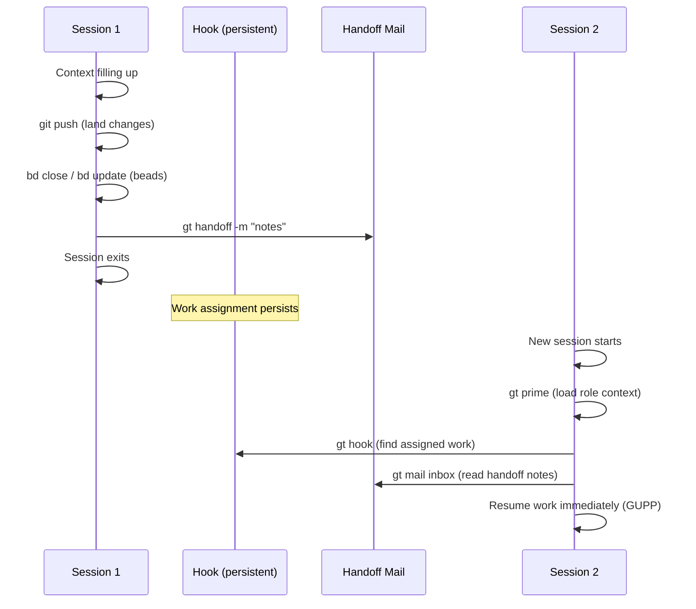

# Handoff Ceremony

The **handoff ceremony** is the protocol agents follow when transitioning from one session to the next. It ensures that work survives context boundaries — no progress is lost, no context is orphaned, and the next session can resume immediately.

---

## Why Handoffs Matter

AI agents have finite context windows. As a session progresses — reading files, writing code, communicating — the context fills up. At capacity, the agent becomes sluggish, repetitive, or loses track of its goals.

The handoff ceremony solves this by defining a clean exit protocol:

1. **Land all work** (commit and push)
2. **Record state** (update beads, close finished work)
3. **Write context notes** (handoff mail for the next session)
4. **Exit** (the next session picks up via the hook)

Without a ceremony, session transitions are chaotic — uncommitted code, lost context, duplicated effort. The ceremony makes transitions deterministic.

---

## The Two Persistence Mechanisms

Handoffs rely on two independent systems:

### 1. The Hook (What You're Working On)

The [hook](../concepts/hooks.md) persists the agent's current work assignment. Whether it is a [molecule](../concepts/molecules.md), a [bead](../concepts/beads.md), or hooked mail, the hook survives session restarts. When the new session starts and runs `gt prime`, it finds the work still on its hook and continues.

The hook is **automatic** — you do not need to do anything special to preserve it.

### 2. Handoff Mail (Context Notes)

Handoff mail is **optional but strongly recommended**. It captures nuances the hook does not — what you tried, what worked, what to do next, which files to look at first.

```bash
gt handoff -s "Working on auth bug" -m "
Found the issue is in token refresh logic.
Check line 145 in auth.go first.
The failing test is TestRefreshExpired.
"
```

The mail is addressed to yourself. Your next session reads it for orientation.

---

## Step-by-Step: Polecat Handoff

Polecats follow the strictest handoff ceremony because their work flows through the merge pipeline.

### 1. Finish Current Step

Complete the logical unit of work you are on. Do not hand off mid-implementation if you can avoid it.

### 2. Commit and Push

```bash
git add <files>
git commit -m "Implement input validation for signup form"
git push
```

:::danger[Non-Negotiable]

Unpushed code in a multi-agent environment is code at risk. Another agent may be assigned to the same rig. Always push before handing off.

:::

### 3. Update Beads

Close finished work, update status on in-progress items:

```bash
bd close ga-abc --reason "Implemented and tests passing"
bd update ga-def --status=in_progress --comment "50% done, form validation complete"
```

### 4. Submit or Handoff

If the work is **done**, submit to the merge queue:

```bash
gt done    # Submits MR, Witness nukes sandbox
```

If the work is **not done** but context is full, hand off:

```bash
gt handoff -s "Auth validation 50% done" -m "
Completed:
- Form validation (signup, login)
- Error message display

Remaining:
- Token refresh validation
- Rate limiting tests

Next step: Look at auth/refresh.go line 145.
"
```

---

## Step-by-Step: Crew Handoff

Crew handoffs are more relaxed — you are human-managed, not monitored by a Witness. But the same principles apply.

### 1. Land Your Changes

```bash
git pull --rebase           # Catch any remote changes
git add <files>
git commit -m "Add sidebar navigation fixes"
git push                    # MANDATORY
git status                  # Verify "up to date with origin/main"
```

### 2. File Follow-Up Work

Create beads for anything that needs attention later:

```bash
bd create "Follow-up: add error handling for edge case in auth" -t task
bd create "Follow-up: flaky test in TestRefreshExpired" -t bug
```

### 3. Close Finished Beads

```bash
bd close ga-abc --reason "Completed — sidebar navigation fixed"
```

### 4. Handoff

```bash
gt handoff -s "Sidebar fixes done, filed follow-ups" -m "
Completed:
- Fixed 9 misaligned sidebar_position values
- Removed orphaned logo.svg

Filed:
- ga-xyz: Follow-up for auth error handling
- ga-def: Flaky test issue

Build is clean. All pushed to main.
"
```

---

## Step-by-Step: Persistent Agent Handoff

Persistent agents (Deacon, Witness, Refinery) rarely hand off explicitly. They experience **automatic compaction** as their context window fills. However, they can be manually cycled:

```bash
# From outside: restart with fresh context
gt witness restart --fresh

# From inside the agent: self-cycle
gt handoff -s "Context full after 200 patrol cycles" -m "
All polecats healthy. No pending escalations.
Merge queue empty. Last patrol at 14:30.
"
```

After restart, the agent runs `gt prime` to reload role context and resumes its patrol molecule from the hook.

---

## What the Next Session Does

The receiving session (which may be "you" with a fresh context) follows the startup protocol:

```bash
# 1. Load full role context
gt prime

# 2. Check hook for assigned work
gt hook

# 3. Read handoff mail
gt mail inbox
gt mail read <handoff-mail-id>

# 4. Resume work immediately (GUPP)
# Do not wait for confirmation — the hook IS the assignment
```



---

## Writing Good Handoff Notes

Handoff notes are for your next session — a version of you with no memory of this session.

### Do

- **Focus on what to do next**, not what you did
- **Include specific file paths and line numbers**
- **List beads you filed** so the next session can find them
- **Note any gotchas** (flaky tests, known issues, workarounds)
- **State the build status** (clean, broken, which tests fail)

### Don't

- Write a novel — keep it under 20 lines
- Repeat information that is already in beads
- Include emotional commentary ("I spent hours on this")
- Omit the build status — the next session needs to know immediately

### Example: Good Handoff

```
gt handoff -s "Token refresh bug — root cause found" -m "
Root cause: RefreshToken() in auth/refresh.go:145 doesn't check expiry.
Fix approach: Add time.Now().After(token.ExpiresAt) guard.

Remaining:
- Implement the fix (5 lines)
- Update TestRefreshExpired
- Run full test suite

Build: clean on main. Tests passing except TestRefreshExpired (the bug).
Filed: ga-xyz for related rate-limiting issue found during investigation.
"
```

### Example: Bad Handoff

```
gt handoff -m "Worked on the auth bug for a while. Made some progress but
couldn't figure it all out. The tests are kind of weird. Check the auth
folder I guess."
```

---

## Handoff vs Park

| Aspect | `gt handoff` | `gt park` |
|--------|-------------|-----------|
| **Intent** | Continue immediately in new session | Pause, resume later |
| **Successor** | Expected immediately | No immediate successor |
| **Use case** | Context full, keep working | End of day, break, deprioritized |
| **Hook state** | Persists | Persists |
| **Mail** | Handoff mail sent to self | No mail |
| **GUPP** | Next session runs immediately | No urgency |

---

## Common Mistakes

### Not Pushing Before Handoff

```bash
# WRONG: Handing off with uncommitted work
gt handoff -m "Almost done with the feature"
# The next session finds a dirty worktree and has to figure out what's staged

# RIGHT: Always push first
git add <files> && git commit -m "WIP: auth validation" && git push
gt handoff -m "Auth validation WIP pushed. Resume from auth/validate.go."
```

### Empty Handoff Notes

```bash
# WRONG: No context for the next session
gt handoff

# RIGHT: Always include notes
gt handoff -s "Feature X progress" -m "Completed A and B. Next: do C. See auth/refresh.go:145."
```

### Handing Off Mid-Thought

If you are in the middle of debugging and context is critical, capture it:

```bash
# Capture debugging state
gt handoff -s "Debugging race condition in convoy close" -m "
Hypothesis: The convoy-close check in deacon patrol races with polecat gt done.
Evidence: bd show ga-abc shows closed, but convoy ga-def still open.
Next: Add logging to convoy_close() in convoys.go:220 and reproduce.
Reproduction: Run gt convoy create with 3 beads, gt done on all 3 within 5s.
"
```

---

## See Also

- **[Session Cycling](../concepts/session-cycling.md)** -- The broader concept of context refresh that handoffs enable
- **[GUPP](../concepts/gupp.md)** -- The propulsion principle that drives immediate execution after handoff
- **[Hooks](../concepts/hooks.md)** -- The persistence mechanism that makes handoffs possible
- **[Molecules](../concepts/molecules.md)** -- Multi-step workflows track progress across handoff boundaries
- **[Crew Collaboration](crew-collaboration.md)** -- Crew-specific workflow patterns including handoff
