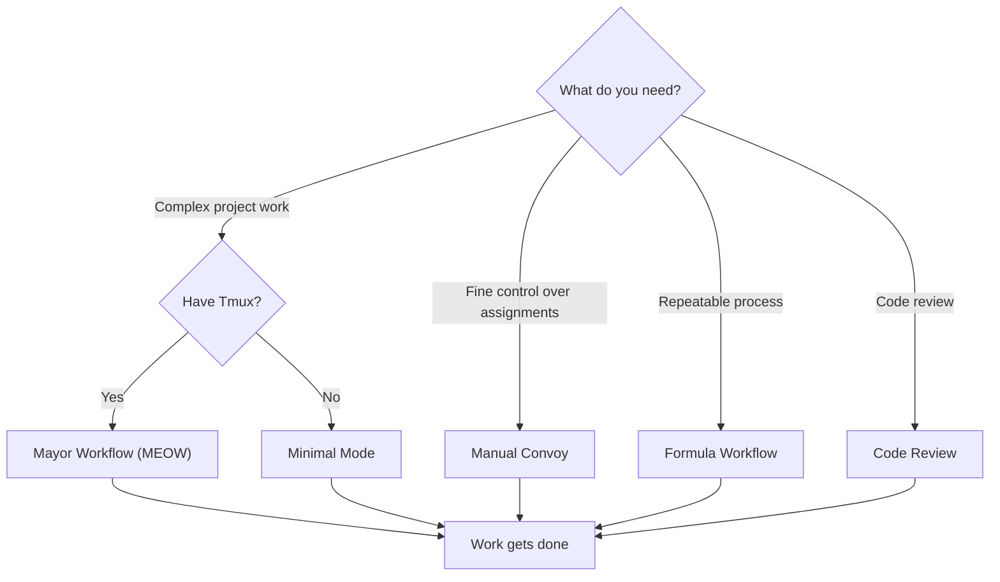

# Workflows

Gas Town supports several workflow patterns for getting work done. Choose the one that best matches your needs and infrastructure.

---

## Choosing a Workflow

| Workflow | Best For | Requires Tmux | Automation Level |
|----------|----------|:-------------:|:----------------:|
| [Mayor Workflow (MEOW)](mayor-workflow.md) | Complex multi-issue work | Yes | Full |
| [Minimal Mode](minimal-mode.md) | Getting started, limited resources | No | Low |
| [Manual Convoy](manual-convoy.md) | Fine-grained control | Optional | Medium |
| [Formula Workflow](formula-workflow.md) | Repeatable processes | Optional | Medium |
| [Code Review](code-review.md) | Thorough parallel reviews | Yes | Full |

## Decision Tree



## Workflow Comparison

### Automation Spectrum

```
  Manual                                              Fully Automated
    |                                                        |
    |   Minimal    Manual Convoy    Formula    MEOW          |
    |------●-----------●--------------●---------●-----------|
```

- **Minimal Mode**: You create beads, sling work, and monitor manually. Gas Town provides persistence and tracking.
- **Manual Convoy**: You create convoys and assign issues yourself. Gas Town handles execution and merge.
- **Formula Workflow**: You select a predefined formula. Gas Town orchestrates the steps.
- **Mayor Workflow**: You describe work in natural language. The Mayor handles everything.

### What Each Workflow Automates

| Task | Minimal | Manual Convoy | Formula | MEOW |
|------|:-------:|:------------:|:-------:|:----:|
| Create beads | Manual | Manual | Auto | Auto |
| Create convoy | Manual | Manual | Manual | Auto |
| Assign to rigs | Manual | Manual | Auto | Auto |
| Spawn polecats | Manual | Auto | Auto | Auto |
| Monitor progress | Manual | Manual | Auto | Auto |
| Handle failures | Manual | Manual | Partial | Auto |
| Merge code | Manual | Auto | Auto | Auto |

## Common Patterns Across Workflows

Regardless of which workflow you choose, several patterns are universal:

### The Hook-Propulsion Loop

Every agent follows the same startup pattern:

```bash
gt prime           # Load context
gt hook            # Check for attached work
gt mail inbox      # Check for messages
```

### The Polecat Lifecycle

Workers always follow the self-cleaning model:

```
Spawn -> Work -> Done -> Nuke
```

### The Merge Pipeline

Completed work always flows through the Refinery:

```
Polecat pushes branch -> Witness sends MERGE_READY ->
Refinery rebases + tests -> Refinery merges to main
```

### Convoy Tracking

All workflows use convoys (explicitly or implicitly) to track batch progress and auto-close when complete.

## Getting Started

If you are new to Gas Town, start with the [Mayor Workflow](mayor-workflow.md) -- it is the recommended approach for most users. If you need to work without Tmux or want more hands-on control, try [Minimal Mode](minimal-mode.md) first.

:::tip[Mix and Match]

These workflows are not mutually exclusive. You can use the Mayor for most work, drop to Manual Convoy for specific tasks, and run Formulas for specialized processes -- all in the same town.


:::