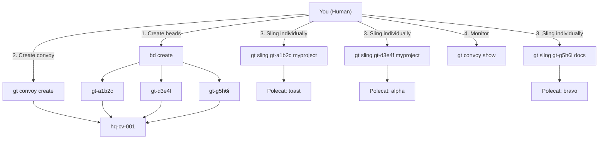
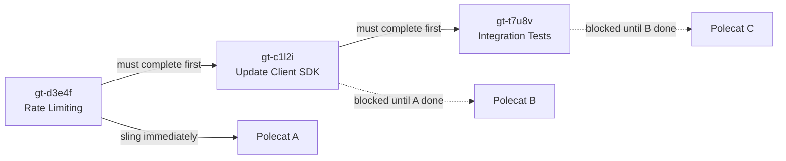
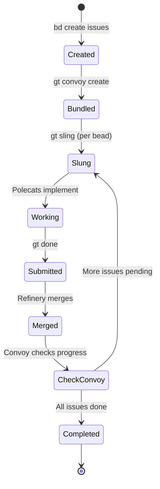
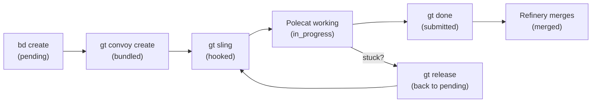

# Manual Convoy Workflow

The **Manual Convoy Workflow** gives you direct control over work distribution while still using Gas Town's convoy tracking, merge queue, and agent infrastructure. Unlike the Mayor Workflow (where the Mayor decides assignments), you create the convoy, add issues, and sling them individually to specific rigs or agents.

---

## When to Use This Workflow

- You want precise control over which agent handles which task
- You need to route specific issues to specific rigs
- You want convoy tracking without full Mayor coordination
- You are debugging an issue that requires hands-on assignment

:::info[Prerequisites]

- Gas Town installed with at least one rig
- Tmux recommended (for auto-spawning polecats)
- Witness and Refinery running on target rigs

:::

## Overview



## Step-by-Step

### Step 1: Create Issues

Create beads with clear titles and metadata:

```bash
# Bug fix with high priority
bd create --title "Fix SQL injection in login" \
  --type bug \
  --priority 1 \
  --labels "security,auth" \
  --description "Login endpoint is vulnerable to SQL injection via the password field. Use parameterized queries."
# Created: gt-a1b2c

# Feature with medium priority
bd create --title "Add rate limiting to API" \
  --type feature \
  --priority 2 \
  --labels "api,security"
# Created: gt-d3e4f

# Documentation task
bd create --title "Update API security docs" \
  --type task \
  --priority 3 \
  --labels "docs"
# Created: gt-g5h6i
```

:::tip[Detailed Descriptions]

The more detail you provide in the bead description, the better the polecat will understand the task. Include file paths, expected behavior, and acceptance criteria when possible.

:::

### Step 2: Create a Convoy

Bundle the beads into a convoy for batch tracking:

```bash
gt convoy create "API Security Hardening" gt-a1b2c gt-d3e4f gt-g5h6i
# Created: hq-cv-007
```

### Step 3: Sling Work to Rigs

Assign each issue individually to the appropriate rig:

```bash
# Send security fix to the backend rig
gt sling gt-a1b2c backend

# Send rate limiting to the same rig
gt sling gt-d3e4f backend

# Send docs to the docs rig
gt sling gt-g5h6i docs
```

Each `gt sling` command:

1. Updates the bead status to `hooked`
2. Attaches the bead to the target rig
3. Spawns a polecat worker (if Tmux available)
4. The polecat finds its hook and begins working

### Step 4: Monitor Progress

Track progress through multiple views:

```bash
# Convoy-level view
gt convoy show hq-cv-007

# Activity feed (live updates)
gt feed

# Rig-level polecat status
gt polecat list

# Merge queue status
gt mq list
```

Example convoy output:

```text
Convoy: hq-cv-007 "API Security Hardening"
Status: OPEN
Progress: 1/3 issues completed

Tracked Issues:
  [DONE]        gt-a1b2c  Fix SQL injection in login
  [IN_PROGRESS] gt-d3e4f  Add rate limiting to API
  [HOOKED]      gt-g5h6i  Update API security docs

Polecats:
  backend/toast  -> gt-a1b2c (completed, awaiting merge)
  backend/alpha  -> gt-d3e4f (implementing)
  docs/bravo     -> gt-g5h6i (loading context)
```

### Step 5: Handle Issues

If a polecat gets stuck or fails:

```bash
# Release the bead back to the pool
gt release gt-d3e4f

# Re-sling to a different rig or agent
gt sling gt-d3e4f backend --agent gemini

# Or manually nudge the polecat
gt nudge backend/polecats/alpha "Status update? Need help?"
```

### Step 6: Add More Work

You can add issues to the convoy at any time:

```bash
# Create a new bead
bd create --title "Add API key rotation" --type feature --priority 2
# Created: gt-n1e2w

# Add to existing convoy
gt convoy add hq-cv-007 gt-n1e2w

# Sling it
gt sling gt-n1e2w backend
```

### Step 7: Convoy Completes

When all tracked issues are done, the convoy auto-closes. You can verify:

```bash
gt convoy list
# hq-cv-007  API Security Hardening  [COMPLETED]  4/4 done
```

:::warning[Convoy Scope Creep]
Manual convoys make it tempting to keep adding beads as new ideas emerge during implementation. While Gas Town supports adding beads to active convoys, doing so excessively creates sprawling, unfocused convoys that are hard to track and never complete. If a convoy grows beyond 10 beads, consider splitting it into multiple focused convoys with clear completion criteria. For convoy organization strategies, see [Your First Convoy in 5 Minutes](/blog/first-convoy).
:::

:::tip[Convoy Naming Discipline]
Use descriptive, outcome-focused convoy names rather than vague labels. "API Security Hardening" is better than "Sprint 3" or "Bug Fixes". Six months later when reviewing convoy history, outcome-focused names make it immediately clear what was delivered without needing to read every bead title.
:::

## Handling Dependencies

For work that must happen in sequence, use bead dependencies. The dependency system ensures blocked beads are not slung until their prerequisites complete.



```bash
# Create the dependent bead
bd create --title "Update client for new API" \
  --type task \
  --depends-on gt-d3e4f \
  --description "After rate limiting lands, update the client SDK"
# Created: gt-c1l2i

# Add to convoy
gt convoy add hq-cv-007 gt-c1l2i

# Don't sling it yet -- it's blocked on gt-d3e4f
bd show gt-c1l2i
# Status: pending (blocked by gt-d3e4f)

# When gt-d3e4f completes, the dependency resolves automatically
# Now you can sling it:
gt sling gt-c1l2i frontend
```

:::warning
When adding beads to a convoy after polecats have already started working, verify that the new beads do not conflict with in-progress work. Two polecats editing the same files will trigger merge conflicts that the Refinery must resolve, adding time and token cost to the convoy.
:::

:::note

When using `gt release` to return a bead to the pool, the polecat's partial work remains on its feature branch. If the polecat made useful progress, note the branch name in the bead before re-slinging so the next polecat can build on it rather than starting from scratch.

:::

## Cross-Rig Coordination



Manual convoys are particularly useful for cross-rig work:

```bash
# Backend changes
gt sling gt-a1b2c backend

# Frontend changes that depend on backend
gt sling gt-d3e4f frontend

# Shared library changes
gt sling gt-g5h6i shared-lib

# All tracked in one convoy
gt convoy show hq-cv-007
```

The following diagram shows how manual convoy work items transition through each stage as you manage them directly:



## Comparison with Other Workflows

| Aspect | Manual Convoy | Mayor Workflow | Minimal Mode |
|--------|:------------:|:--------------:|:------------:|
| Who creates beads | You | Mayor | You |
| Who creates convoy | You | Mayor | You |
| Who slings work | You | Mayor | You |
| Auto-spawn polecats | Yes (with Tmux) | Yes | No |
| Auto-merge (Refinery) | Yes | Yes | No |
| Progress monitoring | Manual | Mayor reports | Manual |
| Assignment flexibility | Full | Mayor decides | Full |

:::tip[Stranded Convoy Check]

If you forget to sling some issues, use `gt convoy stranded` to find convoys with unassigned work:
```bash
gt convoy stranded
# hq-cv-007 has 1 unassigned issue: gt-n1e2w
```


:::

The following Gantt chart shows a typical manual convoy timeline with sequential work assignment and monitoring:

```mermaid
gantt
    title Manual Convoy Workflow Timeline
    dateFormat X
    axisFormat %M min

    section Setup
    Create beads        :0, 3
    Create convoy       :3, 4

    section Sling Work
    Sling bead 1        :4, 5
    Sling bead 2        :5, 6
    Sling bead 3        :6, 7

    section Monitoring
    Monitor progress    :7, 30
    Handle issues       :15, 18

    section Completion
    All work merged     :30, 35
    Convoy auto-closes  :35, 36
```



## Related

- [Mayor Workflow](mayor-workflow.md) -- The fully automated alternative where the Mayor handles assignment
- [Convoys](../concepts/convoys.md) -- How convoy tracking, dependencies, and auto-close work
- [Beads](../concepts/beads.md) -- Creating and managing the work items that convoys track
- [Sling Commands](../cli-reference/sling.md) -- Full CLI reference for `gt sling` and work assignment

### Blog Posts

- [Your First Convoy](/blog/first-convoy) -- Step-by-step guide to creating and running your first convoy
- [Advanced Convoy Patterns](/blog/advanced-convoy-patterns) -- Cross-rig coordination and dependency management techniques
- [Work Distribution Patterns](/blog/work-distribution-patterns) -- When to use manual convoys vs. Mayor vs. formula workflows
- [Mastering gt sling: Precise Work Assignment](/blog/mastering-gt-sling) -- Advanced techniques for slinging work to specific rigs and agents in manual convoy workflows
- [Your Second Convoy: Beyond Hello World](/blog/your-second-convoy) -- Next steps after completing your first manual convoy