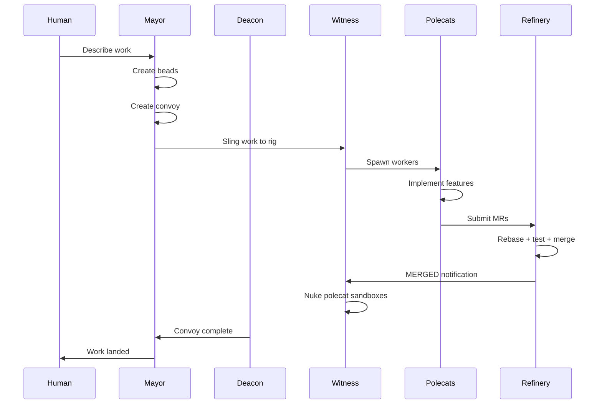
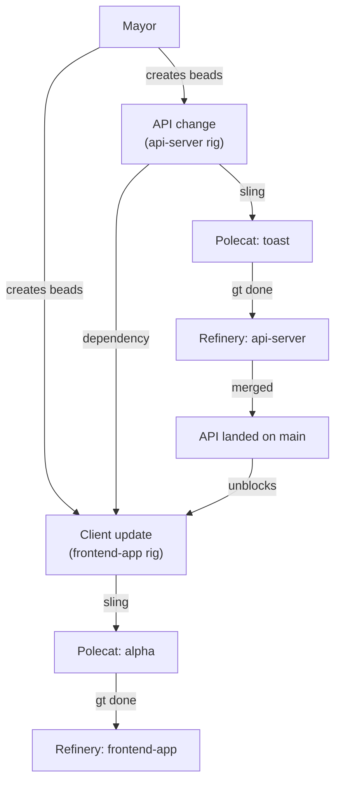
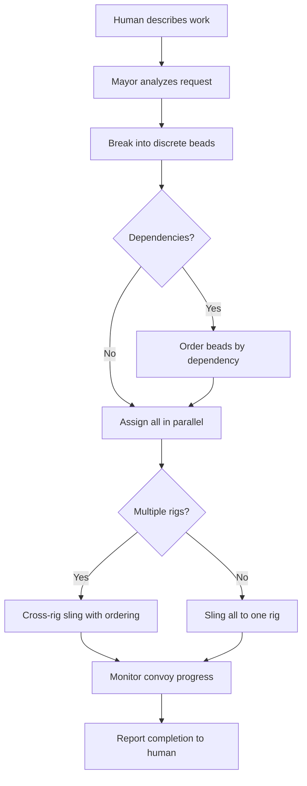

# Mayor Workflow (MEOW)

The **Mayor Workflow** -- also known as **MEOW** (Mayor-Executed Orchestrated Work) -- is the recommended workflow for complex multi-issue coordination. You describe what you want in natural language, and the Mayor handles bead creation, convoy management, agent assignment, progress monitoring, and completion notification.

---

## When to Use This Workflow

- You have multiple related tasks that need coordination
- You want maximum automation with minimum manual intervention
- You have Tmux installed for multi-agent session management
- You are comfortable letting the Mayor make assignment decisions

:::info[Prerequisites]

- Gas Town installed with at least one rig configured
- Tmux 3.0+ installed
- Core agents started (`gt start --all`)

:::

## Overview



## Step-by-Step

### Step 1: Attach to the Mayor

```bash
gt mayor attach
```

This opens an interactive session with the Mayor agent. The Mayor already has context about your town, rigs, and current state.

### Step 2: Describe Your Work

Tell the Mayor what you want in natural language. Be specific about outcomes, not implementation details:

> "Fix the 5 failing tests in the auth module, add input validation to the user registration endpoint, and update the README with the new auth flow."

Or for a simpler request:

> "There's a bug where login fails when the password has special characters. Fix it and add a regression test."

### Step 3: Mayor Creates Beads and Convoy

The Mayor automatically:

1. **Analyzes your request** and breaks it into discrete tasks
2. **Creates beads** for each task with appropriate type, priority, and labels
3. **Bundles beads into a convoy** for batch tracking
4. **Reports the plan** back to you for confirmation

Example Mayor response:

```text
I've created the following plan:

Convoy: hq-cv-012 "Auth Module Improvements"

Issues:
  gt-a1b2c  [bug]     Fix failing auth tests (P1)
  gt-d3e4f  [feature] Add registration input validation (P2)
  gt-g5h6i  [task]    Update README with auth flow (P3)

Shall I proceed with assigning these to polecats?
```

:::warning
Review the Mayor's decomposition before approving. The Mayor may sometimes create too many or too few beads, or miss dependencies between tasks. Verify that the breakdown matches your intent and that dependent work is ordered correctly.
:::

### Step 4: Mayor Assigns Work

Once confirmed, the Mayor slings each bead to the appropriate rig:

```bash
# Mayor runs internally:
gt sling gt-a1b2c myproject
gt sling gt-d3e4f myproject
gt sling gt-g5h6i myproject
```

Each `gt sling` spawns a polecat worker that immediately begins work.

### Step 5: Monitor Progress

You can check progress at any time:

```bash
# Check convoy status
gt convoy list
gt convoy show hq-cv-012

# Watch the live activity feed
gt feed

# Check individual polecat status
gt polecat list
```

Or simply ask the Mayor:

> "How's the auth work going?"

### Step 6: Work Completes

As each polecat finishes:

1. Polecat runs `gt done` (submits MR, nukes sandbox)
2. Witness detects completion, sends MERGE_READY to Refinery
3. Refinery rebases, tests, and merges to main
4. Refinery sends MERGED notification to Witness
5. Witness completes cleanup

When all convoy items are done, the convoy auto-closes and the Mayor notifies you.

## Example Session

Here is a complete example session from start to finish:

```text
$ gt mayor attach

Mayor> Welcome! I see 2 active rigs: myproject, docs. How can I help?

You> The login endpoint returns 500 when the password contains a
     single quote. Fix the bug and add a test. Also update the
     API docs for the login endpoint.

Mayor> I'll break this into 3 tasks across 2 rigs:

  Convoy: hq-cv-015 "Login Quote Bug Fix"

  myproject:
    gt-x1y2z  [bug]  Fix SQL injection in login password handling (P1)
    gt-a3b4c  [task] Add regression test for special char passwords (P1)

  docs:
    gt-d5e6f  [task] Update login endpoint API documentation (P3)

  Ready to assign. Proceed?

You> Yes

Mayor> Assigning...
  ✓ gt-x1y2z slung to myproject (polecat: toast)
  ✓ gt-a3b4c slung to myproject (polecat: alpha)
  ✓ gt-d5e6f slung to docs (polecat: bravo)

  3 polecats working. I'll monitor progress.

  [... time passes ...]

Mayor> Progress update on hq-cv-015:
  ✓ gt-x1y2z  Fixed SQL injection - merged to main
  ✓ gt-a3b4c  Regression test added - merged to main
  ● gt-d5e6f  Docs update in progress

  [... more time ...]

Mayor> Convoy hq-cv-015 "Login Quote Bug Fix" is complete!
  All 3 issues merged to main. Duration: 12 minutes.
```

## Advanced Usage

### Providing Constraints

You can give the Mayor additional constraints:

> "Fix the auth tests, but only use the auth-service rig, not the monolith."

> "Add the feature, but make sure to create a design doc first."

### Requesting Specific Formulas

You can ask the Mayor to use a particular formula:

> "Run a code review on the last 3 PRs using the full preset."

> "Do a design exploration for adding notification levels."

### Cross-Rig Work

The Mayor handles cross-rig coordination automatically:

> "The API changes need to land in api-server first, then update the client in frontend-app to use the new endpoints."

The Mayor will create the beads with dependencies and ensure the work happens in the correct order.



### Intervening Mid-Flight

You can always interrupt:

```bash
# Stop a specific polecat
gt polecat nuke myproject/toast

# Release an issue back to the pool
gt release gt-a1b2c

# Add more work to an existing convoy
gt convoy add hq-cv-015 gt-newbead
```

:::note
For best results, give the Mayor outcome-oriented instructions rather than implementation details. Instead of "edit auth.go line 42 to add a nil check," say "fix the nil pointer crash in the login handler." The Mayor and polecats are more effective when they can choose their own implementation approach.
:::

:::danger

Avoid giving the Mayor multiple unrelated requests in a single message. The Mayor may combine them into one convoy, creating false dependencies and making it harder to track progress. Give one coherent batch of related work per message, then wait for the convoy to be created before issuing the next request.

:::

## Mayor Decision Flow



## Troubleshooting

| Problem | Solution |
|---------|----------|
| Mayor not responding | Check `gt mayor status`. Restart with `gt mayor restart` |
| Polecat stuck | Witness will detect it. Or manually: `gt nudge myproject/polecats/toast "status?"` |
| Merge conflict | Refinery spawns a conflict-resolution polecat automatically |
| Work not starting | Check `gt convoy stranded` for unassigned work |
| Convoy not closing | Run `gt convoy check hq-cv-015` to diagnose |

:::tip[The Mayor Remembers]

The Mayor maintains context across the session. You can refer back to earlier work, ask for status updates, or modify plans. If the Mayor's session restarts (context compaction), it reads its hook to resume.


:::

## Related

- [Mayor](../agents/mayor.md) -- Full documentation of the Mayor agent's capabilities and commands
- [MEOW Stack](../concepts/meow-stack.md) -- The Molecules, Epics, Orchestration, Workflows abstraction model
- [Manual Convoy Workflow](manual-convoy.md) -- Alternative workflow with fine-grained control over work assignment
- [Convoys](../concepts/convoys.md) -- How convoy tracking and auto-close work under the hood

### Blog Posts

- [The Mayor Workflow](/blog/mayor-workflow) -- In-depth walkthrough of the MEOW workflow in practice
- [Your First Convoy](/blog/first-convoy) -- Getting started with convoy-based work coordination
- [Advanced Convoy Patterns](/blog/advanced-convoy-patterns) -- Cross-rig dependencies and phased execution strategies
- [Work Distribution Patterns](/blog/work-distribution-patterns) -- When to use Mayor orchestration vs. manual convoys vs. formula workflows