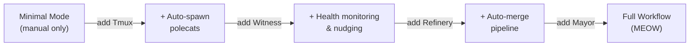
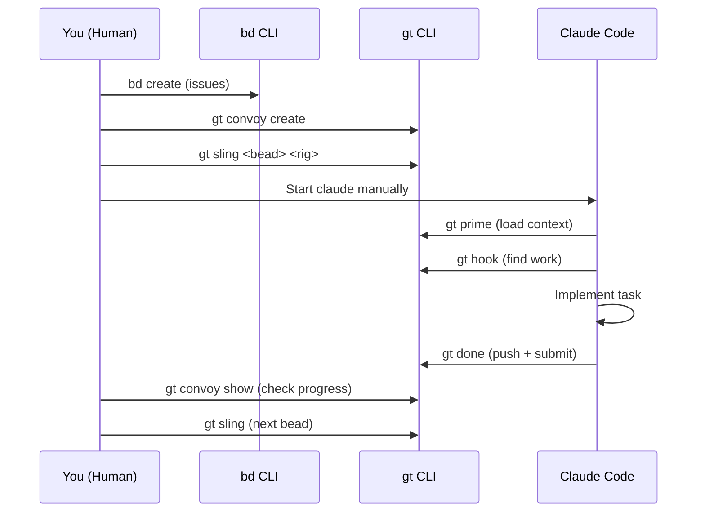
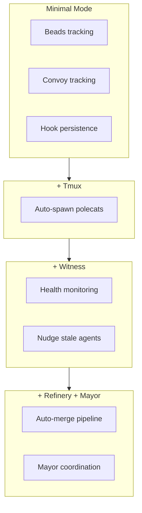

# Minimal Mode (No Tmux)

**Minimal Mode** lets you use Gas Town's persistence and tracking features without requiring Tmux or the full agent hierarchy. You manually spawn agents and manage work, while Gas Town provides hooks, beads, and convoy tracking. This is ideal for getting started, running on limited resources, or when you prefer hands-on control.

---

## When to Use This Workflow

- You do not have Tmux installed
- You are running on a machine with limited resources
- You want to learn Gas Town concepts incrementally
- You prefer direct control over each agent

:::info[Prerequisites]

- Gas Town installed (`gt` CLI available)
- Beads installed (`bd` CLI available)
- At least one rig configured
- Claude Code (or compatible runtime) available

:::

## Overview

In Minimal Mode, you replace the automated agent hierarchy with manual commands. The key difference from the full Mayor Workflow is that **you** are the coordinator:


## Step-by-Step

### Step 1: Create Issues

Use the `bd` CLI to create beads for your work:

```bash
bd create --title "Fix login bug" --type bug --priority 1
# Created: gt-a1b2c

bd create --title "Add email validation" --type feature
# Created: gt-d3e4f
```

### Step 2: Create a Convoy

Bundle the issues for tracking:

```bash
gt convoy create "Auth Fixes" gt-a1b2c gt-d3e4f
# Created: hq-cv-001
```

### Step 3: Sling Work to a Hook

Attach the first issue to an agent's hook:

```bash
gt sling gt-a1b2c myproject
```

This does two things:

1. Updates the bead status to `hooked`
2. Attaches the bead ID to the target location's hook

:::note[Without Tmux]

In Minimal Mode, `gt sling` may not auto-spawn a polecat if Tmux is unavailable. You will need to start the agent session manually in the next step.

:::

### Step 4: Start the Agent Manually

Open a terminal in the rig's working directory and start Claude Code:

```bash
cd ~/gt/myproject/polecats/toast  # Or crew/yourname for persistent workspace
claude
```

When Claude starts, it should run `gt prime` (via the SessionStart hook) and discover the work on its hook. If it does not auto-prime, tell it:

```text
Run gt prime and check your hook for assigned work.
```

The agent will:

1. Run `gt prime` to load context
2. Run `gt hook` to find the assigned bead
3. Read the bead with `bd show gt-a1b2c`
4. Begin working on the task

### Step 5: Monitor Progress

In a separate terminal:

```bash
# Check convoy progress
gt convoy show hq-cv-001

# Check bead status
bd show gt-a1b2c

# Check what's in the merge queue
gt mq list
```

### Step 6: Handle Completion

When the agent finishes, it runs `gt done` which:

1. Pushes the branch
2. Submits to the merge queue
3. Cleans up the sandbox

If you are not running the Refinery, you may need to merge manually:

```bash
cd ~/gt/myproject/refinery/rig
git fetch origin
git merge --ff-only origin/polecat/toast
git push origin main
```

### Step 7: Move to Next Issue

Repeat steps 3-6 for the next issue:

```bash
gt sling gt-d3e4f myproject
# Start a new agent session manually
```

### Step 8: Check Convoy Completion

```bash
gt convoy show hq-cv-001
# If all issues done, convoy shows COMPLETED
```

## Example Session

```bash
# 1. Create work items
$ bd create --title "Fix auth timeout" --type bug --priority 1
Created: gt-x1y2z

$ bd create --title "Add rate limiting" --type feature
Created: gt-a3b4c

# 2. Bundle into convoy
$ gt convoy create "Security Sprint" gt-x1y2z gt-a3b4c
Created: hq-cv-005

# 3. Sling first item
$ gt sling gt-x1y2z myproject

# 4. Start agent in another terminal
$ cd ~/gt/myproject/crew/dave
$ claude
# Agent reads hook, works on gt-x1y2z, runs gt done

# 5. Check progress
$ gt convoy show hq-cv-005
# gt-x1y2z: done
# gt-a3b4c: pending

# 6. Sling next item
$ gt sling gt-a3b4c myproject

# 7. Start agent again
$ cd ~/gt/myproject/crew/dave
$ claude
# Agent reads hook, works on gt-a3b4c, runs gt done

# 8. Convoy completes
$ gt convoy show hq-cv-005
# COMPLETED: 2/2 done
```

:::tip[Minimal Mode for Learning]
Minimal mode is the best way to learn Gas Town's core concepts because you manually perform each step that the full system automates. Starting in minimal mode builds intuition for hooks, beads, and convoys before adding the complexity of Tmux sessions, Witness monitoring, and Mayor coordination. Consider spending at least a week in minimal mode before scaling up.
:::

## Scaling Up from Minimal Mode

Once you are comfortable with Minimal Mode, you can incrementally add automation. Each layer builds on the previous one, adding capabilities without breaking your existing workflow.



### Add Tmux

Install Tmux and let Gas Town manage sessions:

```bash
# Now gt sling will auto-spawn polecats
gt sling gt-a1b2c myproject
# Polecat spawns in a tmux pane automatically
```

### Start the Witness

Let the Witness monitor your polecats:

```bash
gt witness start myproject
```

### Start the Refinery

Let the Refinery handle merges:

```bash
gt refinery start myproject
```

### Start the Full Stack

When ready, start everything:

```bash
gt start --all
gt mayor attach
```

You are now running the full [Mayor Workflow](mayor-workflow.md).

## Tips for Minimal Mode



:::tip[Use Crew Workspaces]

For persistent work, use crew workspaces (`gt crew add myproject yourname`) instead of polecat directories. Crew workspaces persist between sessions while polecat directories are ephemeral.

:::

:::tip[Always Push]

Since you do not have the automated Refinery, always push your changes and sync beads before ending a session:
```bash
git push origin HEAD
bd sync
```

:::

:::warning[No Automatic Recovery]

Without Witness and Deacon monitoring, stuck or crashed sessions will not be automatically detected. Check on your agents periodically.

:::

The following diagram shows which Gas Town components are available at each stage as you scale up from minimal mode to the full workflow:



## Comparison with Full Workflow

| Feature | Minimal Mode | Full Workflow |
|---------|:------------:|:------------:|
| Bead tracking | Yes | Yes |
| Convoy tracking | Yes | Yes |
| Hook persistence | Yes | Yes |
| Auto-spawn polecats | No | Yes |
| Auto-merge (Refinery) | No | Yes |
| Health monitoring (Witness) | No | Yes |
| Coordination (Mayor) | No | Yes |
| Requires Tmux | No | Yes |
| Resource usage | Low | Higher |

## Related

- [Mayor Workflow](mayor-workflow.md) -- The fully automated workflow that minimal mode scales up to
- [Manual Convoy Workflow](manual-convoy.md) -- An intermediate approach with convoy tracking and manual assignment
- [Quick Start](../getting-started/quickstart.md) -- Initial setup steps before using minimal mode
- [Hooks](../concepts/hooks.md) -- How hook persistence works even without the full agent hierarchy

### Blog Posts

- [Getting Started in Minimal Mode: Gas Town Without Tmux](/blog/minimal-mode) -- How to use hooks, beads, and convoys without requiring Tmux or the full agent hierarchy
- [Welcome to the Gas Town Blog](/blog/welcome) -- Introducing the Gas Town documentation blog and getting started resources
- [Cost Tracking and Optimization in Gas Town](/blog/cost-optimization) -- Practical strategies for monitoring costs in reduced-overhead workflows
- [Hook Persistence: Why Work Survives Crashes](/blog/hook-persistence) -- How hooks preserve work state even without the full agent hierarchy running
